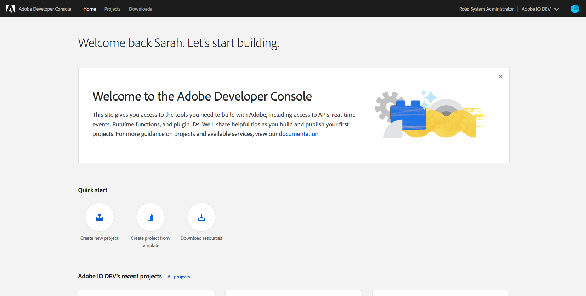
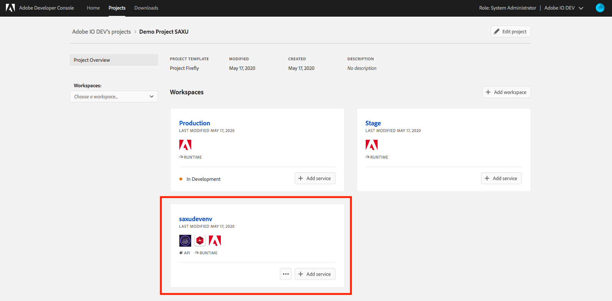
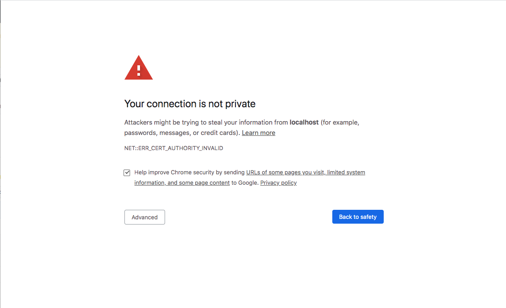

# Creating your First Project Firefly App

In this tutorial, we'll guide you through the following steps to give you an introduction on how to set up and to developer a Project Firefly Application. 
1. Setting up Local Environment
1. Creating a new Project on [Adobe Developer Console](https://console.adobe.io/)
1. Signing in from the [CLI](https://github.com/adobe/aio-cli)
1. Bootstrapping new App using [CLI](https://github.com/adobe/aio-cli)
1. Understanding Main Components of the Application
1. Developing the Application
1. Deploying the Application

If you run into any issues during development, please first refer to the [Common Issues section](https://github.com/AdobeDocs/project-firefly/blob/master/getting_started/first_app.md#having-issues) on this page. If that does not resolve your issue, please refer to our [Support Channels](https://github.com/AdobeDocs/project-firefly/blob/master/support.md).

## 1. Setting up Local Environment

Please always ensure your local environment and tooling is up to date to avoid any possible issues. The instructions can be located at [Setting up Your Environment](getting_started/setup.md). 

## 2. Creating a new Project on Developer Console

[Adobe Developer Console](https://console.adobe.io/) gives you access to [APIs](https://www.adobe.io/apis.html), [SDKs](https://github.com/adobe/aio-sdk) and developer tools to build on, integrate, and extend Adobe products. In Project Firefly, you would need access to Runtime credentials which would be used for deploying your application, and access to API credentials if you want to access any Adobe [APIs](https://www.adobe.io/apis.html) in your application. 

Follow the instructions to set up your project:
1. Navigate to [Adobe Developer Console](https://console.adobe.io/).
    

1. Use the Org Switcher on the upper right corner to ensure or to select the Org you want to use. 
    

1. Once you are in the correct organization, Under `Quick Start`, click on the option to `Create project from template`.

1. Select `Project Firefly` from the list of templates. 
    

1. Enter `Project Title` and `App Name` for your templated project. 
    - `Project Title` is used to identify this project within [Adobe Developer Console](https://console.adobe.io/) and in [CLI](https://github.com/adobe/aio-cli). A default value is suggested on this screen, but we recommend using a meaningful and distinguishable project title.
    - `App Name` will be used as a unique identifier for your application and this value cannot be changed once project set up is complete. 
    - By default, the "Include Runtime with each workspace" checkbox is checked, which means each workspace that created is automatically provisioned with a unique Runtime namespace allowing each developer to work within their own Runtime environment. If you deselect the checkbox and do not opt for automatic inclusion of Runtime, you will need to enable it manually for each individual workspace. You cannot auto-add Runtime to all workspaces after the initial set up is complete.
You can manually remove Runtime from individual workspaces later if you determine that Runtime is not needed.
    - Click `Save` when ready. 
    

1. You should see a new project generated with 2 default `Workspaces`. 
    - Workspaces can be used to manage different deployment environments (dev, qa, stage, prod) for your application and to provide individual working environment for each developer on the project. Workspace is where you will connect services and get the credential details needed to connect to [Adobe APIs](https://www.adobe.io/apis.html). Connected services can differe from workspace to workspace, and the credentials used within each workspace is not shared across workspaces. 
    - Each Project Firefly project has two default workspaces: `Production` and `Stage`. You can add more workspaces as needed. The `Production` workspace is specicial, as it is used for the submission and distribution flow. When you’re ready to deploy your app, you will submit it for approval from the Production workspace.
    

1. Create a new workspace or select an workspace to start adding [APIs](https://www.adobe.io/apis/experienceplatform/console/docs.html#!AdobeDocs/adobeio-console/master/services.md) and [Events](https://www.adobe.io/apis/experienceplatform/console/docs.html#!AdobeDocs/adobeio-console/master/services-add-event.md) that you would need for your application. 
    

To read more about Adobe Developer Console, please refer to [Console Documentation](https://www.adobe.io/apis/experienceplatform/console/docs.html).

## 3. Signing in from CLI

Once you have your project set up in [Adobe Developer Console](https://console.adobe.io/), it is time to move onto your local environment. You can always go back to [Adobe Developer Console](https://console.adobe.io/) to modify your project later.

1. On your machine, navigate to the Terminal and enter

    ```
    $ aio login
    ```

1. A browser window should prompt open, asking you to sign in with your Adobe ID. If the window did not automatically open, you can also copy paste the URL printed in your browser to log in. 

    ```
    $ aio login
    Visit this url to log in: 
    https://aio-login.adobeioruntime.net/api/v1/web/default/applogin?xxxxxxxx
    ```

1. Once you've logged in, you can close the browser window and go back to your Terminal. You would see a string printed in the terminal. This is your user token. It is automatically stored in [CLI](https://github.com/adobe/aio-cli) config, allowing the [CLI](https://github.com/adobe/aio-cli) to use the token to talk to [Adobe Developer Console](https://console.adobe.io/). 

    ```
    eyJ4NXUiOixxxxxxxxxxxxxxxxxxx
    ```

1. You would now be able to start building Project Firefly Applications with the [CLI](https://github.com/adobe/aio-cli).  

## 4. Bootstrapping new App using the CLI

There are two sample flows listed below as we understand some developers may not have access to [Adobe Developer Console](https://console.adobe.io/) as entitled Enterprise Organization users but still want to look at the project or to import credentials later. 

### 4.1 Developer is Logged in as Enterprise Organization user

1. In your Terminal, navigate to where you want to initialize your project and type in the following command in your Terminal:

    ```
    aio app init <app_name>
    ```

    You will be prompted with a few questions about how you want your app to be boostrapped and configured:

1. Select `Organization`, `Project` and `Workspace` that you'd like to use for this new Project Firefly Application. Navigate through the list to find the project and workspace you just created. If you have a lot of organizations / projects / workspaces, you can also start typing in keywords to shorten the list. Upon completing the selection, the [CLI](https://github.com/adobe/aio-cli) automatically downloads a `console.json` file that contains all the credentials from your workspace to be used in your Project Firefly project. 
    ```
    $ aio app init helloworld
    Retrieving information from Adobe Developer Console..
    ? Select Org Adobe IO DEV
    ? Select Project Demo Project SAXU
    ? Select Workspace saxudevenv
       create console.json
    ```

1. Once you have selected org, project and workspace, next, you will be asked to select app features to enable:

    ```
    You are about to initialize the project 'demoproject'
    Generating code in: /Users/sarahxxu/Dropbox/Development/helloworld
    ? Which Adobe I/O App features do you want to enable for this project?
    select components to include (Press <space> to select, <a> to toggle all, <i> to invert selection)
    ❯◉ Actions: Deploy Runtime actions
     ◉ Web Assets: Deploy hosted static assets
     ◉ CI/CD: Include GitHub Actions based workflows for Build, Test and Deploy
    ```
    
    Each option indicates a feature you can enable for your Project Firefly Application. You can select one or all of the options depending on the application you intend to build. We recommend that you select all for now to fully explore all the options. 
    
    - **Actions: Deploy Runtime actions:** adding the boilerplate for backend serverless actions on I/O Runtime
    - **Web Assets: Deploy hosted static assets:** adding the boilerplate for frontend [React-Spectrum](https://react-spectrum.adobe.com/) SPA and static assets
    - **CI/CD: Include GitHub Actions based workflows for Build, Test and Deploy:** adding the boilerplate for Github Actions supporting CI/CD process of the application

1. If you included `Actions` in your last selection, you will be asked to select one or more sample actions to be generated along with the new app. 

    ```
    ? Which type of sample actions do you want to create?
    select type of actions to generate (Press <space> to select, <a> to toggle all, <i> to invert selection)
    ❯◯ Adobe Analytics
     ◯ Adobe Experience Platform: Realtime Customer Profile
     ◉ Generic
    ```
    
    These sample actions help you quickly get started and show best practices for integrating with [Adobe APIs](https://www.adobe.io/apis.html) using [Project Firefly SDK](https://github.com/adobe/aio-sdk) in your applications. 
Note that you may not see all the options listed below on your command line, because we make recommendations based on what credentials you have added in the selected workspace. Similar to the last step, you can select one or all of the options listed:

    - **Adobe Target**: including dependencies and examples of accessing the [Adobe Target API](https://developers.adobetarget.com/api/#admin-apis)
    - **Adobe Analytics**: including dependencies and examples of accessing the [Adobe Analytics 2.0 API](https://adobedocs.github.io/analytics-2.0-apis/)
    - **Adobe Audience Manager: Customer Data**: including dependencies and examples of accessing the [Adobe Audience Manager Customer Data API](https://docs.adobe.com/content/help/en/audience-manager/user-guide/api-and-sdk-code/api.html)
    - **Adobe Campaign Standard**: including dependencies and examples of accessing the [Adobe Campaign Standard (ACS) API](https://docs.adobe.com/content/help/en/campaign-standard/using/working-with-apis/get-started-apis.html)
    - **Adobe Experience Platform: Realtime Customer Profile**: including dependencies and examples of accessing the [Realtime Customer Profile API of Adobe Experience Platform](https://www.adobe.io/apis/experienceplatform/home/api-reference.html#!acpdr/swagger-specs/real-time-customer-profile.yaml)
    - **Generic**: a generic back-end action with hello world flow that can be reused and modified e.g. for simple serverless computing or 3rd party API integration

1. We'll ask you to define the name for the instance of each selected sample actions. You can keep the default name or specify your own.

    ```
    ? We are about to create a new sample action that interacts with the Adobe Analytics API
    how would you like to name this action? analytics
    ? We are about to create a new sample action that interacts with the Adobe Experience Platform: Realtime Customer Profile
    how would you like to name this action? customer-profile
    ? We are about to create a new sample action that showcases how to access an external API
    how would you like to name this action? (generic) 
    ```

1. Once you complete this select, you should see the build process kicking off with necessary npm dependencies are getting installed.

    ```
    create package.json
    create manifest.yml
    create .aio
    create README.md
    
    .......
    
    found 0 vulnerabilities
    
    ✔ App initialization finished!
    ```

1. Now your project is initialized! Go into the folder you just created, and you can see a number of files generated. 

    ```
    $ cd helloworld
    $ ls
    README.md		console.json		manifest.yml		package-lock.json	test
    actions			e2e			node_modules		package.json		web-src
    ```
    
1. Note that you still can add/remove the back-end actions, SPA front-end or Github workflows from your application later by respectively using the `aio app <add|delete> action`, `aio app <add|delete> web-assets` and `aio app <add|delete> ci` commands within your application folder.
    
### 4.2 Developer is not Logged in as Enterprise Organization user

#### Developer with a Console config file

This flow is intended for developers who do not have access to [Adobe Developer Console](https://console.adobe.io/) as entitled Enterprise Organization users, likely due to permission issues, but can get credentials that are tied to a Project Firefly workspace from an entitled Enterprise Organization administrator or developer. 

For this flow to work, the developer should ask someone with access to set up a project and a workspace following the last few sections. With the workspace correctly set up, the credentials can downloaded by authorized [Adobe Developer Console](https://console.adobe.io/) users through the `Download all` button in Workspace overview. 

    
    
1. In your Terminal, navigate to where you want to initialize your project and type in the following command:

    ```
    aio app init <app_name> --import <path_to_config_file>
    ```
    
1. Select project configuration options (see section above)
1. When your project is initialized, go into the folder you just created, and you can see a number of files generated. 

     ```
    $ cd helloworld
    $ ls
    README.md		e2e			node_modules		package.json		web-src
    actions			manifest.yml		package-lock.json	test
    ```
    
1. When you generate a project with a downloaded configuration file without logging into [Adobe Developer Console](https://console.adobe.io/) on your [CLI](https://github.com/adobe/aio-cli), everything should be the same. 
We use the values from the downloaded file to pre-populated values in your `.env` and `.aio`. The only difference you will notice is the missing `config.json` file because that's the file you used to generate this project. 

#### Developer without any credentials

This flow is intended for developers who have no access or credentials whatsoever but still want to look at the code. 

1. In your Terminal, navigate to where you want to initialize your project and type in the following command in your Terminal:

    ```
    aio app init <app_name> -y
    ```

    The `-y` flag allows user to skip all questions and generates a sample project with only the `generic` sample action.

1. You should still be able to see similar files generated, but none of the config files will be pre-polulated. 

    ```
    $ cd helloworld
    $ ls
    README.md		e2e			node_modules		package.json		web-src
    actions			manifest.yml		package-lock.json	test
    ```

1. You will not be able to run or to deploy your application by default because there is no credential provided. 

## 5. Understanding Main Components of the App

Now that your project is initialized, let's open the project in your favorite IDE. We recommend using VSCode, you can easily open the project by entering `code <app-name>`, or opening VSCode -> Open... -> select app folder.

You should be able to see the these folders and files in your project:

1. `actions`: this folder is intended for backend source code for all serverless actions
1. `web-src`: this folder is intended for frontend source code such as html templates, react components, JS, CSS
1. `test`: this folder is intended for unit tests and integration tests
1. `e2e`: this folder is intended for  end-to-end tests
1. `manifest.yml`: this file describes the backend actions you would like to deploy or to redeploy. 
    - The manifest file contents shoud adhere to the [OpenWhisk deployment YAML specification](https://github.com/apache/openwhisk-wskdeploy/tree/master/specification#package-specification). Once defined, the [CLI](https://github.com/adobe/aio-cli) use this file to deploy or redeploy actions. You might see values like `$CUSTOMER_PROFILE_TENANT` listed on this page. These are environment variables that you can define in your `.env` file. 
1. `package.json`: this file describles project definition and various metadata relevant to the project. 
    - It is used to give information to npm that allows it to identify the project as well as handle the project's dependencies. Learn more [here](https://nodejs.org/en/knowledge/getting-started/npm/what-is-the-file-package-json/).
1. `.aio`: this file contains config variables that are useful for the [CLI](https://github.com/adobe/aio-cli) to facilitate the app, e.g. supported API services. 
    - You can manually update the file or use the `aio config` commands to add or to remove configurations. Learn more about the [Config Plugin](https://github.com/adobe/aio-cli-plugin-config). 
1. `.env`: this file contains environment variables that are useful for the app during development, e.g. I/O Runtime credentials and Adobe Product API tenant specifics (API key, secrets, etc.)
    - The environment variables defined here can be used in the application (e.g. in `manifest.yml`). If you've set up credentials for the selected workspaces, you should be able to see some of those values prepopulated upon initialization, like `AIO_runtime_auth` and `AIO_runtime_namespace`. 
    - This file is automatically included in `.gitignore`. It is not intented be shared given the credentails and secrets listed. 
1. `console.json`: this file contains the credentials set up through your Project Firefly project. 
    - This file is also automatically included in `.gitignore`. It is not intented be shared given the credentails and secrets listed. 
    - This file can be downloaded directly from the [Adobe Developer Console](https://console.adobe.io/) as well. You can retrieve it by going to a workspace, and clicking on the `Download all` button. 

## 6.Developing the Application

### 6.1 Running the Application

To run the application locally, use the following command:

```
aio app run
```

This will deploy the actions to Adobe I/O Runtime, while running the UI part on the local machine. 

#### (First time users) Accepting the Certificate
If you are using this application for the first time, you will see a message similar to 
```
success: generated certificate
A self signed development certificate has been generated, you will need to accept it in your browser in order to use it.
Waiting for the certificate to be accepted.... timed out
```

This message pops up because we use a development SSL certificate for secure communication. Understand more about the purpose of this certificate [here](https://letsencrypt.org/docs/certificates-for-localhost/). 

If you see this message, please navigate to `https://localhost:9080`, you should see a screen similar to this.


Click on `Advanced`, the nex screen may vary from browser to browser, but you should see a screen like this, where you can click on `Proceed to localhost (unsafe)` to accept the certificate.


You may need to exit the current process and run `aio app run` again. 

#### Proceeding to the App on Localhost
For users who have accepted the certificate in the past, your should see the following process running in your Teminal instead. You can see that your backend actions are being deployed to Runtime. 
```
$ aio app run
> Local Dev Server
ℹ using remote actions
ℹ redeploying actions..
......
ℹ writing credentials to tmp wskdebug config '.wskdebug.props.tmp'..
ℹ injecting backend urls into frontend config
ℹ starting local frontend server ..
ℹ local frontend server running at https://localhost:9080
ℹ setting up vscode debug configuration files..
ℹ press CTRL+C to terminate dev environment
```

There are two urls printed 
```
To view your local application:
  -> https://localhost:9080
To view your deployed application in the Experience Cloud shell:
  -> https://experience.adobe.com/?devMode=true#/custom-apps/?localDevUrl=https://localhost:9080
```
The first url allows you to see your standalone application on localhost (by default, but the port is configurable). The second url places your local application in the context of Experience Cloud Shell for preview. 

While most changes in your code gets updated in real time when your application is running, the `.env` file is not amongst them. Running the application depends on `.env` file to provide necessary credentials, so the file is unmodifiable while the app is running. When your app is running `.env` file is backed up, and a new one is written with specific values. When you exit the process, the original `.env` is restored. 

As indicated in the message, when you are done, you can press `CTRL+C` to terminate dev environment.

To have the application running local completely, which means the actions will run on a local deployed (standalone) version of OpenWhisk instead of on Runtime, use `aio app run --local`. Some additional dependencies are required if you have not installed them yet, see  `Optional tools` section in  [Setting up Your Environment](getting_started/setup.md) if you want to set them up manually. 

Usually, we recommend running your applications with deployed Runtime actions, as your app should run on Runtime. However, if you need to build complex actions or sequencing, the `--local` flag is handy in allowing you to further debug the application locally. Please see the Debugging the Application section below for more info. 

### 6.2 Trying the Sample App

When you access `https://localhost:9080`, you should see the sample app deployed.


This simple UI contains links to documentation and allows you to run your backend actions for tests. To try it, use the selection box to pick the action you'd like to invoke. 

All actions require an `Authorization` in the header by default. In your project code, if you navigate to `manifest.yml`, you cans see that a `require-adobe-auth` annotation is set to `true` for all the sample actions. Having this flag enabled enforces a valid user token be used to invoke this action. We recommend always having this enabled for security reasons. You can learn more about this in our [Security Overview](../guides/security_overview.md).
1. With the `require-adobe-auth` set to true, you need to pass in a user token to invoke your action. You can easily retrieve this token from your [CLI](https://github.com/adobe/aio-cli) by typing in `aio login`. 
1. Copy the returned token and put it into this following format. 
    ```{"Authorization":"Bearer <token_from_cli>"}```
1. Go back to your browser, and put the joined value in the `headers` field. You should now be able to invoke actions that does not require additional params (like `generic`).


The other sample actions require futher params to be invoked. For instance, if you try to invoke `analytics` with only the authorization header, you would see an error similar to `"error": "missing parameter(s) 'apiKey,companyId'"`. This is because these sample actions use Adobe API that requires those params before it can be invoked. 
1. Each sample action requires different params. Some only needs an API key, some also requires the tenant ID or more information. Go into the action code in `actions` folder to learn more. 
1. The API key is a common required field. If you have the service added in the current workspace, it is easily retrievable in `.env` or `console.json` file.
1. Other fields are not accessible directly through the [CLI](https://github.com/adobe/aio-cli), like tenant ID for Target and for Campaign Standard or company ID for Adobe Analytics. Please refer to product documentation to locate these value for your Org.
1. Once you have these params handy, construct them in the expected format `{"key": "value"}` and paste into the params. You should now be able to invoke these actions. 

### 6.3 Debugging the Application

We integrated our [CLI](https://github.com/adobe/aio-cli) with an open source project [wskdebug](https://github.com/apache/openwhisk-wskdebug) to support our debug functionalities. This tool allows you to develop and debug OpenWhisk actions in your favorite IDE or debugger with a fast feedback loop. It features:
- full debugging of actions of the respective language runtime
- automatic code reloading
- LiveReload for web actions
- auto-invoking of actions on code changes
- or running any shell command such as a curl request on code changes

To debug your application, you will need to install some additional dependencies if you only set up the required tools, see  `Optional tools` section in  [Setting up Your Environment](getting_started/setup.md). When you have the dependencies installed, make sure that local dev environment is running with `aio app run`, the `--local` flag is optional. 

With your applicaiton running, you can easily:
- Set a breakpoint in your code in VSCode
- Go to debugger mode in VSCode
- Select `Web and actions` profile for debugging
- Click on Run, the debugger will stop at the breakpoint and you can inspect your app execution

If the local development is run without `--local` flag, the action you are debugging is running directly on Adobe I/O Runtime. When the `--local` flag is set, the actions are debugged in the standalone OpenWhisk instance running locally. Learn more about what you can do in [debug mode](https://www.npmjs.com/package/@adobe/wskdebug).

### 6.4 Retrieving Logs for the Application

To see logs of your app, use the command `aio app logs`. By default, only the logs of the latest activation is fetched. If you want to see a more extensive list of logs, use the `--limit` flag to define the number of recent activations to be fetched.

Read more at [Managing Application Logs](../guides/application_logging.md)

## 7 Deploying the Application

Once the application is in a good shape, it could be deployed to a dev environment. This is achievable with a single command.

```
aio app deploy
```

This command may take a minute or to as behind the scenes the [CLI](https://github.com/adobe/aio-cli) is building and deploying:
- The actions defined in `manifest.yml` into Adobe I/O Runtime
- The frontend built files and assets into our CDN

The [CLI](https://github.com/adobe/aio-cli) output details this process:

```
> Build actions
ℹ dist/actions/analytics.zip
...

> Build static files
ℹ dist/web-src-prod/index.html
...

> Deploy actions
ℹ Info: Deploying package [demoproject-0.0.1]...
...

> Deploy static files
ℹ index.html

...

Your deployed actions:
  -> demoproject-0.0.1/__secured_analytics 
...

To view your deployed application:
  -> https://<namespace>.adobeio-static.net/<packagename>/index.html
To view your deployed application in the Experience Cloud shell:
  -> https://experience.adobe.com/?devMode=true#/custom-apps/?localDevUrl=https://<namespace>.adobeio-static.net/<packagename>/index.html
Well done, your app is now online 🏄
```

Note the last section of the output `To view your deployed application`. There are 2 urls of the app shown by default, which allow access either to the CDN host or Adobe Experience Cloud. The URL format of the app on Experence Cloud should follow `ttps://experience.adobe.com/?devMode=true#/custom-apps/?localDevUrl=<your-app-url>`.

You can also undeploy your app with `aio app undeploy`. To learn more about deployment, please refer to [Deployment Overview](../guides/deployment.md). To automate your build, deploy and build process with our out-of-the-box CI/CD GitHub actions, please refer to [CI/CD for Project Firefly Applications](../guides/ci_cd_for_firefly_apps.md).

## Common Issues
1. When in doubt, please first ensure your [CLI](https://github.com/adobe/aio-cli) and all plugins are up to date. For the [CLI](https://github.com/adobe/aio-cli), you can check the version through `aio -v` and compare it with `npm show @adobe/aio-cli version`. If your [CLI](https://github.com/adobe/aio-cli) is outdated, update it by running `npm install -g @adobe/aio-cli`. After that, you can simply run `aio update` to ensure all core plugins are updated.
1. Validation error. If you see the following error, it is because you did not pass in an authorization header to an action expecting one. See `Trying the Sample App` section above or learn more about this in our [Security Overview](../guides/security_overview.md).
    ```
    {"error": "cannot validate token, reason: missing authorization header"}
    ```
1. Missing param error. If you see the following error, it is because you did not pass in required params to an action expecting one. See `Trying the Sample App` section above.
    ```
    {"error": "missing parameter(s) 'apiKey,companyId'"}`
    ```
