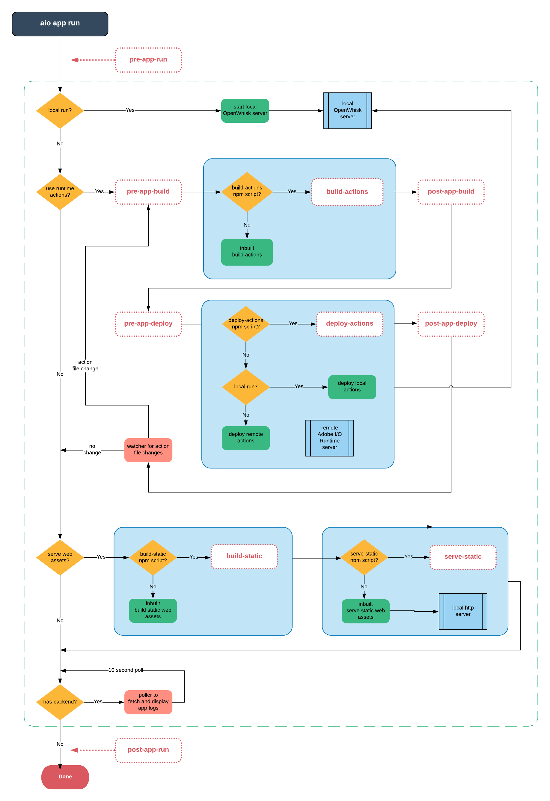
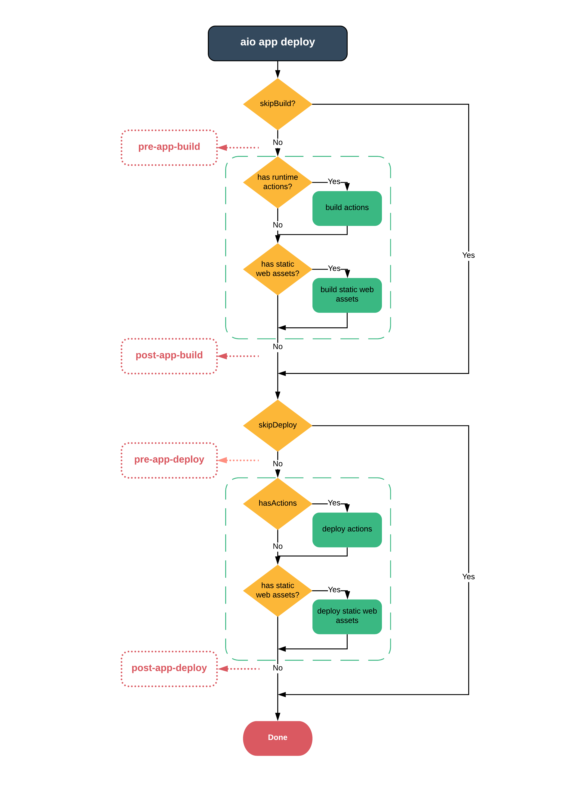

# Project Firefly application tooling lifecycle event hooks

Project Firefly applications created with [our CLI](https://github.com/adobe/aio-cli) are inherently npm packages.
This means they support many of the npm conveniences node developers expect.

`package.json` may include the following scripts which are triggered at various times while an app is being built, deployed and/or run.

## Sample hooks configuration

For example, pre and post hooks can be defined for the `run`, `build` and `deploy` commands in the package.json file of your app. For the `build` and `deploy` commands, you can specify build and deploy script substitutes as well.

`aio app run` supports:
```json
  "scripts": {
    "pre-app-run": "echo pre-app-run",
    "post-app-run": "echo post-app-run"
  }
  ```

`aio app build` supports:
```json
  "scripts": {
    "pre-app-build": "echo pre-app-build",
    "post-app-build": "echo post-app-build",
    "build-actions": "echo build-actions",
    "build-static": "echo build-static"
  }
  ```

`aio app deploy` supports:
```json
  "scripts": {
    "pre-app-build": "echo pre-app-build",
    "post-app-build": "echo post-app-build",
    "pre-app-deploy": "echo pre-app-deploy",
    "post-app-deploy": "echo post-app-deploy",
    "build-actions": "echo build-actions",
    "build-static": "echo build-static",
    "deploy-actions": "echo deploy-actions",
    "deploy-static": "echo deploy-static"
  }
  ```

## Use cases

`aio app run` **pre-app-run** and **post-app-run** hooks:
- manage additional local development tooling that is not managed by the out-of-the-box flow

`aio app build` **build-static** and **build-actions** hooks:
- build actions to include static files with the action zipfile (for templates like in server-side rendering)
- build the web assets with a different bundler and configuration, for example webpack

`aio app deploy` **deploy-static** and **deploy-actions** hooks:
- support additional deployment steps (e.g. deploy to multiple servers or locations)

## Hooks flow

The following diagram illustrates how your custom hooks will be executed within the application via the various commands:






# npm script hooks

Use of Project Firefly event hooks does not interfere with use of npm scripts, however you will need to use `npm run ..` to trigger them.
The only _default_ script that Firefly tooling calls is `test`
`aio app test -> npm test`, and in turn, npm calls `pretest` and `posttest` around your actual test script.

[How npm handles the "scripts" field](https://docs.npmjs.com/misc/scripts)
