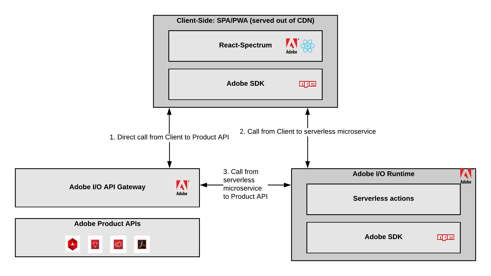

# Adobe Custom Applications - Architecture Overview

## Types of Adobe Custom Applications

An Adobe Custom Application is a serverless application extending [Adobe Product APIs](https://www.adobe.io/apis.html).
It can be of two kinds:

### Headless Applications

In that case, the application consists in a set of serverless actions or sequences deployed to Adobe's serverless platform called [Runtime](https://github.com/AdobeDocs/adobeio-runtime).

This kind of application would integrate well with a remote script or process invoking it, such as an [AEM Assets workflow](https://docs.adobe.com/content/help/en/experience-manager-65/assets/using/assets-workflow.html) or an [ACS activity](https://docs.adobe.com/content/help/en/campaign-standard/using/managing-processes-and-data/data-management-activities/external-api.html).

### Headful Applications

Here, the application is a full-fledged UI Single Page Application delivered out of a Content Delivery Network. It calls directly [Adobe Product APIs](https://www.adobe.io/apis.html) from the client when applicable, or from serverless actions or sequences deployed to Adobe Runtime, when there is the need to orchestrate the calls to [Adobe Product APIs](https://www.adobe.io/apis.html), Adobe Identity Management System, and/or 3rd party APIs.

## JAMStack: Anatomy of an Adobe Custom Application

Adobe Custom Applications that are full-fledged UI Singe Page Applications follow the [JAMStack Architecture](https://jamstack.org/).

The three main components of an Adobe Custom application are:

- [Adobe Product APIs](https://www.adobe.io/apis.html), exposed to external developers and consumers through Adobe I/O API Gateway.
- [Javascript-based SDK](https://github.com/adobe/aio-sdk) and serverless actions, sequences and APIs deployed to [Runtime](https://github.com/AdobeDocs/adobeio-runtime).
- Adobe's front-end framework called React-Spectrum, which applies [Adobe's Design System](https://spectrum.adobe.com/) to React-based components 

## SDK Components

### CLI

The [CLI](https://github.com/adobe/aio-cli) is one of the main touchpoints for Adobe Custom Applications developers. It is based on [oclif](https://oclif.io/), which is a popular framework to build extensible command line tools.
The CLI comes out-of-the-box with the following capabilities:

- [Authentication](https://github.com/adobe/aio-cli-plugin-auth) to Adobe's Identity Management System
- [Certificate management](https://github.com/adobe/aio-cli-plugin-certificate)
- [Configuration management](https://github.com/adobe/aio-cli-plugin-certificate)
- [Interactions](https://github.com/adobe/aio-cli-plugin-console) with [Adobe's Developers Console](https://console.adobe.io/)
- [Interactions](https://github.com/adobe/aio-cli-plugin-runtime) with [Adobe's serverless platform Runtime](https://github.com/AdobeDocs/adobeio-runtime)
- [Livecycle management](https://github.com/adobe/aio-cli-plugin-app) for [Adobe Custom Applications](https://github.com/AdobeDocs/adobe-custom-applications)

### Adobe Custom Applications Generators

The [generators](https://github.com/adobe/generator-aio-app) help developers to bootstrap their Adobe Custom Applications when using the [CLI](https://github.com/adobe/aio-cli).

Generators can help the developer to create:

- An headless application
- A full-fledged UI SPA that deploys into the [Experience Cloud Unified shell](http://experiencecloud.adobe.com/)
- [Runtime](https://github.com/AdobeDocs/adobeio-runtime) serverless actions extending specific [Adobe APIs](https://www.adobe.io/apis.html)

### SDK Libraries

Adobe Custom Applications framework provides also a variety of Javascript-based SDK libraries, which purpose is to increase the developer's velocity when building a custom application on top of Adobe APIs.

#### Main SDK library

The [main SDK library](https://github.com/adobe/aio-sdk) bundles smaller, reusable SDK libraries serving a variety of use-cases:

##### Integration with Adobe APIs

- The [Adobe Analytics](https://github.com/adobe/aio-lib-analytics) SDK library provides a client for [Adobe Analytics 2.0 API](https://adobedocs.github.io/analytics-2.0-apis/)
- The [Adobe Target](https://github.com/adobe/aio-lib-target) SDK library provides a client for [Adobe Target 1.0 API](https://developers.adobetarget.com/api/)
- The [Adobe Campaign Standard](https://github.com/adobe/aio-lib-campaign-standard) SDK library provides a client for [Adobe Campaign Standard API](https://docs.adobe.com/content/help/en/campaign-standard/using/working-with-apis/about-campaign-standard-apis/about-campaign-standard-apis.html)

##### Integration with Adobe's Identity Management System

The [Adobe IMS SDK library](https://github.com/adobe/aio-lib-core-ims) provides authentication management capabilities to Adobe's Identity Management System, for both following scenarios:

- [User-based (OAuth 2.0)](https://github.com/adobe/aio-lib-core-ims-oauth)
- [Technical account-based (JWT Bearer-token)](https://github.com/adobe/aio-lib-core-ims-jwt)

##### Integration with additional out-of-the-box services 

- The [Files SDK](https://github.com/adobe/aio-lib-files) provides a FileSystem-like abstraction on top of an out-of-the-box cloud storage to store large, temporary files
- The [State SDK](https://github.com/adobe/aio-lib-state) provides a State-like abstraction on top of an out-of-the-box cloud-based Key-Value store

##### Technical framework for developers

The [Core SDK library](https://github.com/adobe/aio-sdk-core) bundled into the [main SDK library](https://github.com/adobe/aio-sdk) provides a lower-level technical framework for developers. 
This framework must be used when contributing to the Adobe Custom Applications SDK. It is also recommended to use it when building an Adobe Custom Application.

#### Core SDK library

The [Core SDK library](https://github.com/adobe/aio-sdk-core) enables developers with the following technical capabilities.

##### Configuration

The [Configuration SDK library](https://github.com/adobe/aio-lib-core-config) allows management of persistent and environment variable configuration.

##### Logging

The [Logging SDK library](https://github.com/adobe/aio-lib-core-logging) provides a logger abstraction that can be used in [SDK libraries](https://github.com/adobe/aio-sdk) and serverless actions deployed to [Runtime](https://github.com/AdobeDocs/adobeio-runtime).

##### Errors

The [Errors SDK library](https://github.com/adobe/aio-lib-core-errors) is the base implementation for all errors thrown by the [SDK libraries](https://github.com/adobe/aio-sdk), and can be used by developers to manage their own errors.

### Token-Vending Machine

The [Token-Vending Machine](https://github.com/adobe/aio-tvm) is exposed as an out-of-the-box API deployed to [Runtime](https://github.com/AdobeDocs/adobeio-runtime).
It lets developers perform the following actions on behalf of their Adobe Custom Application credentials:

- Deploy the web assets of their Adobe Custom Application to the out-of-the-box CDN
- Use the out-of-the-box cloud storage through the [Files SDK](https://github.com/adobe/aio-lib-files)
- Use the out-of-the-box key-value store throught the [State SDK](https://github.com/adobe/aio-lib-state)

### Github Actions

(Coming soon)

