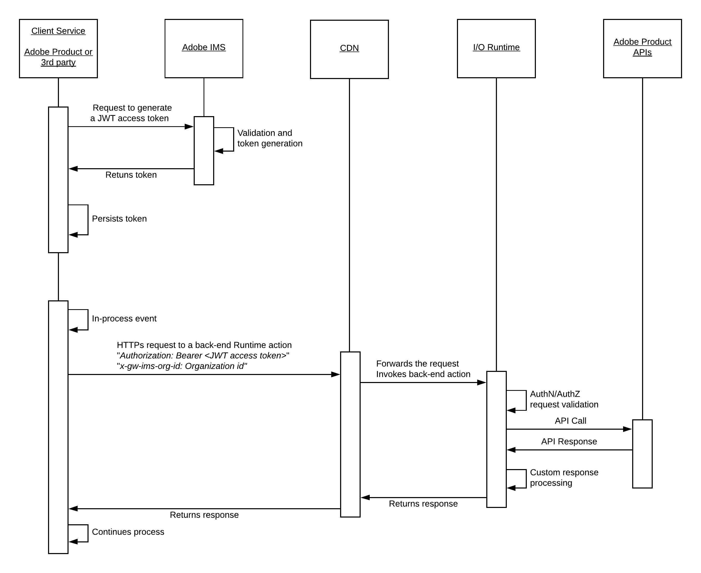
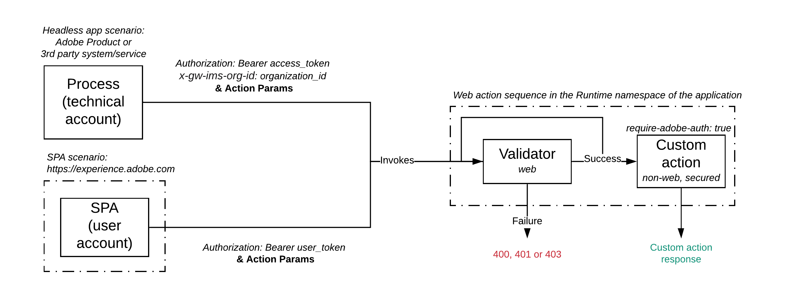

# Security Overview

## Context

Every application development project has its own security requirements. Even for seasoned developers, these critical requirements can lead to complex and time-consuming implementations with an inappropriate support at SDK and tools level.

Project Firefly [SDK](https://github.com/adobe/aio-sdk) and [CLI](https://github.com/adobe/aio-cli) are designed to fasten the implementation of the typical security requirements for cloud-native applications that deploy into Adobe's ecosystem.

The following sections will focus on specific aspects of the security for Firefly Applications.

## Securing the access to Firefly Applications

Any interaction with [Adobe Product APIs](https://www.adobe.io/apis.html) needs to be authenticated against Adobe Identity Management Services (IMS).
The [Understanding Authentication](understanding_authentication.md) guide is a good pre-read to get deeper preliminary insights on those services.

### Adobe IMS Support for Firefly Applications

Project Firefly [SDK](https://github.com/adobe/aio-sdk) and [CLI](https://github.com/adobe/aio-cli) help developers to [bootstrap applications](../getting_started/setup.md#bootstrapping-an-application) easily from application templates with `aio app init`. 
These includes templates for Runtime web actions, which integrate with the [Adobe Product APIs](https://www.adobe.io/apis.html) that can be extended with Project Firefly.
Any generated action is initialized with boilerplate code based on Project Firefly [SDK libraries](https://github.com/adobe/aio-sdk). Out-of-the box, the following steps are implemented:

- Validation that an Adobe IMS bearer token has been passed as Authorization header of the request which invoked this action
- Extraction of this bearer token for further usage in the action
- Instantiation of an API client, by using the appropriate product [SDK library](https://github.com/adobe/aio-sdk)
- Pre-configured API call, passing the required credentials, by using the same product [SDK library](https://github.com/adobe/aio-sdk)

### Headless Firefly Applications & Adobe IMS

Headless applications (e.g. Runtime actions or sequences) are usually executed as a back-end service invoked by another service - another Adobe product or a 3rd party system. For example:

- A custom asset worker integrating with AEM Assets as a Cloud Service
- An Adobe Campaign Standard Marketing Activity
- A 3rd party CRM workflow



A headless Firefly application requires to pass an Adobe IMS JWT access token in order to successfully call Adobe Product APIs. This token can be obtained within the [Developer Console](https://console.adobe.io/), by accessing the corresponding Firefly project and workspace.

However, its lifetime will be of 24 hours and it will expire afterwards, for obvious security reasons. A developer shouldn't have to manually refresh the token and update the application configuration every day.

If needed, the [IMS SDK Library](https://github.com/adobe/aio-lib-ims) can be used to automate the JWT access token generation and renewal directly from a custom Runtime action.

This SDK library also uses the [State SDK Library](https://github.com/adobe/aio-lib-state) behind the scenes in order to persist the token in Project Firefly's cloud storage on behalf of the developer between two invocations of the Runtime action.

### Firefly SPAs & Adobe IMS

These SPAs are business-to-employees custom applications that deploy into the [Experience Cloud Shell](https://experience.adobe.com) for the end-users of an Enterprise organization.


The SPA front-end interacts with Runtime web actions on specific events triggered at UI level.
In this scenario, the Experience Cloud Shell exposes a [client-side API](../reference_documentation/exc_app/overview.md), which can be used by the SPA to obtain the OAUth token generated for the logged-in Enterprise user. 
This token will be used by the back-end Runtime actions to call the [Adobe Product APIs](https://www.adobe.io/apis.html), which need to be integrated in this application.

SPAs bootstrapped from the [CLI](https://github.com/adobe/aio-cli) with `aio app init` automatically include a [React-Spectrum](https://react-spectrum.adobe.com/) based front-end that integrates with the Experience Cloud Shell [client-side API](../reference_documentation/exc_app/overview.md) and sends the user OAuth token from the client to the invoked Runtime actions.

### Authentication and Authorization
 
Every Firefly application gets integrated to an out-of-the-box Authentication and Authorization handling layer when deployed from the [CLI](https://github.com/adobe/aio-cli) with `aio app deploy`.

Whether the application is headless or an SPA, this extra-security layer will check that:

- There is a bearer token passed as Authorization header of the calling request
- This token is validated successfully against Adobe IMS for authentication
- This token is validated successfully against [Adobe Exchange](https://exchange.adobe.com/) for authorization

[Adobe Exchange](https://exchange.adobe.com/) is the distribution platform for Firefly applications. It will authorize a token if and only if:

- The invoked back-end action belongs to the Enterprise organization for which the token has been emitted
- The token is authorized to use the Adobe Product APIs, which are integrated in this Firefly application



The authentication and authorization validation is enabled by default for every Runtime action bootstrapped from the [CLI](https://github.com/adobe/aio-cli) with `aio app init` or `aio app add action`. This results in a specific `require-adobe-auth` action annotation set to true in the application `manifest.yml` file:

```
packages:
  helloworld:
    actions:
      hello:
        function: hello.js
        web: 'yes'
        annotations:
          require-adobe-auth: true
```

Upon deployment with `aio app deploy`, the manifest will be dynamically rewritten and replace the custom Runtime actions by Runtime sequences. The action definition above will by seamlessly rewritten into:

```
packages:
  helloworld:
    actions:
      __secured_hello:
        # non-web
        function: hello.js
    sequences:
      hello: 
        actions: '/adobeio/shared-validators/<validator>,helloworld/__secured_hello'
        web: 'yes'
```

The first action of the sequence is an out-of-the-box validator will automatically perform the checks against Adobe IMS and Adobe Exchange as described above. The custom action invocation will be chained if and only if the validation is successful.

A developer can still choose to unprotect a specific action by setting the `require-adobe-auth` annotation to `false` or by deleting it and redeploying the application with `aio app deploy` afterwards.
However, we strongly recommend to validate these changes against the application security requirements, and to keep the `require-adobe-auth` annotation value to `true` for any action integrating with one or several [Adobe Product APIs](https://www.adobe.io/apis.html).

**Note:** Project Firefly doesn't offer 3rd party API management at this stage, and similar authentication/authorization handling against 3rd party services should be managed by developers within their custom action codes for the time being.

## Securing Firefly Applications

### I/O Runtime Specific guidelines

The [security guidelines for I/O Runtime](https://github.com/AdobeDocs/adobeio-runtime/blob/master/guides/security_general.md) generally apply for the back-end actions of a Firefly application.

The guidelines below are specific to Firefly applications.

### Transport Security

Developers building Firefly applications on top of the out-of-the-box infrastructure will benefit from HTTPs connections between all the components that are part of this infrastructure.

We strongly recommend to ensure that every 3rd party system or service integrating with a Firefly application supports HTTPs connections as well.
 
### Tenant isolation

#### Runtime actions

#### SPA front-end

#### Files & State Services

#### Firefly Apps Service

## Summary

Project Firefly [SDK](https://github.com/adobe/aio-sdk) and [CLI](https://github.com/adobe/aio-cli) provide an out-of-the-box support for developers to implement secure Adobe-native applications that deploy into Project Firefly Serverless infrastructure and integrate with Adobe Product APIs.

Developers are able to build serverless processes and user-context aware applications with a minimal knowledge of Adobe's authentication and authorization mechanisms for the Enterprise and without having to worry about other key concepts such as tenant isolation.

