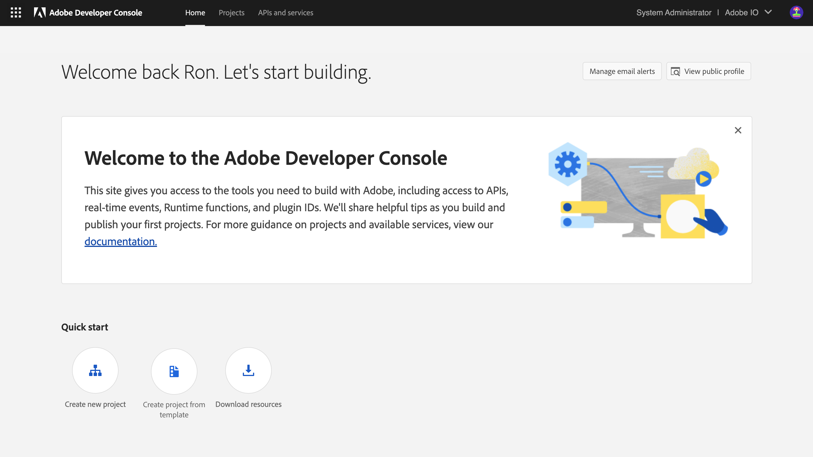
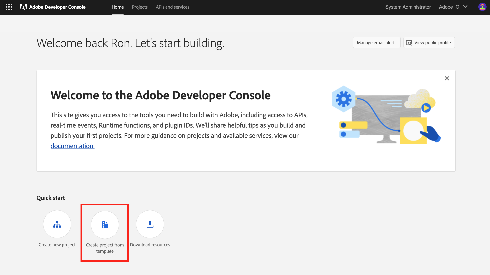
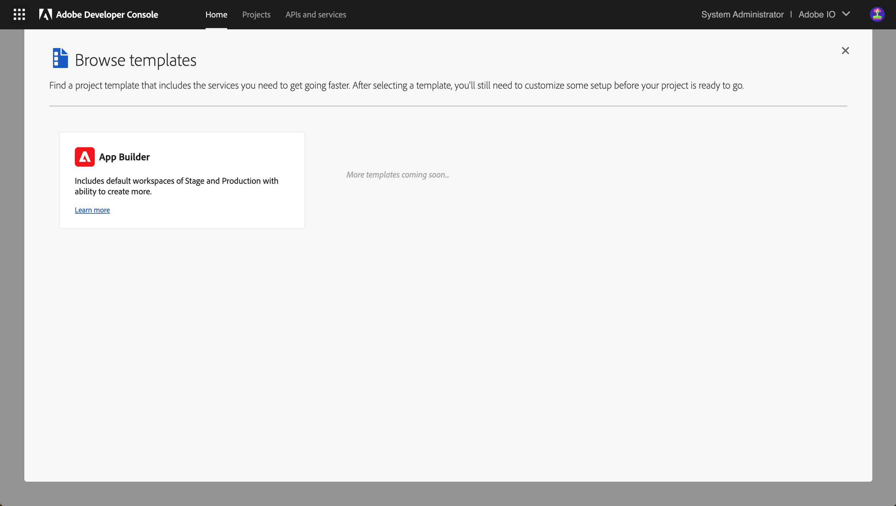
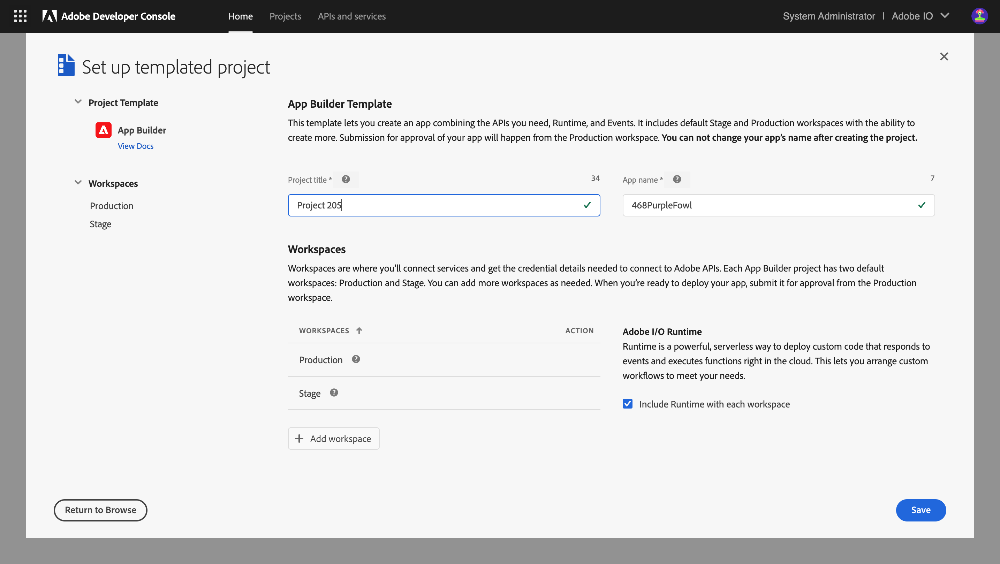
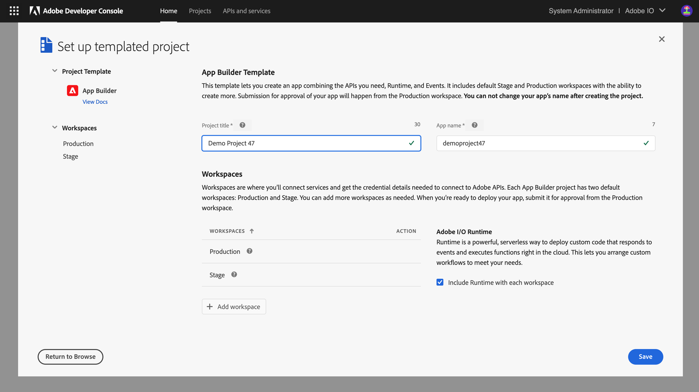
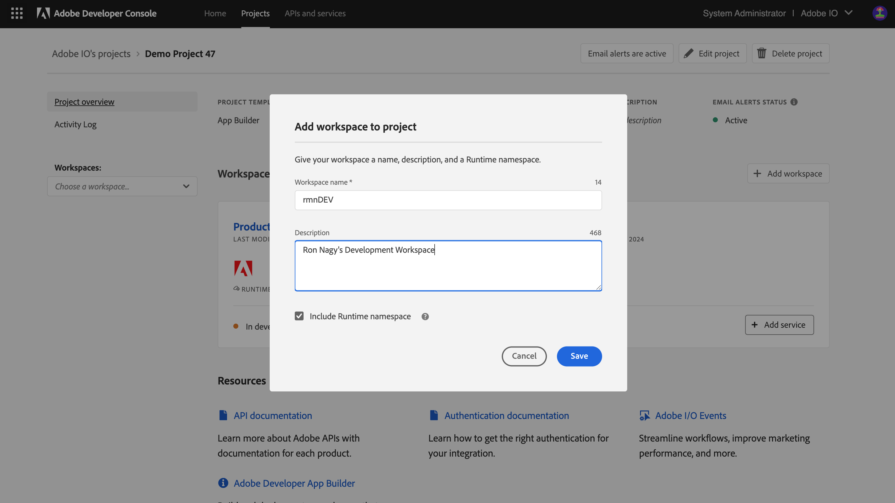
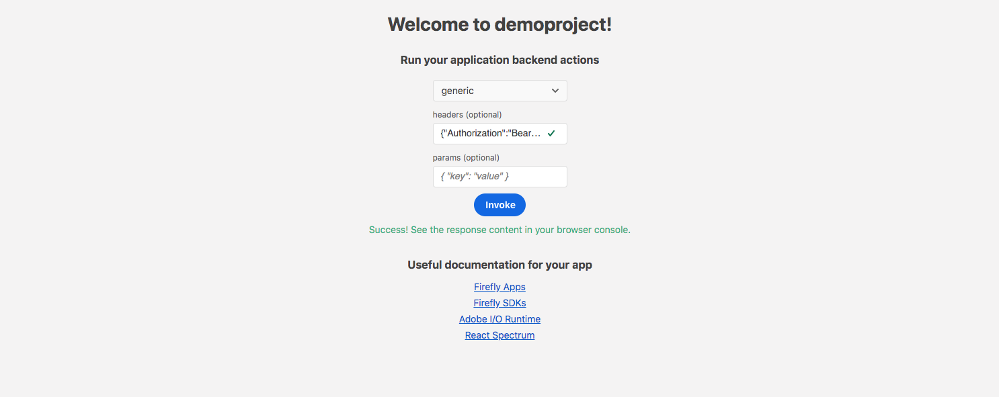

---
keywords:
  - App Builder
  - Extensibility
  - API Documentation
  - Developer Tooling
title: Creating your First App Builder Application
---

# Create your First App Builder Application

This is a guide through the steps to set up and develop an App Builder Application. Please refer to the [Common issues](#8-common-issues) section at the end of this page to resolve any problems you encounter.

## 1. Check your environment and tools

Make sure you have [access to App Builder](set-up.md#access-and-credentials), and that your [local environment and tooling](set-up.md#local-environment-setup) are up to date, as described in [Set up Access, Environment, and Tools](set-up.md). 

## 2. Create a new project on Developer Console

[Adobe Developer Console](https://developer.adobe.com/developer-console/) gives you access to [APIs](https://developer.adobe.com/developer-console/docs/guides/apis-and-services#apis), [SDKs](https://github.com/adobe/aio-sdk) and Developer tools to integrate and extend Adobe products. In App Builder, you will need access to [Adobe I/O Runtime](../runtime_getting_started/setup.md) credentials to deploy your application, and access to API credentials if you want to access Adobe APIs in your application.

Follow these instructions to set up your project:

1. Navigate to [Adobe Developer Console](https://developer.adobe.com/developer-console/).

   

2. Use the IMS Org Switcher in the upper right corner to select the IMS organization you want to use if it is not the current one.

   

3. Once you are in the correct organization, click on `Quick Start` and select the option `Create project from template` 
   > **Note:** if you don't see the `Create project from template` option, confirm that the IMS org is correct. If it is, you do not yet have access to App Builder: recheck the process in [Set up Access, Environment, and Tools](set-up.md).

4. Select `App Builder` from the list of templates.

   

5. Enter `Project Title` and `App Name` for your templated project.

   `Project Title` identifies the project in [Adobe Developer Console](https://developer.adobe.com/developer-console/) and the [CLI](https://github.com/adobe/aio-cli). We recommend changing the default title to a meaningful project title.

   `App Name` is the unique identifier for your application.

   > **Note:** once project setup is complete, `App Name` cannot be changed.

   The "Include Runtime with each workspace" checkbox is checked by default, so each workspace will be provisioned with a unique Adobe I/O Runtime namespace automatically. This allows Developers to work within their own unique Adobe I/O Runtimeenvironments.

   > **Note:** If you deselect the checkbox to decline automatic inclusion of Adobe I/O Runtime, you will need to enable it manually for each individual workspace. You cannot auto-add Adobe I/O Runtime to all workspaces once the initial setup is complete.

   You can manually remove Adobe I/O Runtime from individual workspaces later if it is not needed.

   Click `Save` when ready.

   

6. You should now see a new project generated with two default `Workspaces`.

   - Workspaces can be used to manage different deployment environments (Development, Q/A, Staging, Production) for your application and to provide individual working environments for each Developer on the project. The workspace is where you will connect services and get credential details needed to connect to Adobe APIs. Connected services may differ from workspace to workspace, and credentials used within each workspace are not shared across workspaces.

   - Every App Builder project has two default workspaces, `Production` and `Stage`. You can add more workspaces as needed. The `Production` workspace is used for submission and distribution workflows: when you’re ready to deploy your app, you will submit it for approval from the Production workspace.

     

7. Create a new workspace or select a workspace to add [APIs](https://developer.adobe.com/developer-console/docs/guides/services/#add-api) and [Events](https://developer.adobe.com/developer-console/docs/guides/services/services-add-event/) that you will need for your application.

    

To learn more about Adobe Developer Console, please refer to [Console Documentation](https://developer.adobe.com/developer-console/docs).

## 3. Sign in from the CLI

Once your project is set up in Adobe Developer Console, you can move on to your local environment. You can always go back to Adobe Developer Console to modify your project later.

1. Navigate to the Terminal and enter:

   ```bash
   aio login
   ```

2. A browser window should open, asking you to sign in with your Adobe ID. If the window does not automatically, copy/paste the URL shown in your browser to log in:

   ```bash
   $ aio login
   Visit this url to log in:
   https://aio-login.adobeioruntime.net/api/v1/web/default/applogin?xxxxxxxx
   ```

3. Once you've logged in, you can close the browser window and go back to Terminal. You will see your user token string displayed in the terminal. Tokens are automatically stored in the CLI configuration, so the CLI can use them to talk to Adobe Developer Console.

   ```bash
   eyJ4NXUiOixxxxxxxxxxxxxxxxxxx
   ```

4. Now you can use the CLI to start building App Builder Applications.

## 4. Bootstrap the new app using the CLI

Several flow options are listed below, because some Developers may not have access to Adobe Developer Console as entitled enterprise organization users but may still want to look at the project, and others may wish to import their credentials later.

Entitled enterprise organization users should start immediately below. Developers who plan to use a Console configuration file should start [here](#421-developer-with-a-console-config-file), and Developers without any credentials should start [here](#422-developer-without-any-credentials).

### 4.1 Option 1: Developer is logged in as enterprise organization user

Enterprise organization users may learn to initialize App Builder projects using extension points immediately below, or [skip here](#412-initialize-an-empty-project) to learn how to initialize empty projects.

#### 4.1.1 Initialize your project with Extension Points

1. In Terminal, navigate to where you want to initialize your project and type:

   ```bash
   aio app init <app_name>
   ```

   You will be prompted with a few questions about how you want your app to be boostrapped and configured.

2. Select the `Organization` you plan to use for the new App Builder Application. Navigate through the list to find the project and workspace you just created. If the list of organizations is long, start typing the project name to shorten it.

   ```bash
   $ aio app init helloworld
   Retrieving information from Adobe Developer Console..
   ? Select Org Adobe IO DEV
   ```

3. Once you have selected the org, project and workspace, select the product you would like to extend:

   ```bash
   ? Which extension point(s) do you with to implement?
   select components to include (Press <space> to select, <a> to toggle all, <i> to invert selection)
   ❯◉ DX Experience Cloud SPA v1
    ◉ DX Asset Compute Worker v1
   ```

4. Select the `Project` you plan to use for the new App Builder application. Navigate through the list to find the project you just created. If it is long, you can start typing to shorten it.

   ```bash
   ? Select Project Demo Project SAXU
   ```

5. When this selection is complete, the build process should initialize, with installation of npm dependencies.

   ```bash
   create package.json
   create app.config.yaml
   create .aio
   create README.md

   .......

   found 0 vulnerabilities

   ✔ App initialization finished!
   ```

6. Your project is initialized. Open the folder you just created to see the files that were generated:

   ```bash
   $ cd helloworld
   $ ls
   README.md  src  app.config.yaml  package-lock.json test
   e2e   node_modules  package.json  web-src
   ```

7. Note that you can add or remove extension points, back-end actions, SPA front-end, and Github workflows from your application later using the `aio app <add|delete> ext`, `aio app <add|delete> action`, `aio app <add|delete> web-assets` and `aio app <add|delete> ci` commands, respectively, in your application folder.

8. You can also install an App Builder template from the template registry: discover available templates in the App Builder template registry with the command:

   ```bash
   aio templates discover
   ```

9. Install desired templates with this command:

   ```bash
   aio templates install <npm package name>
   ```

    or this one:

   ```bash
   aio templates discover --interactive
   ```

    The template's npm package will be downloaded and extracted, and Developer Console resources such as services and workspaces will be created and configured based on the template's **install.yaml** configuration file. `npm install` will run in the background to install the npm package.

   This ends the section on how enterprise organization users can initialize App Builder projects using extension points. Please continue reading to explore alternative initialization protocols, or skip ahead to [Anatomy of an App Builder Application](#5-anatomy-of-an-app-builder-application).

#### 4.1.2 Initialize an empty project

1. In your Terminal, navigate to the place you want to initialize your project and type:

```bash
aio app init <app_name> --standalone-app
```

You will be prompted with a few questions about your boostrapping and configuration preferences for the app:

1. Select the `Organization`, `Project` and `Workspace` that you plan to use for the new application. Navigate through the list to find the project and workspace you just created. You can start typing to shorten long lists. When your selection is complete, the [CLI](https://github.com/adobe/aio-cli) will automatically download a `console.json` file containing all the credentials from your workspace to be used in your App Builder project.

```bash
$ aio app init helloworld
Retrieving information from Adobe Developer Console..
? Select Org Adobe IO DEV
? Select Project Demo Project SAXU
? Select Workspace saxudevenv
   create console.json
```

Next, you will be asked to select the app features you want to enable:

```bash
You are about to initialize the project 'demoproject'
Generating code in: /Users/sarahxxu/Dropbox/Development/helloworld
? Which Adobe I/O App features do you want to enable for this project?
select components to include (Press <space> to select, <a> to toggle all, <i> to invert selection)
❯◉ Actions: Deploy Runtime actions
 ◉ Events: Publish to Adobe I/O Events
 ◉ Web Assets: Deploy hosted static assets
 ◉ CI/CD: Include GitHub Actions based workflows for Build, Test and Deploy
```

Each option represents a feature you can enable for the App Builder application. Select one or more depending on the application you intend to build. For this tutorial, we recommend you select them all.

- **Actions: Deploy Runtime actions** adds the boilerplate for backend serverless actions on Adobe I/O Runtime
- **Events: Publish to Adobe I/O Events** adds the boilerplate for a serverless action that publishes [Custom I/O Events](https://developer.adobe.com/events/docs/guides/using/custom_events/)
- **Web Assets: Deploy hosted static assets** adds the boilerplate for front-end [React-Spectrum](https://react-spectrum.adobe.com/) Single-Page Applications (SPAs) and static assets
- **CI/CD: Include GitHub Actions based workflows for Build, Test and Deploy** adds the boilerplate for Github Actions that support the Continuous Integration/Continuous Delivery (CI/CD) process for the application

If you included `Actions` in your last selection, you will be asked to select one or more sample actions to be generated along with the new app:

```bash
? Which type of sample actions do you want to create?
select type of actions to generate (Press <space> to select, <a> to toggle all, <i> to invert selection)
❯◯ Adobe Analytics
 ◯ Adobe Experience Platform: Realtime Customer Profile
 ◉ Generic
```

These sample actions will help you get started quickly and illustrate best practices for integrating with [Adobe APIs](https://developer.adobe.com/developer-console/docs/guides/services/#add-api) using [SDK](https://github.com/adobe/aio-sdk) in your applications.
You may not see all the options listed below on your command line, because they are recommendations based on the credentials you added in the selected workspace. As with the preceding step, you can select any number of them:

- **Adobe Target**, including dependencies and examples of accessing the [Adobe Target API](https://developers.adobetarget.com/api/#admin-apis)
- **Adobe Analytics**, including dependencies and examples of accessing the [Adobe Analytics 2.0 API](https://adobedocs.github.io/analytics-2.0-apis/)
- **Adobe Audience Manager: Customer Data**, including dependencies and examples of accessing the [Adobe Audience Manager Customer Data API](https://docs.adobe.com/content/help/en/audience-manager/user-guide/api-and-sdk-code/api.html)
- **Adobe Campaign Standard**, including dependencies and examples of accessing the [Adobe Campaign Standard (ACS) API](https://docs.adobe.com/content/help/en/campaign-standard/using/working-with-apis/get-started-apis.html)
- **Adobe Experience Platform: Realtime Customer Profile**, including dependencies and examples of accessing the [Realtime Customer Profile API of Adobe Experience Platform](https://developer.adobe.com/experience-platform-apis/references/profile/)
- **Generic**, a generic back-end action with hello-world flow that can be reused and modified, for simple serverless computing, third-party API integration, and more

If you included `Web Assets` under Adobe I/O App features above, you will be given the choice to include the React Spectrum-based UI template or a raw HTML/JS UI template:

```bash
? Which type of UI do you want to add to your project? select template to generate (Use arrow keys)
❯ React Spectrum 3 UI
  Raw HTML/JS UI
```

- The `React Spectrum 3 UI` template adds a React-based UI with [React Spectrum](https://react-spectrum.adobe.com/) components included

- The `Raw HTML/JS UI` will add a raw HTML/JS/CSS UI with [Spectrum CSS](https://opensource.adobe.com/spectrum-css) styles included.
  
  Both templates come with boilerplate code needed to integrate your App Builder application with [Adobe Experience Cloud](../../guides/app_builder_guides/exc_app/aec-integration.md)

You will be asked to name the instances of selected sample actions, or keep the default names:

```bash
? We are about to create a new sample action that interacts with the Adobe Analytics API
how would you like to name this action? analytics
? We are about to create a new sample action that interacts with the Adobe Experience Platform: Realtime Customer Profile
how would you like to name this action? customer-profile
? We are about to create a new sample action that showcases how to access an external API
how would you like to name this action? (generic)
```

When this selection is complete, you should see the build process kicking off with necessary npm dependencies are getting installed.

```bash
create package.json
create app.config.yaml
create .aio
create README.md

.......

found 0 vulnerabilities

✔ App initialization finished!
```

Your project is initialized. Open the folder you just created to see the files that were generated:

```bash
$ cd helloworld
$ ls
README.md  console.json  app.config.yaml  package-lock.json test
actions   e2e   node_modules  package.json  web-src
```

Note that you can add or remove back-end actions and SPA front-end or Github workflows from your application later using the `aio app <add|delete> action`, `aio app <add|delete> web-assets` and `aio app <add|delete> ci` commands, respectively, in your application folder.

This ends the section on how enterprise organization users can initialize an empty project. Please continue reading to explore initialization protocols for users who are not members of an enterprise organization, or skip ahead to [Anatomy of an App Builder Application](#5-anatomy-of-an-App-Builder-Application).

### 4.2 Developer is not Logged in as enterprise organization user

#### 4.2.1 Developer with a Console config file

This flow is intended for Developers who:

- Do not have access to Adobe Developer Console as entitled enterprise organization users, probably due to permission issues, but

- Can get credentials that are tied to an App Builder workspace from an entitled enterprise organization administrator or Developer

For this flow to work, the Developer should ask someone with access to set up a project and a workspace following the instructions in the preceding sections. With the workspace correctly set up, credentials can downloaded by authorized Adobe Developer Console users through the `Download all` button in Workspace overview.


1. In Terminal, navigate to the place where you want to initialize your project and type:

   ```bash
   aio app init <app_name> --import <path_to_config_file>
   ```

2. Select project configuration options as in the preceding section

3. When your project is initialized, open the folder you just created to seethe files generated:

   ```bash
   $ cd helloworld
   $ ls
   README.md  e2e   node_modules  package.json  web-src
   actions   app.config.yaml  package-lock.json test
   ```

4. When you generate a project using a downloaded configuration file without logging into Adobe Developer Console on your CLI, everything should be the same.
   Adobe uses the values from the downloaded file to pre-populate values in your `.env` and `.aio`. The only difference you will notice is the missing `config.json` file, because that's the file you used to generate this project.

   This ends the tutorial for Developers initializing their apps from a Console config file. you may review the next section on Developers without access or credentials, or scroll down to "Anatomy of an App Builder Application" below.

#### 4.2.2 Developer without any credentials

This flow is intended for Developers who have no access or credentials but still want to look at the code.

1. In your Terminal, navigate to the place where you want to initialize your project and type:

   ```bash
   aio app init <app_name> -y
   ```

   The `-y` flag allows user to skip all questions and generates a sample project with only the `generic` sample action.

2. You should see similar files generated, but none of the config files will be pre-populated.

   ```bash
   $ cd helloworld
   $ ls
   README.md  e2e   node_modules  package.json  web-src
   actions   app.config.yaml  package-lock.json test
   ```

3. You will not be able to run or deploy your application by default because no credential was provided.

## 5. Anatomy of an App Builder Application

Now that your project is initialized, you can open it in your favorite integrated development environment (IDE); we recommend [VSCode](https://code.visualstudio.com/). If you have enabled the Shell command, open the project by entering `code <app-name>`; otherwise open VSCode -> Open... -> select app folder.

You should see these folders and files in your project:

1. `src`: Instead of one folder for all `actions` and all `web-src`, you will see individual folders under `src` for each extension point you selected, for instance, a `dx-excshell-1` folder containing Experience Cloud SPA actions and front-end resources.
   - In each folder, you should be able to see both the actions and the front-end code. You should also see `ext.config.yaml`, a file that contains all the action and extension configuration for the extension point at which it's located. Individual configuration allows for more flexibility in defining and managing individual extension points. Note that this file is also imported to `app.config.yaml` , the master config file.
   - The action definition in this file shoud adhere to the [OpenWhisk deployment YAML specification](https://github.com/apache/openwhisk-wskdeploy/tree/master/specification#package-specification).
   - Once defined, the CLI uses this file to deploy or redeploy actions. You might see values like `$CUSTOMER_PROFILE_TENANT` listed under environments in this file. These are environment variables you can define in your `.env` file.
   - The generated actions use CommonJS syntax: ES Module syntax is not supported by App Builder.
2. **`**test` is for back-end action unit and integration tests.
3. `e2e` is for  end-to-end tests.
4. `app.config.yaml` is the master configuration file. It follows the same principle as the individual `ext.config.yaml`, and compiles these individual file into one comprehensive config upon application build.
5. `lib`  contains all the shared utility actions across different extension points.
6. `package.json` describes project definition and various metadata relevant to the project. It sends information to npm that allows npm to identify the project and handle its dependencies. Learn more [here](https://nodejs.org/en/learn/getting-started/an-introduction-to-the-npm-package-manager#packages).
7. `.aio` contains config variables that are useful for the CLI to facilitate the app, for example, supported API services.
   - This file should not be committed to a source code versioning system.
   - You can manually update the file or use the `aio config` commands to add or to remove configurations. Learn more about the [Config Plugin](https://github.com/adobe/aio-cli-plugin-config).
8. `.env`contains environment variables that are useful for the app during development, for example Adobe I/O Runtime credentials and Adobe Product API key, secrets, and other tenant specifics.
   - The environment variables defined here can be used in the application, for example in `ext.config.yaml` and`app.config.yaml`. If you've set up credentials for the selected workspaces, you should be able to see some of those values, like `AIO_runtime_auth` and `AIO_runtime_namespace`, prepopulated upon initialization.
   - This file is automatically included in `.gitignore`. Because of the credentials and secrets it contains, it is not intended be shared.

## 6. Develop the application

### 6.1 Run the application

To run the application locally, use one of the following commands:

```bash
aio app dev
```

This is the preferred method for local development. It will launch the application locally with support for these features:

- Web actions/sequences served via http
- Hot reload of actions on code change
- Hot reload of web source on code change
- Debug web browser JavaScript code in Visual Studio Code
- Debug web actions/sequences in Visual Studio Code
- Require-adobe-auth web annotation support
- Logging to console

```bash
aio app run
```

To test functionality not supported by `aio app dev`, you can use this command to deploy actions to Adobe I/O Runtime while running the UI on your local machine.

```bash
aio app run --local
```

This deprecated command will deploy actions to a local [OpenWhisk](https://openwhisk.apache.org/) instance, which the CLI will automatically download and install. The SPA will then run on the local machine. Note that users of Apple Silicon processors will encounter issues with this command, and should use `aio app dev` instead.

#### 6.2 Accept the certificate (on first use)

If you are using this application for the first time, you will see a message similar to:

```bash
success: generated certificate
A self signed development certificate has been generated, you will need to accept it in your browser in order to use it.
Waiting for the certificate to be accepted.... timed out
```

This message appears because Adobe uses a development SSL certificate for secure communication. Understand more about the purpose of this certificate [here](https://letsencrypt.org/docs/certificates-for-localhost/). If you see this message, please navigate to `https://localhost:9080`, where you should see a screen like this:


Click on `Advanced`. The next screen will vary from browser to browser, but should offer an option to `Proceed to localhost (unsafe)` which accepts the certificate.


You may need to exit the current process and run `aio app run` again.

#### 6.3 Proceed to the application on localhost

Users who accepted the certificate in the past should see the process shown below running in Teminal, with backend actions deployed to Adobe I/O Runtime or to the local OpenWhisk instance if the `--local` option was used.

```bash
$ aio app run
> Local Dev Server
ℹ using remote actions
ℹ redeploying actions..
......
ℹ writing credentials to tmp wskdebug config '.wskdebug.props.tmp'..
ℹ injecting backend urls into frontend config
ℹ starting local frontend server ..
ℹ local frontend server running at https://localhost:9080
ℹ setting up vscode debug configuration files..
ℹ press CTRL+C to terminate dev environment
```

Two URLs are displayed:

```bash
To view your local application:
  -> https://localhost:9080
To view your deployed application in the Experience Cloud shell:
  -> https://experience.adobe.com/?devMode=true#/custom-apps/?localDevUrl=https://localhost:9080
```

The first URL shows your standalone application on localhost (by default; the port is configurable). The second  places your local application in the context of the [Experience Cloud UI](../../guides/app_builder_guides/exc_app/aec-integration.md) for preview.

While most changes in your code are updated in real time when the application is running, the `.env` file is not among them. Running the application depends on `.env` file to provide necessary credentials, so the file is unmodifiable while the app is running. When your app is running, the `.env` file is backed up, and a new one is written with specific values. When you exit the process, the original `.env` is restored.

As indicated in the message, when you are done, you can press `CTRL+C` to terminate the local development environment.

To have the application run completely locally, so the actions run on a locally deployed standalone version of OpenWhisk instead of on Adobe I/O Runtime, use `aio app run --local`. Some additional dependencies are required if you have not installed them already; see  [Optional tool](set-up.md#optional-tool) section in [Set Up Access, Environment, and Tools](set-up.md) to set them up manually.

Usually, we recommend running your applications with deployed Adobe I/O Runtime actions, since your application should run on Adobe I/O Runtimein production. However, if you need to build complex actions or sequencing, the `--local` flag is helpful to debug the application locally. Please see the "Debugging the Application"" section below for more information.

### 6.4 Try the sample application

When you access `https://localhost:9080`, you should see the sample application deployed:


This simple SPA contains links to documentation and allows you to run your back-end actions for tests. Use the selection box to pick the action you'd like to invoke. You can also pass request headers and parameters from the corresponding input fields in the SPA UI.

All actions require `Authorization` and `x-gw-ims-org-id` in the headers by default. In your project code, navigating to `app.config.yaml`, will reveal that a `require-adobe-auth` annotation is set to `true` for all sample actions. Having this flag enabled enforces that a valid user token be used to invoke this action. We recommend having this enabled for security reasons. You can learn more about this in our [Security Overview](../../guides/app_builder_guides/security/index.md).

1. With the `require-adobe-auth` annotation set to `true`, pass in a valid user token and corresponding organization ID to invoke the action. You can retrieve the token from your CLI by typing in `aio login`, and the org ID (look for `some_hash@AdobeOrg`) from the workspace details on Adobe Developer Console or from the URL of [Adobe Admin Console](https://adminconsole.adobe.com). Be sure to select the correct organization in the top right corner.
   You can also list all the organizations you belong to and their org ID from your CLI by typing in `aio console org list`.

2. Put the token and org ID into this format:
    `{"Authorization":"Bearer <token_from_cli>","x-gw-ims-org-id":"<org-id-from-console>"}`

3. Go back to your browser and put the joined value in the `headers` input field. You should now be able to invoke actions that do not require additional parameters (like `generic`).
   

**Note:** If you open your application in the [Experience Cloud Shell](http://experience.adobe.com/) using the second link provided by the CLI, your Experience Cloud Shell user token will automatically be available to the SPA UI and passed to the underlying Adobe I/O Runtime actions of your application.
This is a very useful feature of the SPA UI template, which integrates with the [client-side API](../../guides/app_builder_guides/exc_app/aec-integration.md) of Experience Cloud Shell.

The other sample actions require invoking additional paramaters. For example, if you try to invoke `analytics` with only the authorization header, you will see an error similar to `"error": "missing parameter(s) 'apiKey,companyId'"`. This is because these sample actions use Adobe API that requires those parameters before the actions can be invoked.

1. Each sample action requires different parameters: some need only an API key, some also requires the tenant ID or other information. Go into the action code in the `actions` folder to learn more.
2. The API key is often required. If you have the service added in the current workspace, it is easily retrievable in the `.env` or `console.json` file.
3. Other fields, like tenant ID for Target and Campaign Standard or company ID for Adobe Analytics, are not accessible directly through the CLI. Please refer to product documentation to locate these value for your Organization.
4. Once you have these parameters on hand, construct them in the expected format `{"key": "value"}` and paste into the parameters. You should now be able to invoke the corresponding actions.

### 6.5 Debug the application

The CLI has a _dev_ command (`aio app dev`) that supports debugging. You can develop and debug Adobe Runtime actions in your favorite IDE or debugger with a fast feedback loop. It features:

- Step-through debugging with lengthy timeouts - previously you could stop at a breakpoint for just 60 seconds
- LiveReload for web actions
- Instant logging output to Terminal

Please visit the [Debugging App Builder Apps](../../resources/debugging/index.md) Code Lab to set up your local environment and go through step-by-step instructions.

If the local development is run (`aio app run`), the actions you call are run directly on Adobe I/O Runtime. When you use `aio app dev`, the actions are run or debugged directly in Node. In both cases your front end is run on localhost.

> **Note:** `aio app dev` does not fully emulate the Adobe I/O Runtime environment. When running locally, your action code executes *in process* within Node.js and is not completely isolated. As a result, some values from `process.env` may be accessible, but this will not be the case in the deployed environment. **Do not write action code that relies on environment variables from your `.env` file being available at runtime.** Instead, use `.env` to populate action inputs (as defined in your `ext.config.yaml`), and access these values as parameters passed to your action during invocation.

### 6.4 Retrieve application logs

#### 6.4.1 Dev

When using `aio app dev` logs are output immediately to the terminal and not kept in an activation record.

#### 6.4.2 Run or deploy

To see application logs after running `aio app run` or after running your deployed app (`aio app deploy`), use the command `aio app logs`. By default, only the logs of the latest activation are fetched. If you want to see a more extensive list of logs, use the `--limit` flag to define the number of recent activations to be fetched.

Read more at [Managing Application Logs](../../guides/app_builder_guides/application_logging/logging.md).

### 6.5 Test the application

The bootstrapped application comes with sample implementations for both unit and end-to-end tests. You can execute these tests locally using `aio app test` or `aio app test -e`, which will run the unit and end-to-end tests, respectively, against the bootstrapped codebase.

As you modify and extend the application code, you will need to update the tests accordingly.

Adobe uses [jestJS](https://jestjs.io/) for the unit tests of the CLI, SDK, and bootstrapped application. You can change the implementation to your preferred framework.

[CI/CD for App Builder Applications](../../guides/app_builder_guides/deployment/cicd-for-app-builder-apps.md) explains how you can also execute these tests in the context of a CI/CD pipeline.

## 7. Deploy the application

Once the application is in a good shape, it can be fully deployed to your development workspace. This requires a single command:

```bash
aio app deploy
```

The command may take a minute or two as the CLI is building and deploying behind the scenes:

- The actions defined in `app.config.yaml` into Adobe I/O Runtime
- The front-end built files and assets into the Content Delivery Network supplied with App Builder

The CLI output details this process:

```bash
> Build actions
ℹ dist/actions/analytics.zip
...

> Build static files
ℹ dist/web-src-prod/index.html
...

> Deploy actions
ℹ Info: Deploying package [demoproject-0.0.1]...
...

> Deploy static files
ℹ index.html

...

Your deployed actions:
  -> demoproject-0.0.1/__secured_analytics
...

To view your deployed application:
  -> https://<namespace>.adobeio-static.net/<packagename>/index.html
To view your deployed application in the Experience Cloud shell:
  -> https://experience.adobe.com/?devMode=true#/custom-apps/?localDevUrl=https://<namespace>.adobeio-static.net/<packagename>/index.html
Well done, your app is now online 🏄
```

Note the last section of the output, `To view your deployed application`, shows two urls of the app by default, for the CDN host and Experience Cloud Shell. In the latter case, The URL format of the app should follow `https://experience.adobe.com/?devMode=true#/custom-apps/?localDevUrl=<your-app-url>`.

You can undeploy your app with `aio app undeploy`. To learn more about deployment, please refer to the [Deployment Overview](../../guides/app_builder_guides/deployment/deployment.md). To automate your build, deploy, and build process with out-of-the-box CI/CD GitHub actions, please refer to [CI/CD for App Builder Applications](../../guides/app_builder_guides/deployment/cicd-for-app-builder-apps.md).

## 8. Common issues

1. Please first make sure your CLI and all plugins are up to date. For the CLI, you can check the version through `aio -v` and compare it with the `npm show @adobe/aio-cli version`. If your CLI is outdated, update it by running `npm install -g @adobe/aio-cli`. After that, you can simply run `aio update` to ensure all core plugins are updated.

2. If you see a validation error, you did not pass in an authorization header to an action that expected one. See `Trying the Sample App` section above, or learn more about this in our [Security Overview](../../guides/app_builder_guides/security/index.md).

   ```bash
   {"error": "cannot validate token, reason: missing authorization header"}
   ```

3. If you see a missing parameter error, you did not pass in required parameters to an action that expected one. See `Trying the Sample App` section above.

   ```bash
   {"error": "missing parameter(s) 'apiKey,companyId'"}`
   ```

## Next steps

For more code examples and use cases, please refer to the [Resources page](../../resources/index.md).

Continue the tutorial at [Publishing Your First App Builder Application](publish-app.md)
