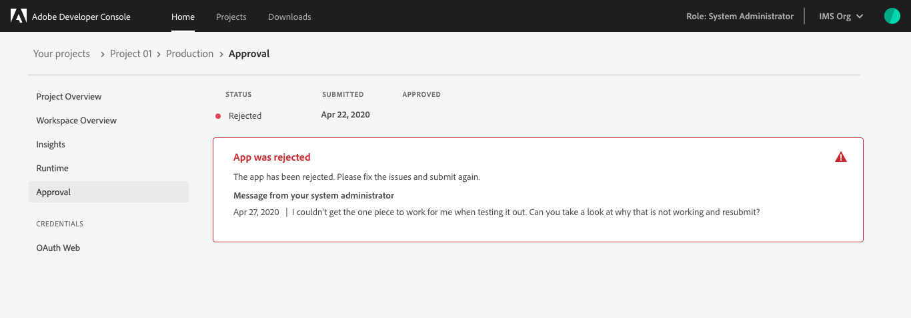
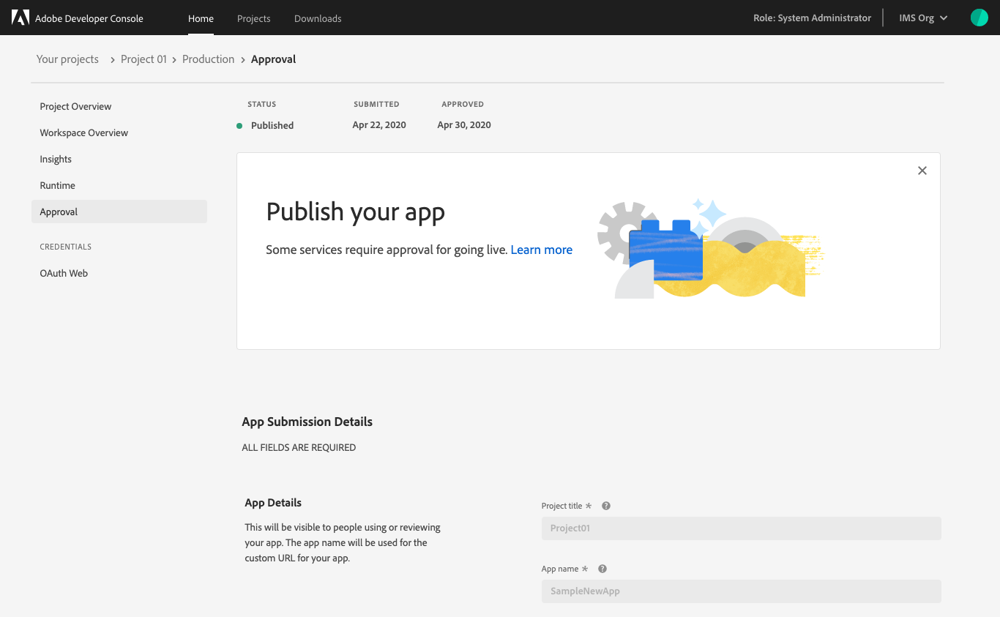
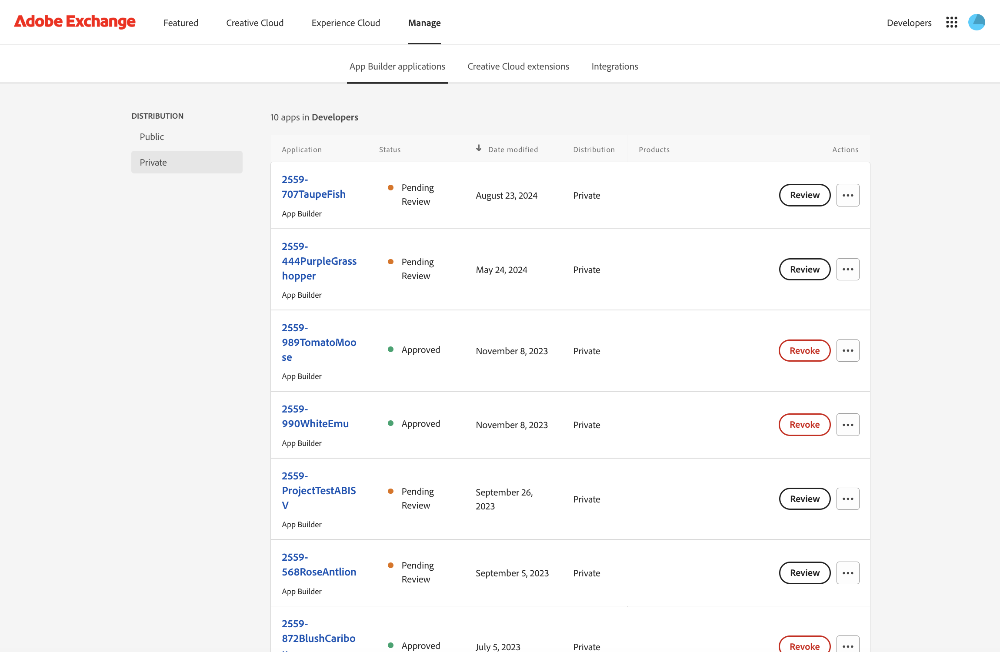
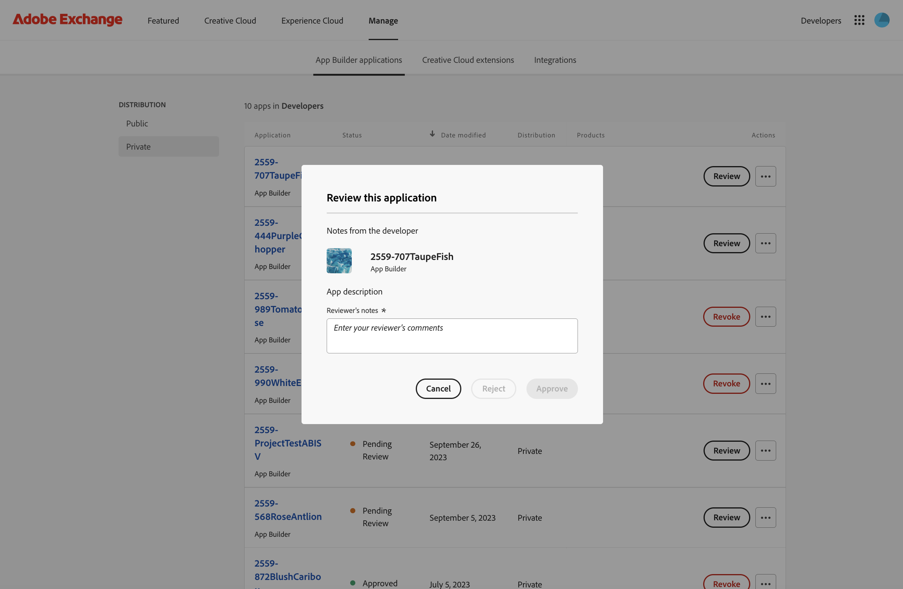
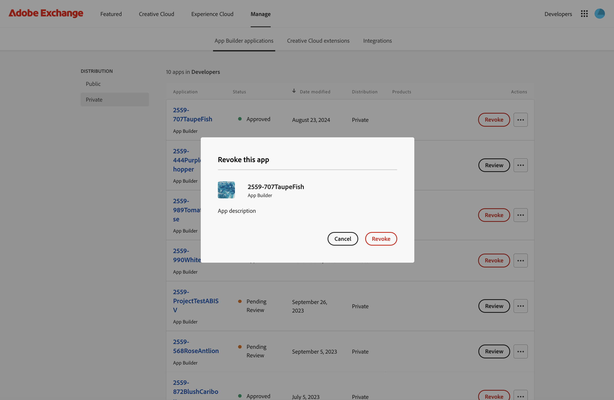

---
keywords:
  - Adobe I/O
  - Extensibility
  - API Documentation
  - Developer Tooling
title: Publishing Your First App Builder Application
---

# Publishing Your First App Builder Application

This tutorial will guide you through the three steps needed to publish your first App Builder Single-Page Application (SPA):

1. Submit for publishing approval through [Adobe Developer Console](https://developer.adobe.com/developer-console/)
2. Review and approve the app in [My Exchange](https://exchange.adobe.com/my-exchange.html)
3. Check your app at [Adobe Experience Cloud](https://experience.adobe.com)

## Project approvals (Console part)

Once you have completed development on your project and deployed your app in the Production workspace, it is ready for approval. 

Projects built using the App Builder template are built by an organization its own use. Therefore, App Builder applications require approval by the enterprise organization administrator only. 

### App Builder applications approval process

Once you have completed development on an App Builder application, you can submit it to your administrators for review and approval.

The final app is based on the Production workspace, so it is important to make sure that the it contains all the necessary APIs, Events, and Runtime code before submitting for approval.

To begin the approval process, navigate to the Production workspace and select **Submit for approval** in the top-right corner of the screen or **Approval** in the left navigation.

On the Approval screen you will be able to fill out the **App Submission Details** form.

These details will be visible to people who use your app and administrators who review your application. Once the form is completed, select **Submit** to begin the approval process.

You will be returned to the Approval screen, where the Status of your application should now be "In Review."

Following a review by your organization administrators, your application will either be approved and published, or rejected. If it is rejected, your Admin will be able to include a note telling you what went wrong so you can fix the error and resubmit.

### Published app

Once your application has been submitted for approval, the Admin can see it pending for review in Adobe Exchange. The next section will describe Admin approval flow from My Exchange. From Console side, once an application has been approved, its Status will be updated to Published and the application will be available for use by employees within your enterprise organization.

## Administrator review of your app (MyExchange part)

Once an application has been submitted for approval, your organization's Administrators will see it in My Exchange -> Experience Cloud Apps, and you will see your submitted apps under Pending Review status.

The reviewer can review this app and approve it or reject it. If the application is rejected, your admin will be able to include a note telling you what went wrong, so you can fix the error and resubmit.

After the app is approved, you will see it in the Approved section. The reviewer can also unpublish the app, requiring the app owner to resubmit it for review and approval.

## Check your published app at Experience Cloud

Once the reviewer has approved your application, you will be notified by email and your app will appear at Adobe Experience Cloud:

Click on `App Builder Apps` to discover all the applications published for your organization.

# Publishing your headless App Builder app

The `App Builder Apps` Adobe Experience Cloud lists only App Builder SPAs. If you publish a headless app, please refer to our Code Lab [Headless Apps with App Builder](../../resources/barcode-reader/index.md).

We may add other discoverability methods for published headless apps in future App Builder releases.

## Next steps

For more code examples and use cases, please refer to the [Resources](../../resources/index.md) page.

To review troubleshooting methods and complete this tutorial, continue to the [Troubleshooting Common Issues](troubleshoot.md) page.
