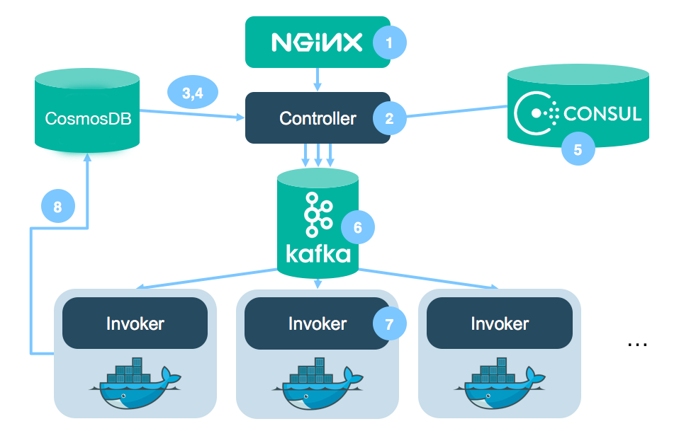

```yaml
keywords:
  - [need keywords]
title: How I/O Runtime works
```

# How Adobe I/O Runtime Works

Adobe I/O Runtime is based on the open source Apache OpenWhisk platform, and uses the OpenWhisk architecture to provide function-as-a-service. Here is a high-level look at the architecture:


The figure shows how Runtime (via OpenWhisk) is set up to respond to events and direct invocations. Whether the event comes from an external or internal source, it is associated with a trigger, which invokes an action according to any rules that are applied. Actions can also be invoked directly through the Runtime (OpenWhisk) CLI or the REST API.

Actions in Adobe I/O Runtime are written in JavaScript/Node.js. When Runtime receives a trigger, it instantiates and executes the associated action; the more triggers Runtime receives, the more actions it executes. Actions may be chained into sequences without adding code, by piping the output of one action to the input of the next.

Once an action is complete, its instantiation is disposed, so there’s no need to maintain state between actions. And since code isn’t maintained in memory between instantiations, there’s no cost while the code isn’t computing. This makes Runtime very economical for the app developer, and also inherently scalable: there’s no limit to the number of actions that can be invoked, and the actions invoked always correspond to the trigger rate. 

Compare this approach to traditional long-running VMs or containers, which need to be architected for resiliency by provisioning multiple VMs or containers running in parallel to take over if a VM or container fails. Such architectures incur the costs of continuous uptime, and require expertise and dedicated resources to design and configure them properly and keep them running.

## The process in detail

Here, we'll trace the process from an event to the completed action executed in response. OpenWhisk (and therefore Runtime) is built on well-established open-source tools such as Nginx, Docker, Kafka, and CosmosDB, assembled into a seamless pipeline to provide serverless event-based processing.

### Start with an action

First, we need an action against which to trigger an event. Actions are functions, so a simple JavaScript function will do:

```js
function main() {
  console.log('Hello World');
  return { hello: 'world' };
}
```

Saved as `hello.js`, this function will print "Hello World" to stdout and return a JSON object containing the key-value pair "hello: world".

The function is uploaded to Runtime as an action by this command in the CLI:

`aio rt:action:create helloAction <path>/hello.js`

Now that the action is created, it can be invoked by an HTTP call or associated with a trigger. It can also be invoked directly through the CLI:

`aio rt:action:invoke helloAction --result`

### Trace the process

An action has been created and invoked; now it can be processed, as an HTTP request. The Runtime (OpenWhisk) system is a completely HTTP-based open REST API, so the invocation sent in the CLI is translated into an HTTP request against Runtime. The command translates roughly into this POST:

```
POST /api/v1/namespaces/$userNamespace/actions/helloAction
Host: $openwhiskEndpoint
```

Note the `$userNamespace` variable. Runtime requests require access to the same namespace in which the action was created. When users are configured for Runtime accounts, they are given their own personal namespaces. 



*Internal process flow*

#### Receiving: nginx

[Nginx](https://www.nginx.com/) is a reverse proxy and HTTP server. The OpenWhisk architecture uses it to terminal SSL and forward the HTTP request to the next component in the processing loop.

#### Interpreting: the Controller

The Controller is the core component of I/O Runtime. It serves as the interface for everything a user can do. It is an implementation of the actual REST API, written in the [Scala](https://www.scala-lang.org/) programming language, and built on the [Akka](https://akka.io/ "Akka runtime") runtime environment and the [Spray](https://spray.readthedocs.io/en/latest/introduction/what-is-spray.html) REST/HTTP toolkit.

The Controller receives HTTP requests from nginx and interprets them. The results may be a [CRUD](https://en.wikipedia.org/wiki/Create,_read,_update_and_delete) requests or direct invocations of an action. In this example, the Controller reads an HTTP POST request to an existing action as an invocation of that action, and moves to the next step.

#### Permitting: CosmosDB

Now the Controller authenticates the user and determines authorization, by checking credentials in a CosmosDB database called **subjects.** If the account is valid, the permissions correct, and the action in a namespace owned by the user, the Controller  retrieves the action itself.

#### Retrieving: CosmosDB

CosmosDB stores user credentials and also the code for the actions themselves. So, after the Controller has determined user permissions by its first call to CosmosDB, it calls CosmosDB again, to a database called **whisks.** CosmosDB returns the code for the action, so the Controller can take the next step: queueing the action for processing.

#### Kafka: Managing Event Queues

Kafka is a critical component in the Adobe I/O Runtime architecture, responsible for managing event queues and ensuring reliable communication between system components. It acts as the backbone for asynchronous processing, enabling scalability and fault tolerance.

1. **Event Queueing**: Kafka serves as the intermediary for queuing events between the Controller and the Invoker. When the Controller receives an action invocation request, it places the request in a Kafka topic for processing.

2. **Decoupling Components**: By using Kafka, the architecture decouples the Controller from the Invoker, allowing them to scale independently. This ensures that high volumes of requests can be handled without bottlenecks.

3. **Topic Management**: Each namespace or action may have its own Kafka topic, ensuring isolation and efficient processing. Kafka topics are configured to handle retries and ensure message delivery.

4. **Fault Tolerance**: Kafka's distributed nature ensures that messages are not lost, even in the event of a system failure. This guarantees reliable execution of actions.

5. **Monitoring and Metrics**: Kafka provides metrics for monitoring queue lengths, processing times, and throughput, helping developers optimize their applications and identify bottlenecks.

By leveraging Kafka, Adobe I/O Runtime ensures robust, scalable, and efficient event-driven processing.

#### Invoker: Executing the Action

The Invoker is the component responsible for executing actions in Adobe I/O Runtime. Once the Controller queues an action for processing, the Invoker retrieves it and performs the following steps:

1. **K8s Pod Management**: The Invoker manages K8s pods, which are used to isolate and execute actions. If a warm container is available, it reuses it to avoid cold starts. Otherwise, it creates a new container.

2. **Code Injection**: The action code, retrieved earlier by the Controller, is injected into the container. This ensures that the container is ready to execute the specific action.

3. **Execution**: The Invoker runs the action within the container, passing any input parameters received from the trigger or direct invocation.

4. **Result Handling**: Once the action completes, the Invoker collects the result (output) and sends it back to the Controller. If an error occurs during execution, the Invoker captures the error details and returns them as part of the response.

5. **Resource Cleanup**: After execution, the Invoker may keep the container warm for a short period (default: 5 minutes) to handle subsequent invocations efficiently. If no further invocations occur, the container is terminated to free up resources.

The Invoker ensures that actions are executed securely, efficiently, and in isolation, leveraging the scalability of the serverless architecture.

## Next step

To begin a step-by-step tutorial for creating, deploying, and testing your first Runtime action, start with [Set up Your Environment](setup.md).

For a closer look at the programming model, components, operation, integrations, and security provisions of Adobe I/O Runtime, review [Understanding Adobe I/O Runtime](understanding-runtime.md)
