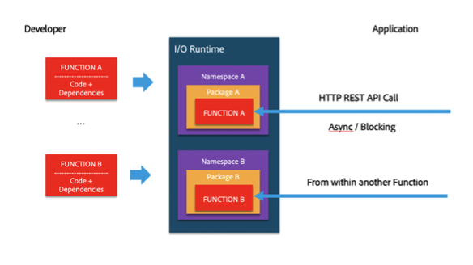
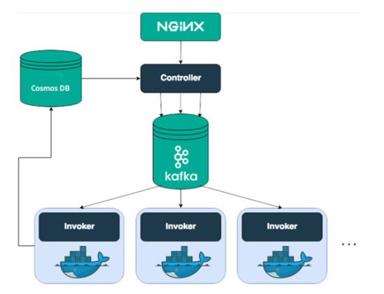

# Understanding Adobe I/O Runtime

Serverless platforms greatly simplify the development and operation of business applications. Successful use of them takes advantage of their many strengths, while working around their limitations. This Quick Start Guide explores the most critical of these considerations as they apply to I/O Runtime.

## Programming model

Developers code for Runtime in JavaScript; it executes in a Node.js environment, and may use any of the available Node modules.

Code is organized in **actions** (equivalent to functions) and is deployed in a **namespace** that is owned by one tenant. A tenant may have multiple namespaces.

Actions may be invoked by HTTP calls (RESTful or HTTP) or by other actions. Actions may be chained together to create complex flows using **sequences** (linear chains) or **compositions**  (trees of actions with decisions at each node). 

Actions may be organized into any number of **packages** within a namespace. Packages are used to organize the code, manage different versions of the same action, or share code with other tenants or applications. Packages marked **shareable** may be bound to the namespaces of anyone who has their full name, in the manner of symbolic links.

Actions may be invoked anonymously - with no authorization required - or with authentication. Runtime supports basic authorization  Developers can implement their own auth. We will be adding support for IMS based auth.

## Understanding I/O Runtime components

Adobe I/O Runtime is built on the Apache OpenWhisk open-source project, so many resources written for Apache OpenWhisk also apply to Adobe I/O Runtime. The [Apache OpenWhisk repository](https://github.com/apache/incubator-openwhisk/tree/master/docs) is a useful resource.

This diagram shows the high-level architecture of I/O Runtime built on OpenWhisk:

This is the sequence by which Runtime components execute user code when an action is executed:

1. The **Nginx web server** receives a call that a specific action has beeninvoked; it performs SSL termination and forwards the call to the Controller.
2. The **Controller** performs tasks that disambiguate what the user is trying to do (for example, invoke action X from namespace Y), authenticate the caller, and determine whether the caller has the permissions to execute the code. AuthN and AuthZ are done against the **Cosmos DB**, where information about users and namespaces is persisted.
3. If all checks have passed, the Controller loads the action code and action settings such as memory and default parameters from the Cosmos DB/S3, and schedules execution with one of the available **Invokers**.
4. Scheduling is accomplished through **Kafka**; that is, Controllers and Invokers communicate through Kafka messages. When an invocation request is persisted in Kafka, the client is issued an **ActivationId** that can be used to retrieve execution results.
5. The Invoker injects the action code into a **Docker container** and invokes the action. The result of the invocation is persisted in Cosmos DB under the same ActivationId.

This flow describes what happens inside a single cluster. Adobe maintains clusters in multiple Amazon regions today, and plans to add Azure clusters in the future. Calls are routed to clusters using latency-based routing: the cluster closest to the caller gets the request. Behind the scenes, customer code is pushed to all clusters.

## What happens when actions are invoked?

When an action invocation request is accepted by I/O Runtime and an ActivationId is issued, developers are primarily interested in the activation lifecycle and the container lifecycle, where "activation"" is Adobe terminology for action invocation and the container is what is used to run the action.

### Activation lifecycle

* For async (non-blocking) invocation, the system returns `202` immediately with an ActivationId that the client will use to pull the result.
* For blocking invocations, the system returns either:
  * `200` and the result, or
  * `504` and an activation ID that will be available for debugging, that is, to see the error message and retrieve logs if any.
* If too many actions per minute are invoked, requests are throttled and the system returns `429`. It is the client's responsibility to scale back and retry: the system does not buffer requests for later processing. Read more about these limits below.

### Container lifecycle

* When an action is invoked for the first time, a new container is created and the action code injected into it, making it a "warm" container. Container initialization takes time; minimizing this overhead contributes significantly to Runtime performance.
* Warm containers can be reused only by the same user and action version.
* Warm containers may sit idle for 10 minutes, and are then recycled if no requests are received.
* The System maintains a pool of "prewarmed" containers, created with the default Node version and a memory value of `256MB`, `512MB`, or `1024MB`; they may be used by any user or action. Once initialized for an action, they become warm containers.
* A "cold start" refers to a system under load with no prewarmed or warm containers available for invocation. Action requests are then buffered; the system will create new containers either by recycling idle containers or creating new ones.

## Understanding system settings

Some system limits are relevant to your application design; you can find a full reference in the Adobe I/O Runtime [System Settings Guide](../../guides/runtime_guides/system-settings.md).

These are particularly important:

1. **Concurrent** is the maximum number of activations that can be submitted per namespace. Exceeding this limit sends a `429` error.
2. **Concurrency per container** is the maximum number of activations that can be executed in parallel for the same action in the same container. Use the largest value that works for your code.
3. **MinuteRate** is the number of activations that may be invoked per namespace per minute. Exceeding it sends a `429` error.
4. **Payload** or **Result** size are limits on sending and receiving inline data, currently 1MB. If you need more, should consider reading or writing from an Amazon S3 or other cloud storage bucket.
5. **Memory** is the maximum amount of RAM your action may request.

<InlineAlert slots="text"/>

If your organization cannot be served by these default values, MinuteRate and Concurrent limits can be raised. Please visit the [Adobe Experience Leage App Builder Community](https://experienceleaguecommunities.adobe.com/t5/app-builder/ct-p/adobe-app-builder) for support.

## I/O Events integration

I/O Events exposes to third parties a growing number of Adobe events, currently Analytics, Experience, Cloud Manager, General Data Protection Regulation, Adobe Experience Manager, Data Ingestion, and Real-Time Customer Profile events. An application can subscribe to these events using a push model and consuming them via webhooks, or a pull model that uses journaling to retrieve the events.

In I/O Console, Developers can:

* Select events and send them to a webhook created on some other platform

* Select Runtime Actions to receive the events

* Create an action that reads the events using the Journaling API

## Strategies for high-availability applications

The I/O Runtime compute platform is highly available and scalable, there are some application design considerations any developer using it should consider:

* **Favor async calls** if your application can work with an async design, to give your code a better chance to execute instead of running in timeouts.
* **Respond to** `429` **status codes** if your application is hitting the upper limit for throttling. If you don’t scale back, you'll keep getting them.
* **Respond to** `5xx` **status codes**. There are situations in which your invocation will not come though - otherwise, we would offer 100% uptime. If you can’t afford to lose an invocation, build a retry mechanism outside the Runtime platform, or use the Runtime Triggers feature to create an action that is executed every 40 minutes and performs the retry or does some logging in your system so you can try again.
* **Minimize chances for cold starts** whenever low latency and high availability are priorities, by tuning:  
  * **Concurrency per container** is the number of invocations that may be sent in parallel to the same container. Exceeding this limit by 1 opens a new container:  for example, with concurrency set to the default 200, a burst of 450 requests would open new containers at requests 1, 201, and 401.
    * For use cases with low resource consumption, leaving concurrency at 200, or even increasing it to its maximum 500, will minimize overhead from container initialization.
    * But for high resource consumption use cases, you may need to reduce concurrency to avoid performance degradation from too many requests sharing the container's CPU, memory, and other resources.  
    * The default concurrency works well for most use cases, but performance tuning and load testing for each use case is the ideal.
  * **Memory**. I/O Runtime keeps a pool of prewarmed containers that use the default RAM setting. Using the default RAM setting for your action lets you use prewarmed containers, the next fastest thing to reusing containers.
* **Fan out**. I/O Runtime is built to run lots of tasks in parallel. So if you can, split large tasks into multiple small ones. Otherwise, your action may need a long time to execute and possibly use so much memory that you can't use prewarmed containers (see above). 

<InlineAlert slots="text"/>

Work is underway to provide persistence, which will make it easier build a retry mechanism or improve fan out/fan in.

## CI/CD pipeline

I/O Runtime currently offers building blocks for creating a CI/CD pipeline, but not a complete pipeline. This is because CI/CD is an evolving topic in the serverless world, including OpenWhisk, the project behind I/O Runtime. Since different teams have different perspectives, we decided to postpone the effort until a consensus emerges.

The components available for building a pipeline are:

1. **CLI tool** to manage (deploy, update, delete) and invoke actions
2. **RESTful API** to manage and invoke actions
3. **Namespaces and packages** that can be used to create Development, QA, Staging, Production, or other environments, and manage different versions of the same action

These components can be used to create a Jenkins, GitLab CI, or other CI/CD pipeline.

## Security considerations

I/O Runtime passed the Adobe Asset team's security review to reach General Availability for use as a multi-tenant serverless environment. Security audits and penetration tests continuously monitor platform security. 

The platform is Common Controls Framework-compliant and GDPR-ready in that no user logs or results are retained more than 30 days. 
Developer code on the I/O Runtime platform is:

1. **Executed in Docker containers** that are never reused across different tenants: reuse is restricted to the same tenant and the same action
2. **Encrypted**
3. **Deployed in a namespace** that is tenant-owned, not shared, and protected by a unique key used to encrypt the code

## Progress toward cloud-native applications

The Adobe I/O Runtime team is working on CLI, debugging, IDE plugin, storage, CDN integration, API wrapper, and other technologies that can be used to create full-stack applications (Single-Page Application + Backend) powered by I/O Runtime + CDN – to create full applications with no need to spin up a server.

Components of this new platform are already available to help Developers build Runtime applications faster. Check our GitHub repository for:

* Adobe I/O CLI with Runtime Plugin
* Authentication library
* Project Starter

## Next steps

I/O Runtime delivers on the serverless promise, but Developers to should always be aware of, and employ, serverless best practices.

This is just the beginning for Adobe I/O Runtime. We encourage you to help us enhance the platform and guide its future. The following sections provide multiple ways for you to engage with the Adobe I/O Runtime team and suggest improvements to the platform and its documentation.

### Social media

You can follow the Adobe I/O team on [Twitter](https://twitter.com/adobeio), [Medium](https://medium.com/adobetech/tagged/platform), and [Youtube](https://www.youtube.com/channel/UCDtYqOjS9Eq9gacLcbMwhhQ).

### Support

The [Adobe I/O Runtime Forum](https://experienceleaguecommunities.adobe.com) can help you address issues with Adobe I/O Runtime.

If you have issues with the documentation, please submit a pull request at the [Adobe I/O Runtime GitHub repository](https://github.com/AdobeDocs/adobeio-runtime).

And please check the [FAQ](../../intro_and_overview/faq.md#using-i-o-runtime) for answers to some of the most common questions asked about Adobe I/O Runtime.
