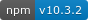

---
keywords:
  - Acquire Access
  - Credentials
  - Local Environment
  - Set up
title: Getting Started
description: App Builder is a complete framework that enables enterprise developers to build and deploy custom web applications that extend Adobe Experience Cloud solutions and run on Adobe infrastructure.
---

# Start your App Builder Journey

Welcome! Here you'll learn what systems you need to access, how to access them, and how to configure your local environment.

## Access and Credentials

First, ensure you have [access to App Builder](../overview/getting-access.md) either via trial (AEM Headless trial which includes App Builder) or having purchased a license.

Next, confirm access to the following services:

[Adobe Developer Console](https://developer.adobe.com/console) _(required)_
- Adobe Developer Console gives you access to APIs, SDKs and developer tools. You will set up your credentials using the Developer Console.
- **note:** You need a developer or system admin role for your Adobe Experience Cloud IMS organization.

Adobe Experience Cloud IMS Organization _(required)_
```
    - App Builder access is provided via an Adobe Experience Cloud IMS Org. If you are using the trial you should use the IMS org you requested or that was assigned to you. If you have a license for App Builder, then the IMS org was selected by the person who purchsed it for your company.
    - If you do not have access to an organization:
        - _Customers: Please contact your account manager for access._
        - _Partners: Please contact your partner manager or request sandbox access via [Adobe Solution Partner Portal](https://solutionpartners.adobe.com/home.html)._
```
- A GitHub Account _(optional)_
    - A [GitHub](https://github.com/) account is optional, but highly recommended, for setting up your CI/CD workflow.

## Local Environment Set Up

### Required Tools

Please ensure you have these tools:

- [NodeJS](https://nodejs.org/en/download/) Version 18-20 (odd versions are not recommended). It should also install npm together. We recommend using [nvm](https://github.com/nvm-sh/nvm/blob/master/README.md) to manage NodeJS installation and versions.
- [Adobe I/O CLI](https://github.com/adobe/aio-cli)
    - `npm install -g @adobe/aio-cli`
    - If you have Adobe I/O CLI installed, please ensure you have the latest version.(Current version: )
        - Check CLI version using `aio -v` and compare it with `npm show @adobe/aio-cli version`. If your CLI is outdated, update by running `npm install -g @adobe/aio-cli`.
        - Even if your Adobe I/O CLI is up to date, run `aio update` to ensure all core plugins are updated as well.
        - When we release a new version of Adobe I/O CLI, you'll see a message like this before the command output. This message lasts for 7 days after a new release.

```bash
›   Warning: @adobe/aio-cli update available from 3.3.0 to 3.4.1.
›   Run npm install -g @adobe/aio-cli to update.
```

#### Supported Local Environment

We aim to provide similar quality of local development experience on both Windows 10 or 11 and macOS 10.14 and higher.
Our [CLI](https://github.com/adobe/aio-cli) and its plugins are automatically tested against NodeJS versions 14 and 16 on both Windows and [Linux Xenial](http://releases.ubuntu.com/16.04/).

#### Supported Terminals for the CLI

The [CLI](https://github.com/adobe/aio-cli) uses the popular [inquirer](https://www.npmjs.com/package/inquirer) package for all its interactive functionalities, such as the application generators.

See [inquirer's Support section](https://www.npmjs.com/package/inquirer#support-os-terminals) and [its known issues](https://www.npmjs.com/package/inquirer#know-issues) for up-to-date details.

### Optional Tools

The following is required if you intend to use local development (`aio app dev`) features provided by the [CLI](https://github.com/adobe/aio-cli):

- [Visual Studio Code](https://code.visualstudio.com/download) (VS Code) as the supported IDE for editor, debugger, etc. You can use any other IDE as a code editor, but advanced usage (e.g. debugger) is not yet supported.


## Next Step

Now that you have your environment set up, you can start [creating your own App Builder application](first-app.md).
