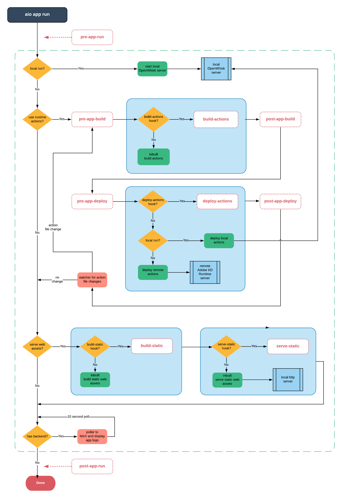
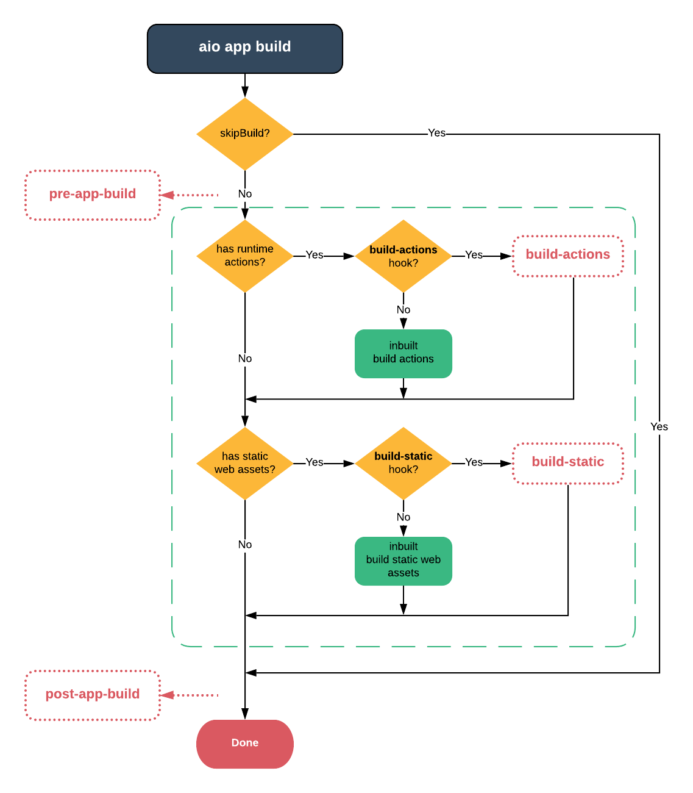
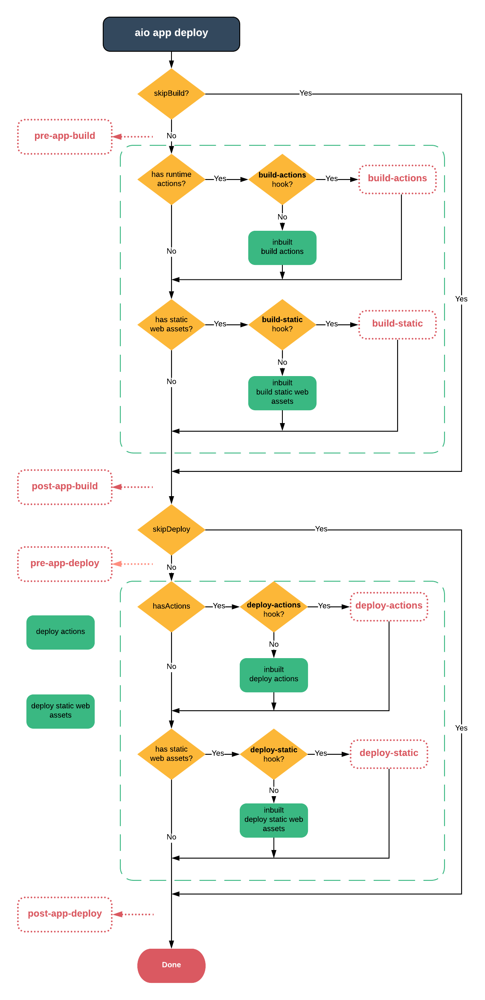
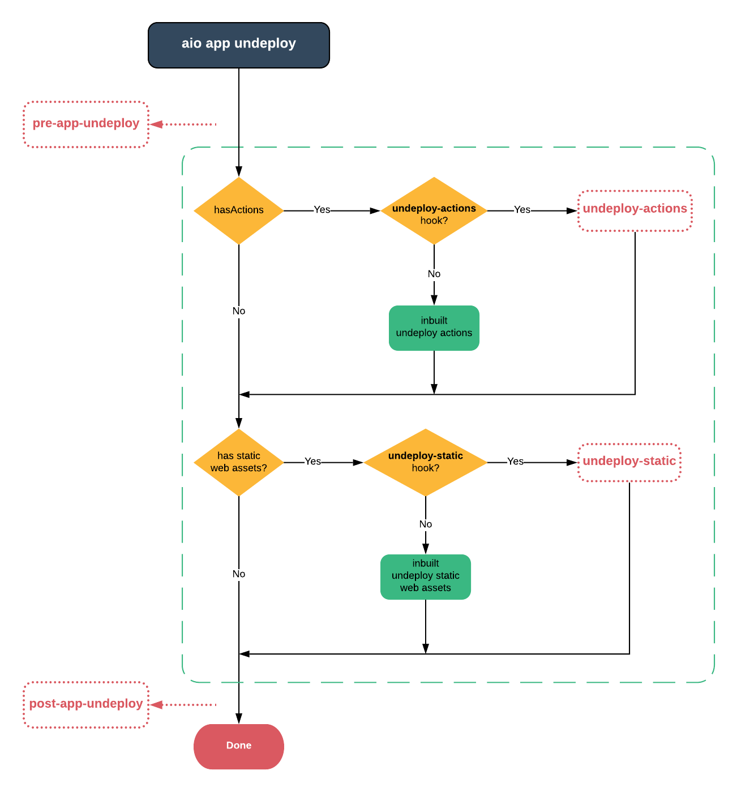

---
keywords:
  - Adobe I/O
  - Extensibility
  - API Documentation
  - Developer Tooling
title: App Builder application tooling lifecycle event hooks
---

# App Builder Application Tooling Lifecycle Event Hooks

Hooks can be defined to run before, after, or in place of many app plug-in commands in the app.config.yaml or ext.config.yaml file of your app. 

## Command support

`aio app run` supports:

```yaml
hooks:
  pre-app-run: echo pre-app-run
  post-app-run: echo post-app-run
  pre-app-build: echo pre-app-build
  post-app-build: echo post-app-build
  pre-app-deploy: echo pre-app-deploy
  post-app-deploy: echo post-app-deploy
  build-actions: echo build-actions
  deploy-actions: echo deploy-actions
  build-static: echo build-static
  serve-static: echo serve-static
  pre-app-undeploy: echo pre-app-undeploy
  post-app-undeploy: echo post-app-undeploy
  undeploy-actions: echo undeploy-actions
  undeploy-static: echo undeploy-static
```

`aio app build` supports:

```yaml
hooks:
  pre-app-build: echo pre-app-build
  post-app-build: echo post-app-build
  build-actions: echo build-actions
  build-static: echo build-static
```

`aio app deploy` supports:

```yaml
hooks:
  pre-app-build: echo pre-app-build
  post-app-build: echo post-app-build
  pre-app-deploy: echo pre-app-deploy
  post-app-deploy: echo post-app-deploy
  build-actions: echo build-actions
  build-static: echo build-static
  deploy-actions: echo deploy-actions
  deploy-static: echo deploy-static
```

`aio app undeploy` supports:

```yaml
hooks:
  pre-app-undeploy: echo pre-app-undeploy
  post-app-undeploy: echo post-app-undeploy
  undeploy-actions: echo undeploy-actions
  undeploy-static: echo undeploy-static
```

`aio app test` supports:

```yaml
hooks:
  test: echo this is your custom test runner
```

`aio app pack` supports: 

```yaml
hooks: 
  pre-pack: echo this is before packaging
  post-pack: echo this is after packaging
```

## Use cases

- `aio app run` hooks manage local development tooling not managed by flows included with App Builder

- `aio app build` **build-static** and **build-actions** hooks:
  
  - Build actions to include static files with action zipfiles, for example, templates in server-side rendering
  
  - Build web assets with different bundlers and configurations, for example webpack

- `aio app deploy` **deploy-static** and **deploy-actions** hooks support additional deployment steps, for example to deploy to multiple servers or locations

- `aio app undeploy` **undeploy-static** and **undeploy-actions** hooks support additional un-deployment steps, for example to undeploy from multiple servers or locations

- `aio app test` **test** hooks support custom test runners for apps and extensions

## Using JavaScript files

You can specify a JavaScript file that contains your hook code. The file must export a function. 

**app.config.yaml**

```yaml
hooks:
  post-app-deploy: ./hooks/post-app-deploy.js
```

**./hooks/post-app-deploy.js**

```js
module.exports = () => {
    console.log("Post app deploy hook")
}
```

## Legacy App with no extensions

Add a `hooks` key in the `app.config.yaml` file under the `application` key in the root of your app. For example:

```
application:
  hooks:
    pre-app-run: echo pre-app-run
```

If you add extensions to a standalone app using `aio app add extension`,  `app.config.yaml` hooks will always run first, followed by extension hooks in each `ext.config.yaml` file.

## App with extensions

In the app extension folder, typically at `src/EXTENSION_NAME`, find the `ext.config.yaml` file and add a `hooks` key. For example:

```
hooks:
  pre-app-run: echo pre-app-run
```

## App-Hooks flow

These diagrams show how custom hooks are run, built, deployed, and undeployed within applications by commands:









## Next steps

Return to [Architecture Overview](architecture-overview.md).

Return to [Guides Index](../../index.md).
