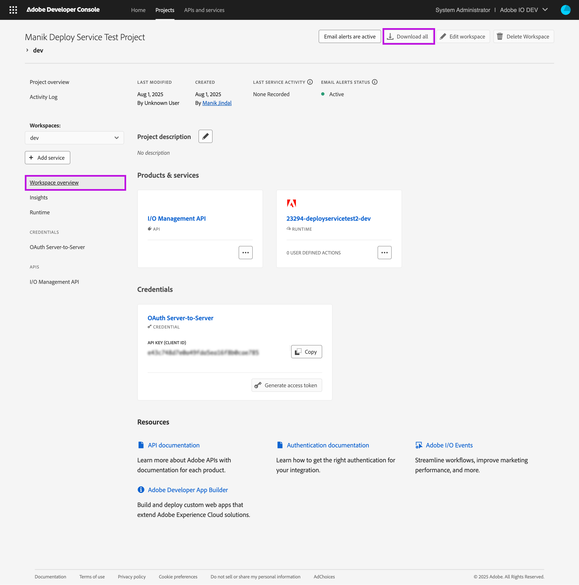

# Setting up a CI/CD pipeline to deploy App Builder apps using GitHub Actions

To deploy App Builder apps, App Builder supports a CI/CD pipeline using GitHub Actions out of the box. The following guide explains how you can set it up.

+ [Step 1: Add GitHub workflow files to your project directory](#step-1-add-github-workflow-files-to-your-project-directory)
+ [Step 2: Prepare Stage Workspace for deployment using a CI/CD pipeline](#step-2-prepare-stage-workspace-for-deployment-using-a-cicd-pipeline)
+ [Step 3: Compute the `.aio` and `.env` files](#step-3-compute-the-aio-and-env-files)
+ [Step 4: Add secrets to your GitHub repository](#step-4-add-secrets-to-your-github-repository)
+ [Step 5: Add any custom secrets](#step-5-add-any-custom-secrets)
+ [Step 6: Repeat for Production workspace](#step-6-repeat-for-production-workspace)
+ [Step 7: Repeat for any other shared workspace](#step-7-repeat-for-any-other-shared-workspace)


## Step 1: Add GitHub workflow files to your project directory

GitHub Actions looks for the `.github/workflows` folder at the root of your App Builder app. You can define any number of workflows or CI/CD pipelines in that folder. Check out the documentation for GitHub workflows [here](https://docs.github.com/en/actions/how-tos/write-workflows).

App Builder supplies a few workflow definitions out of the box that rely on Adobe custom action - [aio-app-action](https://github.com/adobe/aio-apps-action). If you started your App Builder app using `aio app init`, the workflow YAML files will be present in the `.github/workflows` folder at the root of your App Builder app. 

However, if they're not already present, you can add them by running 

``` bash
# Add the Workflow definition files
aio app add ci

# Commit the workflow files to your repository's main branch
git add ./github/workflows/
git commit -m "Adding GitHub workflows" 
git push
```

The following workflow definitions are supported out of the box:

1. **deploy_prod.yml**: Deploys your application to the Production Workspace when you [create a new release in your GitHub repository](https://docs.github.com/en/repositories/releasing-projects-on-github/managing-releases-in-a-repository#creating-a-release).
2. **deploy_stage.yml**: Deploys your application to the Stage Workspace when you merge any code in the `main` branch.
3. **pr_test.yml**: Unit tests your code in a pull request when the pull request is created. To run unit tests against the pull request, the workflow runs `aio app test`.


## Step 2: Prepare Stage Workspace for deployment using a CI/CD pipeline

To enable a workspace for deployment via a CI/CD pipeline:
1. Open the [Developer Console](https://developer.adobe.com/console)
2. Navigate to your App Builder Project and Stage Workspace
3. Add the I/O Management API to the workspace. This will add an OAuth Server-to-Server credential to the workspace, if one is not already present. It will also ensure that the credential has the right scopes to deploy your application. 
4. Click the Download all button on the Workspace overview page to download the workspace.json file.



## Step 3: Compute the `.aio` and `.env` files

<InlineAlert slots="text" />

Note: This guide refers to the "root of your App Builder app". The root of your App Builder app is the directory that contains the `app.config.yaml`, `.aio`, and `.env` files.


1. Open your terminal and navigate to the root of your App Builder app.
2. Run `aio app use path/to/workspace/json/from/step1_4.json>`
3. When prompted, be sure to merge the `.aio` and the `.env` files to avoid losing any other configuration you may have added to those files.


## Step 4: Add secrets to your GitHub repository

Before you can deploy your app from the CI/CD pipeline using GitHub Actions, you must add your application secrets to your repository. To do so:

1. Open your GitHub repository
2. Navigate to the `Settings` tab > `Secrets and variables` on the left nav > `Actions`
3. Click on `New repository secret`. Note: App Builder does not support environment secrets yet. Ensure you add the secrets as repository secrets and not environment secrets.
4. Enter the secrets as key-value pairs in the Name and Secret text inputs respectively.
5. Click `Add Secret`

You must add the following secrets to your GitHub repository to ensure your CI/CD pipeline can test Pull Requests and deploy your application.

|    | Workspace  | Secret Name                                  | Required for which workflow   |
|----|------------|----------------------------------------------|-------------------------------|
|  1 | Stage      | CLIENTID_STAGE                               | deploy_stage.yml, pr_test.yml |
|  2 | Stage      | CLIENTSECRET_STAGE                           | deploy_stage.yml, pr_test.yml |
|  3 | Stage      | TECHNICALACCOUNTID_STAGE                     | deploy_stage.yml, pr_test.yml |
|  4 | Stage      | TECHNICALACCOUNTEMAIL_STAGE                  | deploy_stage.yml, pr_test.yml |
|  5 | Stage      | IMSORGID_STAGE                               | deploy_stage.yml, pr_test.yml |
|  6 | Stage      | SCOPES_STAGE                                 | deploy_stage.yml, pr_test.yml |
|  7 | Stage      | AIO_RUNTIME_NAMESPACE_STAGE                  | deploy_stage.yml, pr_test.yml |
|  8 | Stage      | AIO_RUNTIME_AUTH_STAGE                       | deploy_stage.yml              |
|  9 | Stage      | AIO_PROJECT_ID_STAGE                         | deploy_stage.yml              |
| 10 | Stage      | AIO_PROJECT_NAME_STAGE                       | deploy_stage.yml              |
| 11 | Stage      | AIO_PROJECT_ORG_ID_STAGE                     | deploy_stage.yml              |
| 12 | Stage      | AIO_PROJECT_WORKSPACE_ID_STAGE               | deploy_stage.yml              |
| 13 | Stage      | AIO_PROJECT_WORKSPACE_NAME_STAGE             | deploy_stage.yml              |
| 14 | Stage      | AIO_PROJECT_WORKSPACE_DETAILS_SERVICES_STAGE | deploy_stage.yml              |


To obtain the values for each of these secrets in the correct format, use the following script to print your secrets to your terminal window.

Note: the script relies on the `.aio` and `.env` files to contain the correct values. Ensure you have completed the previous steps to compute the correct secret values.

```bash
#!/bin/bash

main (){

    config=$(aio config ls --json)

    # Extract workspace_services
    workspace_services=$(echo "$config" | jq -c '.project.workspace.details.services')

    # Check if I/O Management API is present
    if ! echo "$workspace_services" | jq -e 'any(.[]; .code == "AdobeIOManagementAPISDK")' > /dev/null; then
    echo "Error: I/O Management API was not found in your workspace." >&2
    exit 1
    fi

    # Get the lowercase context name
    ctx=$(echo "$config" \
        | jq -r '.project.workspace.details.credentials[] | select(.integration_type == "oauth_server_to_server") | .name' \
        | tr '[:upper:]' '[:lower:]'
    )

    echo "CLIENTID:                     $(echo "$config" | jq -r --arg ctx "$ctx" '.ims.contexts[$ctx].client_id')"
    echo "CLIENTSECRET:                 $(echo "$config" | jq --arg ctx "$ctx" '.ims.contexts[$ctx].client_secrets' |  jq -r | jq -r '.[0]')"
    echo "TECHNICALACCOUNTID:           $(echo "$config" | jq -r --arg ctx "$ctx" '.ims.contexts[$ctx].technical_account_id')"
    echo "TECHNICALACCOUNTEMAIL:        $(echo "$config" | jq -r --arg ctx "$ctx" '.ims.contexts[$ctx].technical_account_email')"
    echo "IMSORGID:                     $(echo "$config" | jq -r --arg ctx "$ctx" '.ims.contexts[$ctx].ims_org_id')"
    echo "SCOPES:                       $(echo "$config" | jq --arg ctx "$ctx" '.ims.contexts[$ctx].scopes' | jq -r | jq -r '. | join(",")')"
    echo "AIO_RUNTIME_NAMESPACE:        $(echo "$config" | jq -r '.runtime.namespace')"
    echo "AIO_RUNTIME_AUTH:             $(echo "$config" | jq -r '.runtime.auth')"
    echo "AIO_PROJECT_ID:               $(echo "$config" | jq -r '.project.id')"
    echo "AIO_PROJECT_NAME:             $(echo "$config" | jq -r '.project.name')"
    echo "AIO_PROJECT_ORG_ID:           $(echo "$config" | jq -r '.project.org.id')"
    echo "AIO_PROJECT_WORKSPACE_ID:     $(echo "$config" | jq -r '.project.workspace.id')"
    echo "AIO_PROJECT_WORKSPACE_NAME:   $(echo "$config" | jq -r '.project.workspace.name')"
    echo "AIO_PROJECT_WORKSPACE_DETAILS_SERVICES:   $(echo "$config" | jq -r -c '.project.workspace.details.services')"
}

main
```

To run this script:

1. Save the above script on your machine as `fetch-secrets.sh`
2. Run `chmod +x path/to/fetch-secrets.sh`
3. Navigate to the root of your App Builder app
4. Run `path/to/fetch-secrets.sh`

Here's a sample output
```text
➜  app-builder pbpaste > fetch-secrets.sh
➜  app-builder chmod +x fetch-secrets.sh 
➜  app-builder cd test-deploy-service
➜  test-deploy-service ../fetch-secrets.sh 
CLIENTID:                     dc***************************64c
CLIENTSECRET:                 p**-******************************Nl
TECHNICALACCOUNTID:           0*********************AC@techacct.adobe.com
TECHNICALACCOUNTEMAIL:        2******d-4**c-4**2-8**f-1*********a4@techacct.adobe.com
IMSORGID:                     6*********************01@AdobeOrg
SCOPES:                       ["AdobeID","openid","read_organizations","additional_info.projectedProductContext","additional_info.roles","adobeio_api","read_client_secret","manage_client_secrets"]
AIO_RUNTIME_NAMESPACE:        2***4-manikdeploytest-stage
AIO_RUNTIME_AUTH:             2******a-d**2-4**1-9**c-9*********9:C46C4C8038Vs5hrS2i0tqNw0a80unnv1jdtLW6K7weku4UA7jSjQ805YB0WIxlSC
AIO_PROJECT_ID:               45***************13
AIO_PROJECT_NAME:             ManikDeployTest
AIO_PROJECT_ORG_ID:           23294
AIO_PROJECT_WORKSPACE_ID:     45***************57
AIO_PROJECT_WORKSPACE_NAME:   Stage
AIO_PROJECT_WORKSPACE_DETAILS_SERVICES:   [{"code":"AdobeIOManagementAPISDK","name":"I/O Management API"}]

```

<InlineAlert slots="text" />

Note: The script outputs the variables without the `_STAGE` suffix, you'll need to add the suffix to the secret name while storing it in GitHub Secrets. You must match the secret names exactly to the names mentioned in the table	.


## Step 5: Add any custom secrets

If your App Builder app requires other application secrets (such as API keys for third-party APIs), you will also need to store them in GitHub Secrets. To do so

1. Add your secrets to `deploy_stage.yml` file. Add them under the `env` key under the `Deploy` step.
   ```yml
   MY_CUSTOM_SECRET: ${{ secrets.MY_CUSTOM_SECRET_STAGE}}
   ```
   <InlineAlert slots="text">
   Adding the secret to the workflow definition is equivalent to adding the secret to the `.env` file locally. The CI/CD pipeline will ensure your action receives this secret during deployment.
   </InlineAlert>

2. Save the value of `MY_CUSTOM_SECRET_STAGE` to your GitHub repository (steps are outlined in [Step 4](#step-4-add-secrets-to-your-github-repository)).

## Step 6: Repeat for Production workspace

Repeat steps 2-5 for the Production workspace. We have included some notes for each step below.

1. Step 2: Add I/O Management API to the Production workspace
2. Step 3: Compute the `.aio` and `.env` files for your Production workspace
3. Step 4: Once you've computed the `.aio` and `.env` file, you can run the `fetch-secrets.sh` script again to see the production values. However, this time, be sure to add the suffix `_PROD` instead of `_STAGE` while saving the secret in the GitHub repository. See table below.
4. Step 5: Ensure that you pick the production values of your custom secrets and add it to the `deploy_prod.yml` file instead.


|    | Workspace  | Secret Name                                  | Required for which workflow   |
|----|------------|----------------------------------------------|-------------------------------|
|  1 | Production | CLIENTID_PROD                                | deploy_prod.yml               |
|  2 | Production | CLIENTSECRET_PROD                            | deploy_prod.yml               |
|  3 | Production | TECHNICALACCOUNTID_PROD                      | deploy_prod.yml               |
|  4 | Production | TECHNICALACCOUNTEMAIL_PROD                   | deploy_prod.yml               |
|  5 | Production | IMSORGID_PROD                                | deploy_prod.yml               |
|  6 | Production | SCOPES_PROD                                  | deploy_prod.yml               |
|  7 | Production | AIO_RUNTIME_NAMESPACE_PROD                   | deploy_prod.yml               |
|  8 | Production | AIO_RUNTIME_AUTH_PROD                        | deploy_prod.yml               |
|  9 | Production | AIO_PROJECT_ID_PROD                          | deploy_prod.yml               |
| 10 | Production | AIO_PROJECT_NAME_PROD                        | deploy_prod.yml               |
| 11 | Production | AIO_PROJECT_ORG_ID_PROD                      | deploy_prod.yml               |
| 12 | Production | AIO_PROJECT_WORKSPACE_ID_PROD                | deploy_prod.yml               |
| 13 | Production | AIO_PROJECT_WORKSPACE_NAME_PROD              | deploy_prod.yml               |
| 14 | Production | AIO_PROJECT_WORKSPACE_DETAILS_SERVICES_PROD  | deploy_prod.yml               |


## Step 7: Repeat for any other shared workspace

You can set up CI/CD to deploy to any workspace. To do so:

1. Create another GitHub workflow `deploy_workspace.yml` in the `.github/workflows` folder.
2. You can freely customize the trigger for the workflow and other aspects of deployment. Read the documentation for GitHub workflows [here](https://docs.github.com/en/actions/how-tos/write-workflows). Also see the [GitHub actions published by App Builder](./cicd-for-app-builder-apps.md#github-actions-for-aio-cli).
3. Similar to how you performed the steps 2-6 from the Production workspace, you can repeat them for another workspace. When you save your secrets in the GitHub Repository ensure that
   1. You have added an appropriate suffix to the secret name.
   2. The secret name matches the name you have used in `deploy_workspace.yml` file.