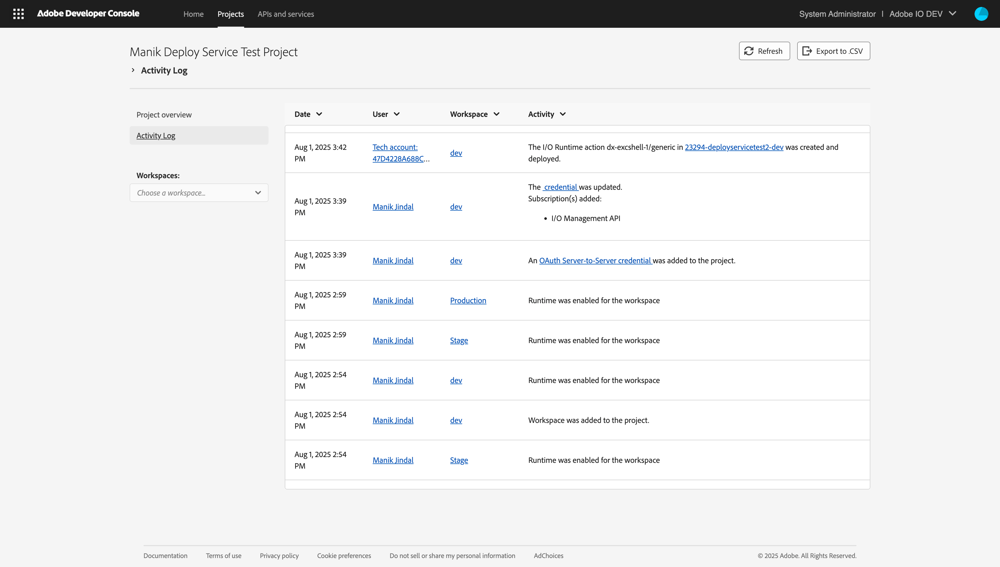

---
keywords:
  - Deployment
title: Deployment
description: The guide explains how App Builder apps can be deployed.
---

# Deployment Overview

The [AIO CLI](https://github.com/adobe/aio-cli) allows developers to deploy their App Builder app to Adobe servers. The following guide explains how App Builder apps are deployed. Read our [CI/CD guide](cicd-for-app-builder-apps.md), to set up a CI/CD pipeline to deploy your app.

<InlineAlert slots="text" />

Starting with AIO CLI v11, the use of Runtime namespace auth to deploy App Builder apps has been discontinued. Instead, Adobe IMS authentication is required to deploy App Builder apps, regardless of whether you are deploying from your local machine or a CI/CD pipeline. 

You must either log in to the CLI `aio login` or [set up a CI/CD pipeline](cicd-for-app-builder-apps.md) using a technical account to deploy your App Builder app. 

<InlineAlert slots="text" />

The following guide covers details on deploying your app to Adobe servers. If you want to run your app locally, read our guide on [local development](../development.md).

## Which components of the App Builder app are deployed?

An App Builder app can contain different components - frontend, backend, extensions, and event registrations. These components are declared in the `app.config.yaml` file. When you deploy your App Builder app, the following components are deployed.

1. **Frontend web assets**: During deployment, web assets (html, js, css, .map, images, and other static assets) are packed and deployed to the App Builder CDN. The CDN is automatically provisioned in the selected Project and Workspace.
2. **Adobe I/O Runtime entities**: During deployment the following Runtime entities are deployed to the Adobe I/O Runtime namespace in the selected Project and Workspace.
   1. [Actions](../../runtime_guides/creating-actions.md) 
   2. [Sequences](../../runtime_guides/reference_docs/sequences-compositions.md#sequences) 
   3. [APIs](../../runtime_guides/creating-rest-apis.md)
   4. [Rules](../../runtime_guides/reference_docs/triggersrules.md#about-rules) 
   5. [Triggers](../../runtime_guides/reference_docs/triggersrules.md#about-triggers) 
   6. [Log Forwarding configuration](../application_logging/logging.md#forwarding-application-logs) 
3. **Extensions** - During deployment, your app is registered as an extension in the Adobe extension registry against any extension points implemented in the app.
4. **Event Registrations** - During deployment, any event registrations defined in the `app.config.yaml` file are created in the selected Project and workspace.

Here's a sample `app.config.yaml` file containing different components of the App Builder app.
```YAML
application:
  actions: actions
  web: web-src
  runtimeManifest:
    packages:
      test-app:
        license: Apache-2.0
        actions:
          generic:
            function: actions/generic/index.js
            web: 'yes'
            runtime: nodejs:18
            inputs:
              LOG_LEVEL: debug
            annotations:
              require-adobe-auth: true
              final: true
          generic2:
            function: actions/generic/index.js
            web: 'yes'
            runtime: nodejs:22
            inputs:
              LOG_LEVEL: debug
            annotations:
              require-adobe-auth: true
              final: true
        sequences:
            all_generic:
              actions: generic, generic2
        triggers:
          triggerA:
            inputs:
              name: Foo
              place: the Shire
          Every24Hours:
            feed: /whisk.system/alarms/alarm
            inputs:
              cron: "0 */24 * * *"
              name: Foo
        rules:
          generic2OnCron:
            action: generic2
            trigger: Every24Hours
          ruleA:
            action: generic
            trigger: triggerA
        apis:
          my-api-name: # API Name
            some-base-path: # Base Path
              some-relative-path: # Relative Path
                generic: # Name of the action to connect this path to
                  method: get
                  response: http
          my-api-name-2: # API Name
            some-base-path-2: # Base Path
              some-relative-path/{id}: # Relative Path
                generic: # Name of the action to connect this path to
                  method: get
                  response: http
```

## Multiple deployment environments

By default, an App Builder Project on the Developer Console contains a Production and a Stage workspace. The Production and Stage workspaces can be used by your team for shared production and staging environments, respectively. Furthermore, you can add more workspaces to your App Builder project, even an individual workspace for every developer on your team.


Each workspace is completely isolated from other workspaces and can be deployed separately. To deploy to a workspace, you must select it before running the `aio app deploy` command. See the section below for more information.

## How to deploy your app?

The following steps outline how you can deploy an App Builder app from your machine. If you want to deploy it from a CI/CD pipeline, please read our [guide on setting up a CI/CD pipeline](cicd-for-app-builder-apps.md).

<InlineAlert slots="text" />

Note: This guide refers to the "root of your App Builder app". The root of your App Builder app is the directory that contains the `app.config.yaml`, `.aio`, and `.env` files.


1. Open your terminal and navigate to the root of your App Builder app. The directory that contains the `app.config.yaml`, `.aio`, and `.env` files. 

2. Ensure you are logged in to the CLI. Make sure to pick the correct account (personal vs company account) and the correct profile during the login.
   ```bash
   aio login
   ```
   If you want to log in to a different account, you can use the `aio logout --force` command to log out.

3. Ensure a Developer Console Project and Workspace is selected in your project. If you are at the root of your App Builder app, the Project and Workspace will be determined using the values in the `.aio` file. 
   ```bash
   aio where
   ```

4. If a Project and Workspace is not selected, or you want to pick a different one, navigate to the Project and Workspace on the Developer Console. On the Workspace overview page, click the `Download all` button to download the `workspace-config.json` file.
   
   

   ```bash
   aio app use <path_to_workspace_config_json_file>
   ```
   When prompted, be sure to merge the `.aio` and the `.env` files to avoid losing any other configuration you may have added to those files.
   
5. To deploy the app, run 
   ```bash
   aio app deploy
   ``` 

   You can view the help menu (`aio app deploy --help`) to understand the advanced deployment options available to you. Using these options you can deploy only parts of your application or skip deploying some parts.

   Note: you can skip steps 2-4 if you have already logged in to the CLI and selected the correct Project and Workspace.

6. Once your app is deployed it will be available at `https://<namespace>.adobeio-static.net/`

## Tracking deployment activity

Whenever a developer makes a change to a Project, her action is recorded in the [Project Activity Logs](https://developer.adobe.com/developer-console/docs/guides/projects/#view-a-projects-activity-log). Each activity log describes who made what change, and when. 

Activities related to deploying an App Builder are also captured in the Project Activity Logs. This includes deployment to any Workspace in the Project. Furthermore, Activity logs are captured whether the app is deployed from a developer's machine or from a CI/CD pipeline.

Note: While deployment activity is recorded, the actual contents of the deployment are not recorded in the activity logs.

The following deployment activities are captured as Project Activity logs:
1. Deploying and undeploying static assets to the App Builder CDN.
2. Deploying Action code to Adobe I/O Runtime.
3. Deploying Triggers, Rules, Sequences, or APIs to Adobe I/O Runtime.
4. Changing the Log forwarding configuration for the workspace.

<InlineAlert slots="text">
The AIO CLI v11 introduces the mandatory use of Adobe IMS authentication to deploy App Builder apps. Therefore, activity logs are captured only if you use AIO CLI v11 or higher. 

Currently, older versions of the AIO CLI can be used to deploy App Builder apps, but that deployment will not be recorded in the Project Activity Logs. Once AIO CLI v11 reaches critical adoption, the App Builder team will communicate plans around restricting deployments from older CLI versions. 

Meanwhile, we strongly recommend upgrading your AIO CLI version to 11 or higher for a better security posture.
</InlineAlert>

<InlineAlert slots="text">
Deployment activity logs were recorded from Aug 11, 2025 onward. Historical data before then is not available. The activity logs are retained for a year.
</InlineAlert>





## Undeploying your app

You can run the `aio app undeploy` command at the root of your App Builder app to undeploy all components deployed through the `aio app deploy` command.

You can view the help menu (`aio app undeploy --help`) to understand the available advanced options. Using these options you can undeploy only parts of your application.

Use this command carefully because if you inadvertently undeploy the app from the Production workspace, it could result in downtime. You can of course deploy the app again immediately.

Note: Starting with AIO CLI v11, Adobe IMS authentication is also required to undeploy your app.


## Next steps

Continue to [CI/CD for App Builder Applications](cicd-for-app-builder-apps.md).

Set up [CI/CD using GitHub Actions](cicd-using-github-actions.md).

Set up [custom CI/CD pipeline](cicd-custom.md).

Return to the [Guides Index](../../index.md).
