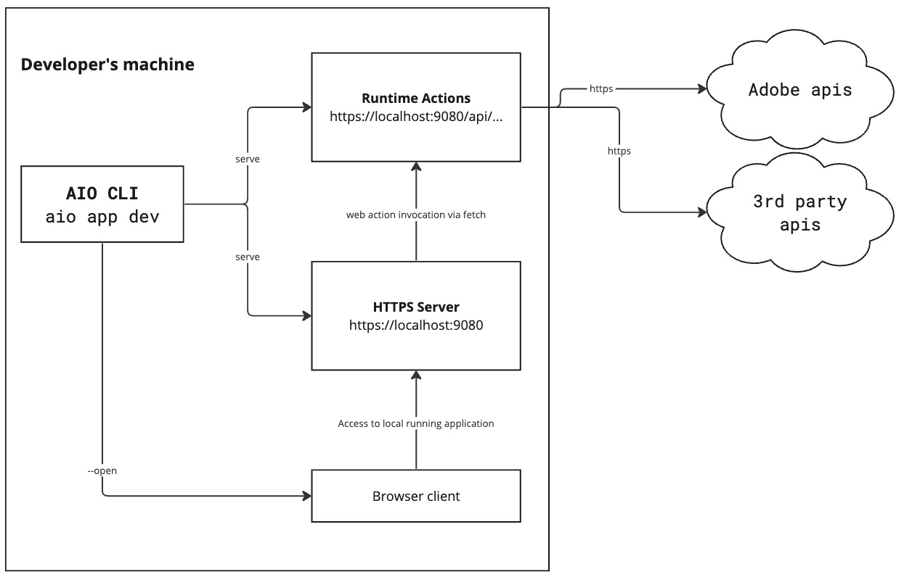

---
keywords:
  - Deployment
  - Local Deployment
  - Architecture
title: Deployment
description: The CLI provides out-of-the-box features for developers to manage the lifecycle of their  App Builder Applications. This documentation focuses on the application deployment step of this lifecycle.
---

# Deployment Overview

The [CLI](https://github.com/adobe/aio-cli) includes features for Developers to manage App Builder Application lifecycles. This section focuses on the deployment step of the lifecycle.

## Setup assumptions

In the following chapters of this documentation, it will be assumed that:

- Custom Adobe applications were bootstrapped from a [generator](https://github.com/adobe/generator-aio-app/) using the CLI

- There is a **.env** file at the root of the application folder, containing these keys and their values:
  
  - **AIO_RUNTIME_AUTH**, holding the credentials for use by the Runtime namespace
  - **AIO_RUNTIME_NAMESPACE**, holding the name for use by the Runtime namespace

If you do not own a [Runtime](https://developer.adobe.com/runtime) namespace, please [request trial access](https://developer.adobe.com/app-builder/trial/). Please also check the [Setup Requirements](../../../get_started/runtime_getting_started/setup.md) documentation before trying out the deployment scenarios described below.

The CLI offers three types of deployment to Developers:

## Local deployment

Local deployment capabilities are offered to Developers who plan to test and debug their application before it is deployed to the Content Delivery Network included with App Builder.

### Local Runtime actions and UI

#### Use case

This local deployment feature is useful for Developers to get a preview of their custom application before deploying it to Runtime and Content Delivery Network. They will also benefit from local Runtime actions and UI debugging capabilities.

The feature also helps Developers planning to work on their custom application implementation without an Internet connection. Of course, in this case they will not able to interact with [Adobe APIs](https://developer.adobe.com/apis) or remote third-party systems.

Developers who choose this option will not be able to run code that uses [Files](https://github.com/adobe/aio-lib-files) or [State](https://github.com/adobe/aio-lib-state) SDKs, the [cron jobs scheduler with Alarms package](../../../resources/cron-jobs/index.md), or to expose web actions as webhooks for [I/O Events](https://developer.adobe.com/events/) or external events providers. These are only available when the actions are deployed to Runtime.

This deployment scenario doesn't require any specific credentials, since both Runtime actions and application UI are hosted on the developer's machine.

#### CLI command

This deployment is triggered when running `aio app dev` at the root of the Custom Application source code directory.

#### Architecture



The Runtime actions of the application will be run in NodeJS:

```
http://localhost:9080/api/v1/web/<namespace>/<pkg-name>/<action-name>
```

**pkg-name** and **action-name** are the names of the package and action, chosen by the Developer when bootstrapping the application from the generator executed using `aio app init <appname>`.

For headful custom applications, the UI will be served locally from [ParcelJS](https://parceljs.org/features/cli), which is the underlying framework used by the [CLI](https://github.com/adobe/aio-cli) to build the front-end source code.

### Remote Runtime actions and local UI

#### Technical prerequisites

This deployment scenario requires Runtime credentials in a .env file at the root of the custom application source code folder, as documented in the [Setup assumptions](#setup-assumptions) above.

#### Use case

This feature is useful for Developers planning to test and debug locally their custom application in a live environment fully integrated to Adobe's ecosystem, with minimal deployment time and efforts.

#### CLI command

This deployment is triggered when running `aio app run` at the root of the Custom Application source code directory.

#### Architecture


The UI is still served locally from [ParcelJS](https://parceljs.org/features/cli/), which allows hot updates of the front-end code. It communicates with Runtime actions deployed to the Developer's Runtime namespace.

## Full deployment

#### Technical prerequisites

This deployment scenario requires Runtime credentials in an `.env` file at the root of the custom application source code folder, as documented in the [Setup assumptions](#setup-assumptions) above.

#### Use case

This feature is useful for Developers planning to test and preview custom applications fully integrated to Adobe's ecosystem, in conditions that are similar to a production deployment.

#### CLI command

This deployment is triggered when running `aio app deploy` at the root of the Custom Application source code directory.

#### Architecture


The UI is deployed to the Content Delivery Network on behalf of the Developer's Runtime credentials. It communicates with [Runtime](../../../intro_and_overview/what-is-app-builder.md#what-is-adobe-io-runtime) actions deployed to the developer's Runtime namespace.

The [Token-Vending Machine](https://github.com/adobe/aio-tvm) supplied with App Builder is implicitely used by the CLI `aio app deploy` command, and validates the developer's Runtime credentials against Runtime.

If the credentials are valid, the Token Vending Machine provides an access token to the CLI, which authorizes the CLI to deploy the static files of the custom application to the Content Delivery Network.

The deployed Custom Application will then be available at `https://<namespace>.adobeio-static.net/index.html`

## Next steps

Continue to [CI/CD for App Builder Applications](cicd-for-app-builder-apps.md).

Return to the [Guides Index](../../index.md).
