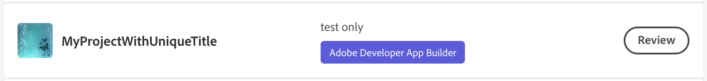
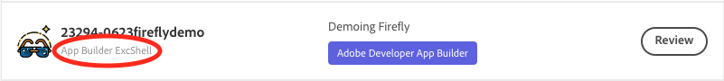

# Migrating Apps to DX Experience Cloud v1 SPAs

## Overview

This tutorial documents one way to migrate App Builder applications originally initialized as standalone applications to DX Experience Cloud v1 Single-Page Applications (SPAs). Although this can be done by modifying only the project's configuration, following this tutorial will allow your application to closely mirror those initialized as DX Experience Cloud v1 SPAs. 

## Who is this tutorial for?

This tutorial is for Developers who can't view an application in Adobe Experience Cloud and may have initialized it as a standalone application. Applications built with App Builder can only be accessed through the App Builder Catalog in Adobe Experience Cloud if they have been initialized as DX Experience Cloud v1 SPAs. 

## How can I tell if my project is a standalone application?

Standalone applications will **not** have the `App Builder ExcShell` sub-heading in Adobe Exchange; compare:

**Standalone application**



**DX Experience Cloud v1 SPA**



## Understanding the difference

The [Extension Migration Guide](../extensions/extension-migration-guide.md#old-file-structure) details the differences between standalone applications and DX Experience Cloud v1 SPAs, provides an overview of the directory structure for DX Experience Cloud v1 SPAs )under [New file structure](../extensions/extension-migration-guide.md#new-file-structure)), and shows how to configure extension points. 

## Migration steps

1. Modify the local directory: 
   
   1. Create a new `src/dx-excshell-1` folder
   2. Move `web-src`, `test`, `e2e`, `actions` under `src/dx-excshell-1`

2. Add the extension configuration:
   
   1. Create `src/dx-excshell-1/ext.config.yaml` 
   
   2. Copy the contents of `app.config.yaml` to `src/dx-excshell-1/ext.config.yaml` 
   
   3. Delete the `application` tag in `src/dx-excshell-1/ext.config.yaml` 
   
   4. Shift the contents of `src/dx-excshell-1/ext.config.yaml` left one tab space 
   
   5. Add an `operations` tag at the top of `src/dx-excshell-1/ext.config.yaml` with the following contents: 
      
      ```yaml
      operations:
        view:
          - type: web
            impl: index.html
      ```
   
   6. Replace the contents of `app.config.yaml` with: 
      
      ```yaml
      extensions:
          dx/excshell/1:
              $include: src/dx-excshell-1/ext.config.yaml
      ```

3. Revoke the application - necessary only if application is published:
   
   1. If Admin:
      1. Navigate to Adobe Exchange 
      2. Select **Manage** in the top toolbar 
      3. Select **Approved Apps** in the top sub-toolbar
      4. Find the application in the list and click **Revoke**
      5. Click **Revoke**
   2. If not Admin:
      1. Request that Admin revoke
      2. Wait for Admin to revoke 

4. Re-initialize application 
   
   1. Run `aio app init`
      1. Select the organization 
      2. Select the project 
      3. Select **All Templates**
      4. Select the **@adobe/generator-app-excshell** template
      5. Overwrite package.json 
      6. Overwrite .env

5. Deploy the application
   
   1. Run `aio app deploy` 

6. Submit the application for approval
   
   1. Navigate to the Adobe Developer Console 
   2. Select the project
   3. Select the Production workspace 
   4. Find and click **Submit for Approval**
   5. Fill out the relevant submission details
   6. Find and click **Submit** 

7. Approve application 
   
   1. If Admin
      1. Navigate to Adobe Exchange 
      2. Select **Manage** in the top toolbar 
      3. Select **Apps Pending Review** in the top sub toolbar
      4. Find your application in the list, click **Review**
         1. Note: Application should have `App Builder ExcShell` sub-heading
      5. Fill in approval notes, click **Approve** 
   2. If not Admin
      1. Request approval by Admin
      2. Wait for approval

8. The application should now be in the App Builder Catalog in Adobe Experience Cloud.

## Next steps

Explore migration details in the [Extension Migration Guide](../extensions/extension-migration-guide.md).

Return to the [Guides Index](../../index.md).
