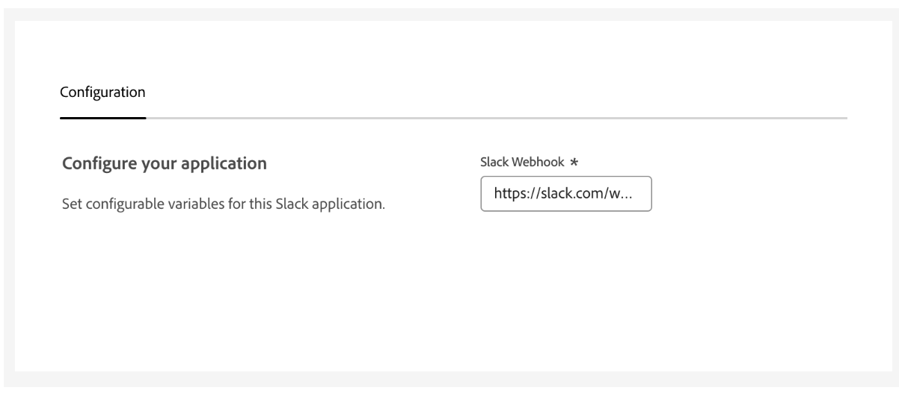
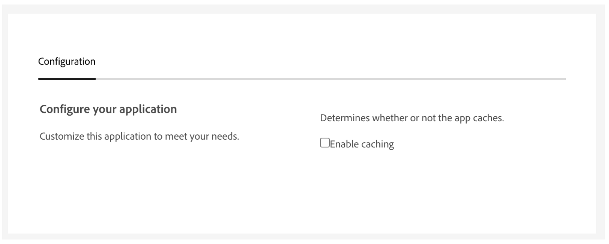
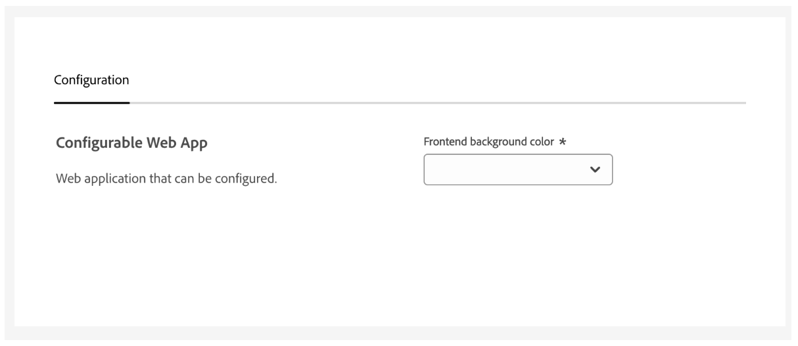
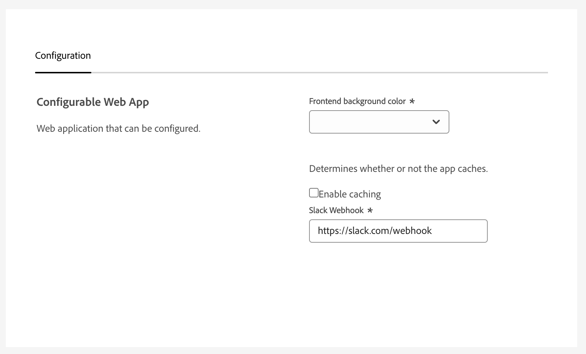

---
keywords:
  - Distribution
  - Local Distribution
  - App Builder
  - Public
title: Public Distribution
description: This documentation focuses on publicly distributing App Builder applications.
---

# Public Distribution

Distribute apps to anyone on [Adobe Exchange](https://exchange.adobe.com/apps/browse/ec).

## Overview

Publicly distributed apps are available for any Adobe organization to install and can be accessed via [Adobe Exchange](https://exchange.adobe.com/). These apps are submitted via [Adobe Developer Distribution](https://developer.adobe.com/developer-distribution/) and reviewed by Adobe. See below for configuration options and required steps to prepare your app for public distribution.

## Customer configuration

Developers of publicly distributable apps can define configuration options for customers to set at install time.

### Defining customer configuration options

Customer configuration can be defined via the `configSchema` property.

**app.config.yaml**

```yaml
application:
  <application config>
extensions:
  <extension configs>
configSchema: # This is a top-level property and is global to the app and all extensions
  title: 'the title'
  description: 'the description'
  properties:
    - title: 'Slack Webhook'
      type: 'string'
      description: 'Please provide the webhook used by this application. Configure in slack.com'
      envKey: 'SLACK_WEBHOOK'
```

### Usage

The `envKey` property of a customer configuration option maps to the environment variable name in the app.

#### Runtime action

To use customer configuration in a Runtime action, map the `envKey` value for the desired variable to the inputs of the Runtime action, then access values via `params.<envKey>` in the action code.

**app.config.yaml**

```yaml
configSchema:
  title: 'the title'
  description: 'the description'
  properties:
    - title: 'enable caching'
      type: 'boolean'
      envKey: 'IS_CACHING_ENABLED'                      <--- Environment variable name
application:
  actions: actions
  web: web-src
  runtimeManifest:
    packages:
      dx-excshell-1:
        license: Apache-2.0
        actions:
          generic:
            function: actions/generic/index.js
            web: 'yes'
            runtime: nodejs:16
            inputs:
              LOG_LEVEL: debug
              IS_CACHING_ENABLED: $IS_CACHING_ENABLED   <--- Mapped environment variable
            annotations:
              require-adobe-auth: true
              final: true
              code-download: true
```

**Action code**

```js
async function main (params) {
    if (params.IS_CACHING_ENABLED) {
        enableCache()
    }
}

exports.main = main
```

#### Web application

To use customer configuration in the web application, values can be accessed directly via `process.env.<envKey>`.

**app.config.yaml**

```yaml
configSchema:
  title: 'Configurable Web App'
  description: 'Web application that can be configured.'
  properties:
    - title: 'Frontend background color'
      type: string
      description: 'Please provide the background color for your frontend'
      enum:
        - blue-400
        - celery-400
        - indigo-400
      envKey: FRONTEND_BACKGROUND_COLOR                <--- Environment variable name
application:
  web: web-src
```

**Component.js**

```js
<View backgroundColor={process.env.FRONTEND_BACKGROUND_COLOR}></View>
```

### Customer configuration types

#### Text field



```yaml
configSchema:
  title: 'Configure your application'
  description: 'Set configurable variables for this Slack application'
  properties:
    - title: 'Slack Webhook'
      type: 'string'
      description: 'Please provide the webhook used by this application. Configure in slack.com'
      envKey: 'SLACK_WEBHOOK'
      default: 'https://slack.com/webhook'
```

#### Checkbox



```yaml
configSchema:
  title: 'Configure your application'
  description: 'Customize this application to meet your needs.'
  properties:
    - title: 'Enable caching'
      description: 'Determines whether or not the app caches.'
      type: 'boolean'
      envKey: 'IS_CACHING_ENABLED'
```

#### Dropdown



```yaml
configSchema:
  title: 'Configurable Web App'
  description: 'Web application that can be configured.'
  properties:
    - title: 'Frontend background color'
      type: string
      description: 'Please provide the background color for your frontend'
      enum:
        - blue-400
        - celery-400
        - indigo-400
      envKey: FRONTEND_BACKGROUND_COLOR
```

#### Secret

_Secret screenshot pending bug fix_

```yaml
configSchema:
  title: 'the title'
  description: 'the description'
  properties:
    - title: 'aws secret key'
      type: 'string'
      secret: true 
      envKey: 'AWS_SECRET'
```

#### Multiple configuration options



```yaml
configSchema:
  title: 'Configurable Web App'
  description: 'Web application that can be configured.'
  properties:
    - title: 'Frontend background color'
      type: string
      description: 'Please provide the background color for your frontend'
      enum:
        - blue-400
        - celery-400
        - indigo-400
      envKey: FRONTEND_BACKGROUND_COLOR
    - title: 'Enable caching'
      description: 'Determines whether or not the app caches.'
      type: 'boolean'
      envKey: 'IS_CACHING_ENABLED'
    - title: 'Slack Webhook'
      type: 'string'
      description: 'Please provide the webhook used by this application. Configure in slack.com'
      envKey: 'SLACK_WEBHOOK'
      default: 'https://slack.com/webhook'
```

## Required products

Developers of publicly distributable App Builder apps can define Adobe products that are required for their apps to work properly.

See the [Discover](/developer-distribution/experience-cloud/docs/guides/discoverandmanage/#discover) and [Acquire](/developer-distribution/experience-cloud/docs/guides/discoverandmanage/#acquire) sections of the distribution documentation for more details on how these options surface to customers.

### Defining required products

Required products can be defined via the `productDependencies` property.

**app.config.yaml**

```yaml
application:
  <application config>
extensions:
  <extension configs>
configSchema: 
  <customer configuration>
productDependencies: 
  - code: AEP
    minVersion: 0.0.0
    maxVersion: 1.0.0
```

#### Valid products 
- **AEM** - Experience Manager
- **AAM** - Audience Manager
- **ANLYTC** - Analytics
- **CMPGN** - Campaign
- **TRGT** - Target
- **AEP** - Experience Platform Services
- **COMMC** - Commerce Cloud
- **MRKTO** - Marketo Engage
- **WRKFRNT** - Workfront
- **AAC** - Advertising Cloud
- **RTCDP** - Real-time Customer Data Platform
- **AJO** - Journey Optimizer
- **CJA** - Customer Journey Analytics
- **GPM** - GenStudio for Performance Marketing

Product version information can be found on [Adobe Experience League](https://experienceleague.adobe.com/en/docs).

## Packaging for developer distribution

Once you've configured your app for public distribution, it's time to upload it to [Adobe Developer Distribution](/developer-distribution). Before you do that, you will need to package it.

The `aio app pack` command will verify and bundle your app. In the root of your app folder, run this command:

```sh
aio app pack
```

After this command completes, you can find the app package in your app folder as: `dist/app.zip`. 

Continue to the [Adobe Developer Distribution](/developer-distribution/experience-cloud/docs/guides/getting_started/) documentation for details on how to upload your package.

### Validation

When a developer uploads a package to Adobe Developer Distribution, the following validations are performed: 

1. `app.config.yaml` 
     - will be checked if it's in a valid format, and will show specific config errors for you to fix, if necessary
2. `package.json` version
     - application version format must be `X.Y.Z`, where X, Y, and Z are non-negative integers
3. files to be packaged. All the files in your app folder will be packaged EXCEPT:
     - files specified in `.gitignore`
     - files specified in `.npmignore`
     - any `dist` folders
     - any dot files (.env, .gitignore, etc)
     - any OS junk files (.DS_Store, thumbs.db, etc)
4. event registrations will be validated (if any)

### Hooks

Two [hooks](../app-hooks.md) are available to customize the packaging step:

1. `pre-pack` - runs before packaging 
2. `post-pack` - runs after packaging

Your hook handler function will be passed two items:

1. `appConfig` (object) - this contains the config of the current application
2. `artifactsFolder` (string) - this will be the location of the folder containing all the packaging artifacts that will be bundled
