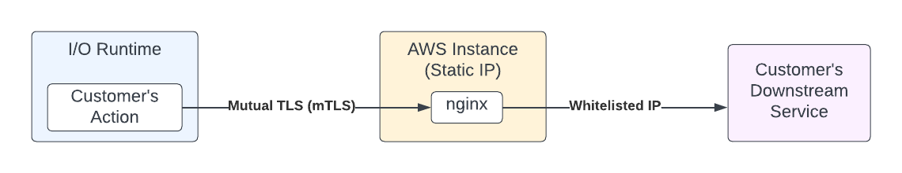

## Configuring a Secure Proxy

For security reasons, Runtime does not expose egress IPs. Customers who need a way to secure communication with downstream services using IP whitelisting can use a proxy between their backend service and I/O Runtime.

This can be done by adding a proxy component (in this example, an AWS EC2 instance running nginx). The proxy component will have a fixed IP address, so using an IP allowlist can secure the backend service. Communication between I/O Runtime and the proxy component will be secured via mutual TLS (mTLS) communication. 



The following steps outline how to:

* Configure the NGINX proxy component to support mutual TLS (mTLS)
* Configure an AppBuilder action to use mTLS to securely communicate with the proxy component

An EC2 instance with NGINX installed is a prerequisite for configuring this proxy. The [official NGINX documentation](https://docs.nginx.com/nginx/deployment-guides/amazon-web-services/ec2-instances-for-nginx/) has more information.

1. Verify SSH connectivity to the EC2 instance. (screenshot of terminal/template cmd)
   
   ```
   ssh -i <your-key.pem> ec2-user@<EC2-IPAddress>
   ```

2. Generate certificates needed for mTLS (link out to example-mtls project for generating secrets)
   
   * Generate **mtls_server.key/.crt**
     
     ```
     openssl req -x509 -nodes -days 3650 -newkey rsa:4096 -keyout mtls_server.key -out mtls_server.crt
     ```
   
   * Generate **mtls_client.key/.crt**
     
     ```
     openssl req -x509 -nodes -days 3650 -newkey rsa:4096 -keyout mtls_client.key -out mtls_client.crt
     ```

3. Use the referenced file `mtls.conf.example` and replace `DESTINATION_HOST` with the final destination you would like to proxy to. For example, if your target host is `api.myhost.com` you would search for this line:
   
   ```
   proxy_pass https://DESTINATION_HOST
   ```
   
    Then make the replacement:
   
   ```
   proxy_pass https://api.myhost.com
   ```
   
   Save the resulting file locally as `mtls.conf`, in the same folder as your certificates.

4. Copy sample NGINX configuration to EC2 instance with updated placeholder details. (terminal screenshots for `scp` cmds)
   
   1. First copy files to home folder:
      
      ```
      scp -i <your-key.pem> mtls_server.key mtls_server.crt mtls_client.key mtls_client.crt mtls.conf ec2-user@<EC2-IPAddress>:~/
      ```
   
   2. Then move them into place, while connected via SSH to the ec2 instance:
      
      ```
      sudo mv ~/mtls* /etc/nginx/conf.d/
      ```

5. Restart `nginx`

6. Verify you can connect via curl locally from the ec2 instance:
   
   ```
   $ curl -ki --cert /etc/nginx/conf.d/mtls_client.crt --key /etc/nginx/conf.d/mtls_client.key https://localhost/
   ```
   
   * To preserve your changes, you may [create an AMI](https://docs.aws.amazon.com/AWSEC2/latest/UserGuide/creating-an-ami-ebs.html) from your running AWS instance.

7. In your AppBuilder app, you will need to make changes to wire the mTLS client key and certificate.
   
   * **`.env`:** Add the following lines with paths to your mtls client certificate files.
     
     ```
     ## Support mTLS
     __AIO_MTLS_CERT=(cat /path/to/mtls_client.crt)
     __AIO_MTLS_KEY=(cat /path/to/mtls_client.key)
     ```
   
   * **`app.config.yaml`:** Add the following default parameters pointing to the environment variables.
     
     ```
     inputs:
         __AIO_MTLS_CERT: $__AIO_MTLS_CERT
         __AIO_MTLS_KEY: $__AIO_MTLS_KEY
     ```

8. In your action code, you can reference these environment variables when making an HTTP request to the proxy component (replace the `PROXY_ENDPOINT` with your AWS EC2 hostname/IP):
   
   ```
   // configure the client side of mTLS
   const options = {
       cert: params.__AIO_MTLS_CERT,
       key:  params.__AIO_MTLS_KEY,
       rejectUnauthorized: false, // in test, if you're working with self-signed certificates
       keepAlive: false, // switch to true if you're making a lot of calls from this client
   };
   
   const sslConfiguredAgent = new https.Agent(options);
   
   try {
       // Replace the `PROXY_ENDPOINT` with your AWS EC2 hostname/IP
       const url = "https://PROXY_ENDPOINT/path/to/resource?param=value"
   
       console.log(`Making call to: [${url}]`);
       // make the request just as you would normally ...
       const response = await fetch(url, {
       agent: sslConfiguredAgent, // ... but add the agent we initialised
       });
   
       const responseBody = await response.text();
   
       // handle the response as you would see fit
       console.log(responseBody);
       return { statusCode: 200, body: { resp: responseBody }};
   } catch (error) {
       // return the error
       console.log(error);
       return { statusCode: 418, body: { error: error }};
   }
   ```

9. Deploy your application to I/O Runtime via `aio app deploy` and test out the setup by invoking your action.

## Next steps

Return to the [Runtime Reference Documentation Index](index.md).

Return to the [Guides Index](../../index.md).
