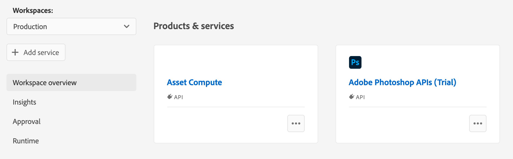

---
keywords:
  - Adobe I/O
  - Extensibility
  - API Documentation
  - Developer Tooling
contributors:
  - 'https://github.com/duynguyen'
title: 'Lesson 1: Create an App Builder app from the Asset Compute template'
---

# Lesson 1: Create an App Builder app from the Asset Compute template

To begin this codelab, you should have [a project already created from App Builder Template in Adobe Developer Console](../../getting-started/first-app.md#2-creating-a-new-project-on-developer-console). Please add the `Asset Compute` and `Adobe Photoshop APIs (Trial)` services to the workspace that you are using for the codelab.



Make sure to have the Adobe I/O CLI installed locally. In your terminal, execute the command `aio app init <app-name>`.

If you have not logged in already, this command prompts a browser asking you to sign into the Adobe Developer Console with your Adobe ID. See [here](../../getting-started/first-app.md#3-signing-in-from-cli) for more information on signing in from the cli.

After logging in, follow the prompts in the CLI and select the Organization, Project, and Workspace to use for the application. Choose the project and workspace you created when you set up your environment. When prompted `Which extension point(s) do you wish to implement ? `, make sure to select `DX Asset Compute Worker`:

```bash
$ aio app init <app-name>
Retrieving information from [!DNL Adobe I/O] Console.
? Select Org My Adobe Org
? Select Project MyFireflyProject
? Which extension point(s) do you wish to implement ? (Press <space> to select, <a>
to toggle all, <i> to invert selection)
❯◯ DX Experience Cloud SPA
 ◯ DX Asset Compute Worker
```

Follow the rest of the prompts and open the new application in Visual Studio Code (or your favorite code editor). It contains the scaffolding and sample code for a custom application.

The template application leverages the [Asset Compute SDK](https://github.com/adobe/asset-compute-sdk) for the uploading, downloading, and orchestration of application renditions so developers only need to implement the custom application logic. Inside the `actions/<worker-name>` folder, the `index.js` file is where to add the custom application code.
