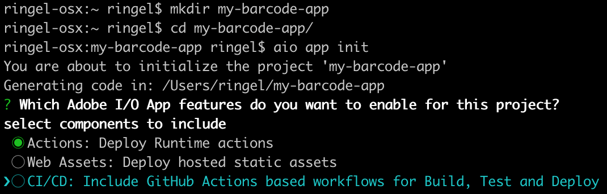
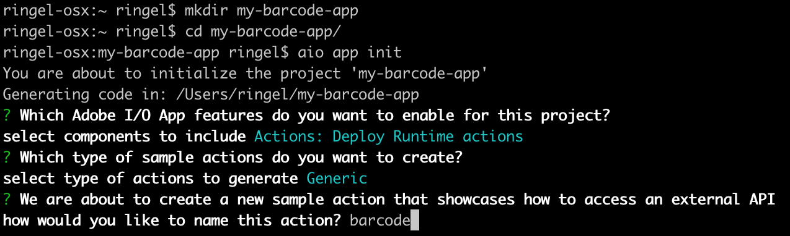
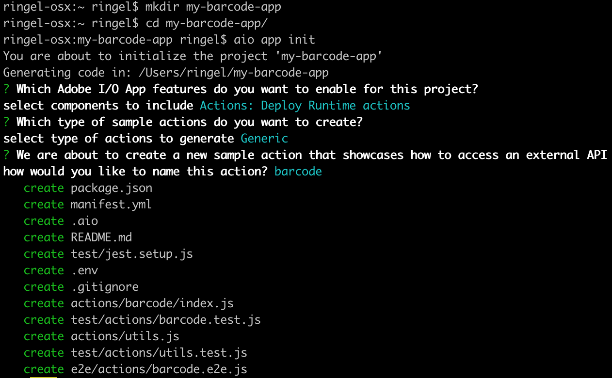

---
keywords:
  - Adobe I/O
  - Extensibility
  - API Documentation
  - Developer Tooling
title: 'Lesson 1: Bootstrap a Headless App Builder App'
---

# Lesson 1: Bootstrap a Headless App Builder App

In order to create your barcode application, use the following command:

```bash
aio app init my-barcode-app --no-extensions
```

We select the org, project and workspace for our app, and then be presented with a few options what you want your app to include, for example Serverless Actions, Web UI, CI/CD pipeline, and I/O Events. Since we are building a headless app, we're only interested in using `Actions: Deploy Runtime actions`.



The second question the CLI asks is which experience cloud or experience platform apps you want to extend or build. In this case, we're going to choose `Generic`.


To the third question, we'll specify the action name `barcode`.



From the command line, we are creating a Developer project with everything it needs, from the serverless actions, configuration files, tests, etc.



We didn't include the UI setup, CI/CD pipeline, nor I/O Events. These topics will be covered in other Code Labs.

For our barcode app, we'll start by modifying the following files:

**app.config.yaml**, which contains all defined actions with their default parameters:

```yaml
application:
  actions: actions
  web: web-src
  runtimeManifest:
    packages:
      my-app:
        license: Apache-2.0
        actions:
          generic:
            function: actions/generic/index.js
            web: 'yes'
            runtime: 'nodejs:14'
            inputs:
              LOG_LEVEL: debug
            annotations:
              require-adobe-auth: true
              final: true
```

**package.json**, which holds your app name, version and all dependencies that will be bundled when deploying the barcode action:

```json
{
  "name": "my-barcode-app",
  "version": "0.0.1",
  "dependencies": {
    "@adobe/aio-sdk": "^2.1.0",
    "node-fetch": "^2.6.0"
  },
  "devDependencies": {
    "jest": "^24.9.0",
    "@adobe/wskdebug": "^1.1.0"
  },
  "scripts": {
    "test": "jest",
    "e2e": "jest --collectCoverage=false --testRegex ./e2e"
  }
}
```

**.env** should not be committed, since this is where you'll store your Adobe I/O Runtime secrets (namespace and auth):

```
# Specify your secrets here
# This file should not be committed to source control

## please provide your Adobe I/O Runtime credentials
# AIO_RUNTIME_AUTH=
# AIO_RUNTIME_NAMESPACE=
```

**actions/barcode/index.js** is the source code of your barcode action:

```javascript
/*
* <license header>
*/

/**
 * This is a sample action showcasing how to access an external API
 */

const { Core } = require('@adobe/aio-sdk')
const fetch = require('node-fetch')
const { errorResponse, getBearerToken, stringParameters, checkMissingRequestInputs } = require('../utils')

// main function that will be executed by Adobe I/O Runtime
async function main (params) {
  // create a Logger
  const logger = Core.Logger('main', { level: params.LOG_LEVEL || 'info' })

  try {
    // 'info' is the default level if not set
    logger.info('Calling the main action')

    // log parameters, only if params.LOG_LEVEL === 'debug'
    logger.debug(stringParameters(params))

    // check for missing request input parameters and headers
    const requiredParams = [/* add required params */]
    const errorMessage = checkMissingRequestInputs(params, requiredParams, ['Authorization'])
    if (errorMessage) {
      // return and log client errors
      return errorResponse(400, errorMessage, logger)
    }

    // extract the user Bearer token from the input request parameters
    const token = getBearerToken(params)

    // replace this with the api you want to access
    const apiEndpoint = 'https://adobeioruntime.net/api/v1/api-docs'

    // fetch content from external api endpoint
    const res = await fetch(apiEndpoint)
    if (!res.ok) {
      throw new Error('request to ' + apiEndpoint + ' failed with status code ' + res.status)
    }
    const content = await res.json()
    logger.debug('fetch content = ' + JSON.stringify(content, null, 2))
    const response = {
      statusCode: 200,
      body: content
    }

    // log the response status code
    logger.info(`${response.statusCode}: successful request`)
    return response
  } catch (error) {
    // log any server errors
    logger.error(error)
    // return with 500
    return errorResponse(500, 'server error', logger)
  }
}

exports.main = main
```
