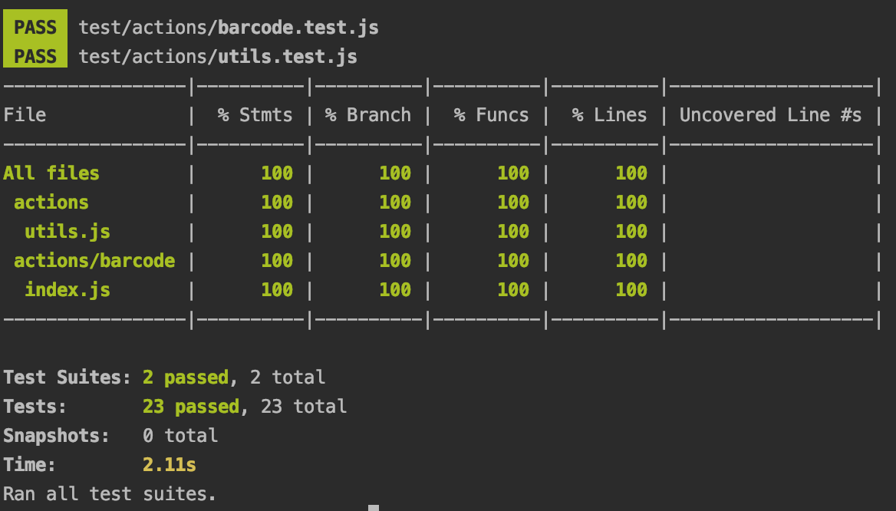
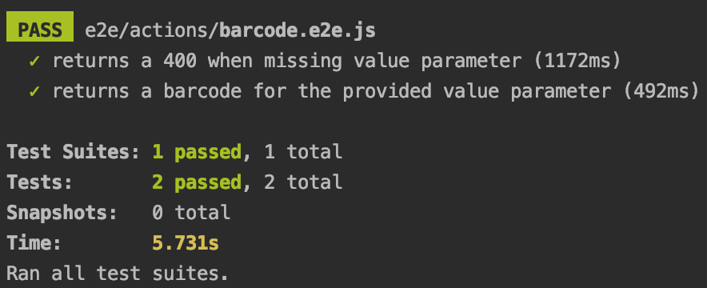

---
keywords:
  - Adobe I/O
  - Extensibility
  - API Documentation
  - Developer Tooling
title: 'Lesson 3: Testing a Serverless Action'
---

# Lesson 3: Testing a Serverless Action

An App Builder App created with `aio app init` has a [Jest](https://jestjs.io/) test structure by default. We'll show how to take advantage of it.

## Unit tests

Under `test/actions`, you should see a file named `barcode.test.js`. We'll add our barcode action unit tests to it.
First we add some required dependencies like the action itself, the logger, and `bwip-js` that we'll mock using Jest utilities.   

```javascript
const { Core } = require('@adobe/aio-sdk');
const bwipjs = require('bwip-js');
const action = require('./../../actions/barcode/index.js');

jest.mock('@adobe/aio-sdk', () => ({
  Core: {
    Logger: jest.fn()
  }
}));

const mockLoggerInstance = {
  info: jest.fn(),
  debug: jest.fn(),
  error: jest.fn()
};
Core.Logger.mockReturnValue(mockLoggerInstance);

jest.mock('bwip-js');

beforeEach(() => {
  Core.Logger.mockClear();
  mockLoggerInstance.info.mockReset();
  mockLoggerInstance.debug.mockReset();
  mockLoggerInstance.error.mockReset();
});

// Test parameters
const params = {
  value: 'test'
};
```

The first test, which is bootstrapped by default, is whether our action is exporting a main function which is a main requirement for all actions.

```javascript
test('main should be defined', () => {
  expect(action.main).toBeInstanceOf(Function);
});
```

The second test, which is also bootstrapped, is testing the log level defined in the `manifest.yml` for our barcode action which is defined as `LOG_LEVEL: debug` by default.

```javascript
test('should set logger to use LOG_LEVEL param', async () => {
  await action.main({
    LOG_LEVEL: 'level'
  });
  expect(Core.Logger).toHaveBeenCalledWith(expect.any(String), { level: 'level' });
});
```

Next, we'll verify that a successful 200 http action response also returns the correct `Content-Type` and `body`. For that, we'll mock `bwipjs.toBuffer` to respond with fake data:   

```javascript
test('should return a 200 http response', async () => {
  bwipjs.toBuffer.mockResolvedValue('barcode');

  const response = await action.main(params);
  expect(response.statusCode).toEqual(200);
  expect(response.headers['Content-Type']).toEqual('image/png');
  expect(response.body).toEqual('barcode');
});
```

We'll use the same mechanism to verify a 500 http action response by mocking an error: 

```javascript
test('if there is an error should return a 500 and log the error', async () => {
  const error = new Error('barcode error');
  bwipjs.toBuffer.mockRejectedValue(error);

  const response = await action.main(params);
  expect(response).toEqual({
    error : {
      statusCode: 500,
      body: { error: 'barcode error' }
    }
  });
  expect(mockLoggerInstance.error).toHaveBeenCalledWith(error);
});
```

Finally, we'll end the test suite by testing the 400 http response if the `value` parameter is missing:

```javascript
test('missing input request parameters, should return 400', async () => {
  const response = await action.main({});
  expect(response).toEqual({
    error: {
      statusCode: 400,
      body: { error: 'missing parameter(s) \'value\'' }
    }
  })
});
```

To run the tests, we can use `npm run test`, a predefined npm script in `package.json` but first we'll modify the script to add the code coverage in the output:

```javascript
"test": "jest --collectCoverage=true --testRegex ./test/actions"
```

Running the unit tests should output 100% coverage (which also includes the utils tests): 

 

## End-to-End tests
## End-to-End tests

Similar to unit tests, we have a predefined structure for end-to-end tests, but it's empty - so let's add a test that will read our barcode.
For that we'll use [javascript-barcode-reader](https://www.npmjs.com/package/javascript-barcode-reader/) to read the code128 barcode output by our action. 

First, we're adding our dependencies like `node-fetch` to make an http request to fetch the action response and `javascript-barcode-reader` to read it.

```javascript
const { Config } = require('@adobe/aio-sdk').Core;
const fs = require('fs');
const fetch = require('node-fetch');
const barcodeReader = require('javascript-barcode-reader');
```

By default, your deployed action is accessible at `https://<namespace>.adobeioruntime.net/api/v1/web/<app-name>-<version>/<action>`. 
We can construct the action URL following this pattern:

```javascript
const namespace = Config.get('runtime.namespace');
const hostname = Config.get('cna.hostname') || 'adobeioruntime.net';
const packageJSON = JSON.parse(fs.readFileSync('package.json').toString());
const runtimePackage = `${packageJSON.name}-${packageJSON.version}`;
const actionUrl = `https://${namespace}.${hostname}/api/v1/web/${runtimePackage}/barcode`;
```

We'll create a first test to verify that the action will fail to render a barcode without the `value` parameter and respond accordingly: 

```javascript
test('returns a 400 when missing value parameter', async () => {
  const res = await fetch(actionUrl);
  expect(res).toEqual(expect.objectContaining({
    status: 400
  }));
  const body = await res.json();
  expect(body).toEqual(expect.objectContaining({
    error: 'missing parameter(s) \'value\''
  }));
});
```

The second test will actually read the value of the barcode and test it against the provided `value` parameter. For that, we'll temporary store the barcode as PNG image in order to pass it to the reader:    

```javascript
test('returns a barcode for the provided value parameter', async () => {
  const param = 'value';
  const res = await fetch(`${actionUrl}?value=${param}`);
  expect(res).toEqual(expect.objectContaining({
    status: 200
  }));
  expect(res.headers.get('content-type')).toEqual('image/png');

  const buffer = await res.buffer();
  const barcode = `${__dirname}/barcode.png`;
  fs.writeFile(barcode, buffer);

  const value = await barcodeReader({
    image: barcode,
    barcode: 'code-128'
  });

  expect(value).toEqual(param);

  fs.unlinkSync(barcode);
});
```

Similar to the unit tests, we'll use the npm script `npm run e2e` from `package.json` to run the e2e tests which will output:


