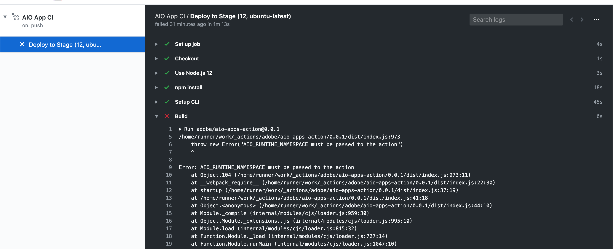
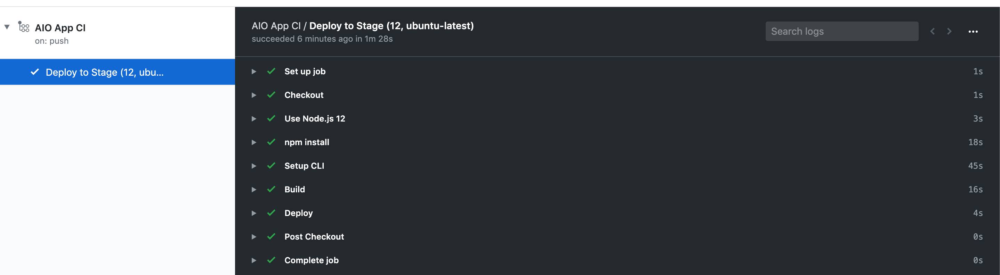
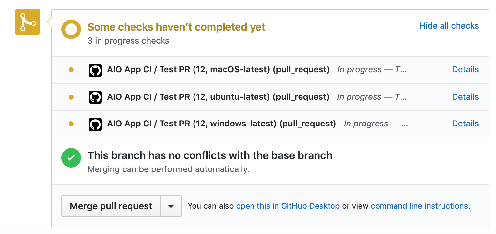
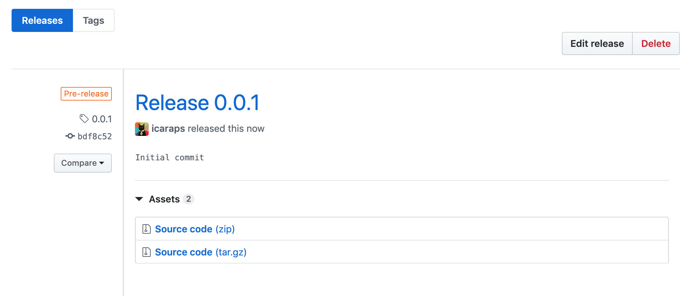
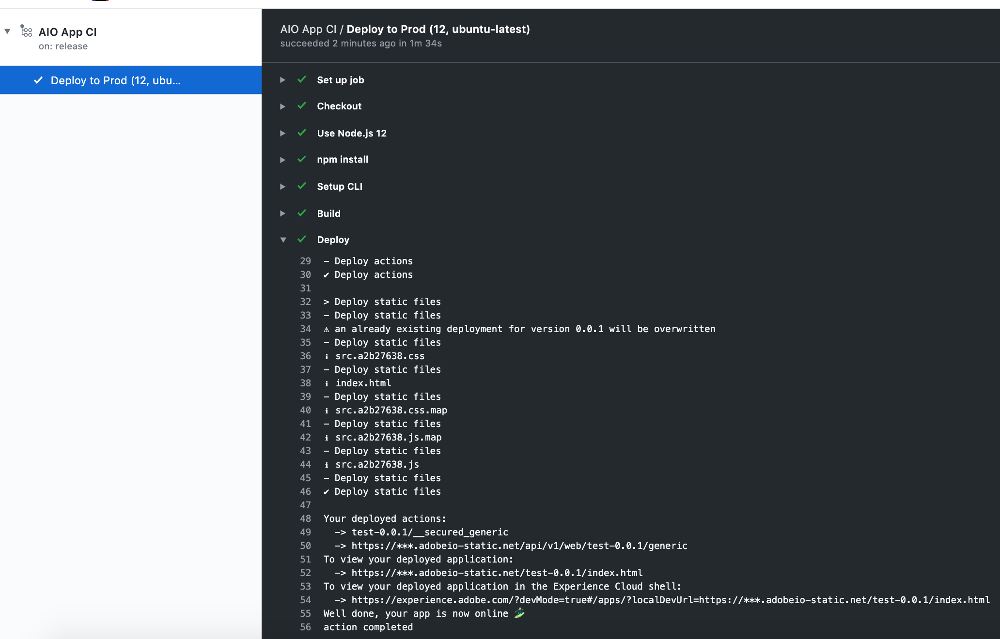

# Lesson 2: Monitoring CI/CD

Once your GitHub actions and secrets are defined in the repository, you can monitor the workflow directly in GitHub on `https://github.com/<org>/<project_name>/actions`.

## Re-run failing jobs

In the previous lesson, the job failed because the GitHub secrets were missing. Go to the failed job named `AIO App CI / Deploy to Stage` and click on the `Build` step to open the logs:

`AIO_RUNTIME_NAMESPACE must be passed to the action` is the thrown error message.

Now that the secrets are defined, you can try to rerun the job by clicking on Re-run all jobs to start the workflow. The job should complete and all steps should pass: 

If you click on the Deploy step to open the logs, you'll see that your App Builder App was deployed successfully on your stage environment:

## Run tests on pull request

The GitHub action defined in `pr_test.yml` will run `aio app test` any time a pull request is submitted to your project. 
By default, it will only run tests for the Runtime actions. If all the checks pass and the pull request is merged, the above workflow will run and deploy the App Builder App on the Stage environment. 

## Continuous deployment

To deploy your App Builder App on the Production environment, perform a GitHub release in your project repository, since the GitHub action relies on the `release` event.

For convenience, we'll go to `https://github.com/<org>/<project_name>/releases/new` to perform a release. Fill out the release version, optionally add a release title and description, then click Publish Release. 

     

Finally, the Deploy GitHub action will run and deploy the App Builder App on the Production environment using the Production GitHub secrets:

## Debugging jobs

GitHub Actions provide cloud based CI/CD features; therefore you can't debug jobs locally. GitHub provides tools to help you debug failing jobs.

Please find more information on how to view run logs, enable verbose logs, and more in the [GitHub documentation](https://docs.github.com/en/free-pro-team@latest/actions/managing-workflow-runs).   
