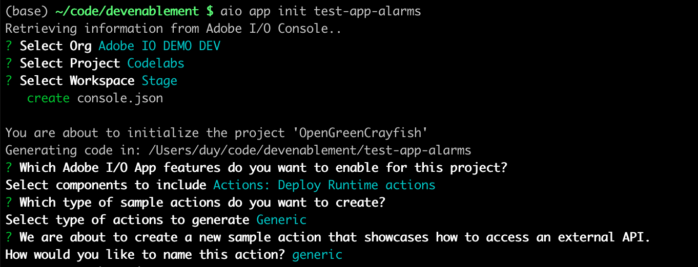
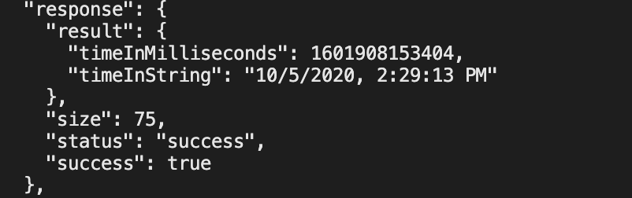

---
keywords:
  - Adobe I/O
  - Extensibility
  - API Documentation
  - Developer Tooling
contributors:
  - 'https://github.com/duynguyen'
title: 'Lesson 1: Bootstrap a Headless App'
---

# Lesson 1: Bootstrap a Headless App

First, you need a new headless app created with AIO CLI. This app needs only a simple action to test the cron job, so all other components have been deselected.
Follow this, from [Creating your First App Builder Application](../../get_started/app_builder_get_started/first-app.md)



Now edit the action code at `actions/generic/index.js` to simplify it. We will make it print the current execution time to logs, and return it in the result:

```javascript
const { Core } = require('@adobe/aio-sdk')

async function main (params) {
  const logger = Core.Logger('main', { level: 'info' })

  try {
    logger.info('Calling the main action')
    const currentTime = new Date()
    logger.info(`Current time is ${currentTime.toLocaleString()}.`)

    return {
      timeInMilliseconds: currentTime.getTime(),
      timeInString: currentTime.toLocaleString()
    }
  } catch (error) {
    logger.error(error)
    return { error }
  }
}

exports.main = main
```

Because the action is invoked only by internal alarms, it does not need to be exposed as a web action. This prevents the action from being accessed by unprivileged users. Your manifest file should look like this:

```yaml
application:
  actions: actions
  web: web-src
  runtimeManifest:
    packages:
      my-app:
        license: Apache-2.0
        actions:
          generic:
            function: actions/generic/index.js
            web: 'yes'
            runtime: 'nodejs:14'
```

To test the action, you could execute `aio app deploy` in the VSCode terminal. Once the deployment is finished, run `aio rt action invoke your-app-name/generic` and verify its result and logs using `aio rt activation get ID` and `aio rt activation logs ID` (`ID` is available in the output of the invoke command earlier). This is an extract of the result from the activation information:


