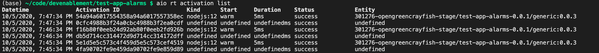

```yaml
keywords:
- Adobe I/O
- Extensibility
- API Documentation
- Developer Tooling
- OpenWhisk
contributors:
- 'https://github.com/duynguyen'
title: 'Lesson 2: Set up Alarm Feed with Trigger and Rule'
description: 'Instructions to configure the OpenWhisk Alarm Package interval feed to fire triggers on a scheduled basis, linking triggers and rules to actions.'
faqs:
- question: What does the /whisk.system/alarms/interval feed do?
  answer: It fires trigger events on a specified interval schedule, allowing periodic execution of actions.
- question: What is the only required parameter for the interval feed?
  answer: The required parameter is "minutes", which sets the interval length in minutes between trigger events.
- question: How can I test if my trigger schedule is working correctly?
  answer: Deploy your app with `aio app deploy` and verify the action invocation using `aio rt activation list` after 1-2 minutes.
- question: What optional parameters can I provide to the interval feed?
  answer: You can provide optional parameters like trigger_payload, startDate, and stopDate to customize trigger behavior.
- question: How do I connect a trigger to an action in this setup?
  answer: Create a rule that links the trigger (using the interval feed) to the target action you want executed on each trigger event.
```
# Lesson 2: Set up Alarm Feed with Trigger and Rule

Use the `/whisk.system/alarms/interval` feed of the OpenWhisk Alarm Package to [fire trigger events on an interval base schedule](https://github.com/apache/openwhisk-package-alarms#firing-a-trigger-event-periodically-on-an-interval-based-schedule). To see the effect instantly, we will make it run every minute. You will need a [trigger](https://github.com/apache/openwhisk/blob/master/docs/triggers_rules.md#creating-triggers) set up with the `/whisk.system/alarms/interval` feed, and a [rule](https://github.com/apache/openwhisk/blob/master/docs/triggers_rules.md#using-rules) to wire this trigger to the `generic` action created earlier.

The only required parameter for the `interval` feed is `minutes`, which is an integer representing the length of the interval (in minutes) between trigger fires. Optional parameters are `trigger_payload`, `startDate` and `stopDate`.

```yaml
application:
  actions: actions
  web: web-src
  runtimeManifest:
    packages:
      my-app:
        license: Apache-2.0
        actions:
          generic:
            function: actions/generic/index.js
            web: 'yes'
            runtime: 'nodejs:14'
            inputs:
              LOG_LEVEL: debug
            annotations:
              final: true
        triggers:
          everyMin:
            feed: /whisk.system/alarms/interval
            inputs: 
              minutes: 1
        rules:
          everyMinRule:
            trigger: everyMin
            action: generic
```

To test the trigger schedule,  deploy the app again with `aio app deploy`, and observe that the action is invoked after 1 - 2 minutes with `aio rt activation list`.
To test the trigger schedule,  deploy the app again with `aio app deploy`, and observe that the action is invoked after 1 - 2 minutes with `aio rt activation list`.


