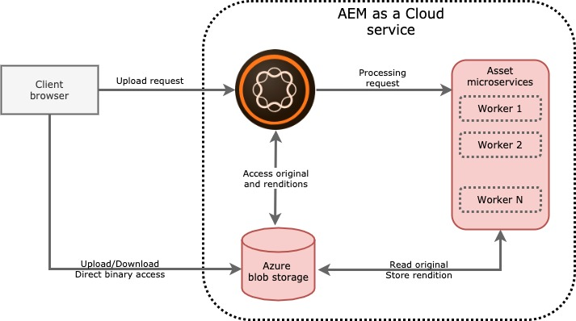
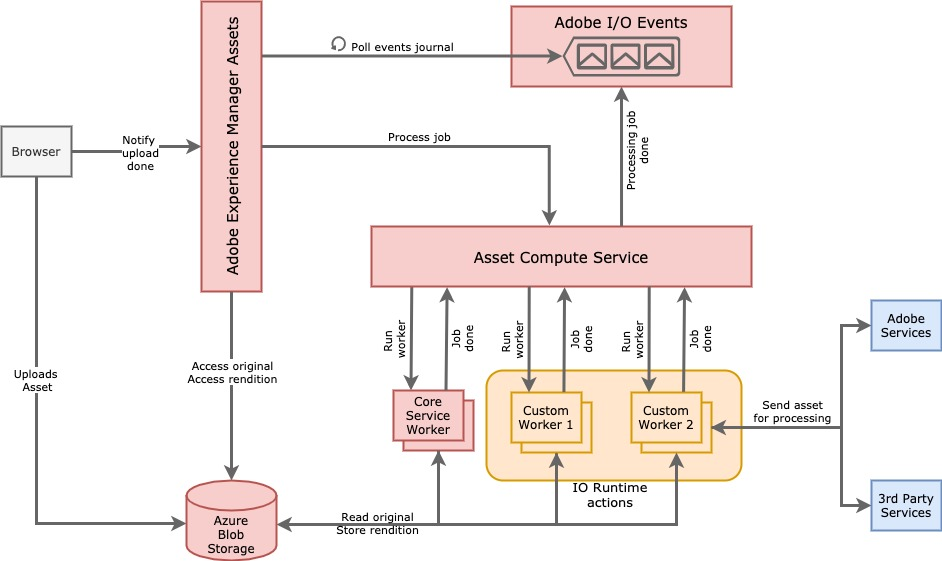

---
keywords:
  - Adobe I/O
  - Extensibility
  - API Documentation
  - Developer Tooling
contributors:
  - 'https://github.com/marcinczeczko'
title: How AEM as Cloud Aassets Works
---

# How AEM as Cloud Assets Works

Asset binaries are no longer processed by the AEM instance. AEM only coordinates access to the Azure Blob storage where binaries are stored.

The red box called **Asset microservices** at the right on the diagram lists the services that are driven by Adobe Asset Compute, which is built on top of Adobe IO Runtime. The aim of this service is to:

- Perform any kind of asset binary transformation, such as: resizing, cropping, intelligent cropping, colors
  manipulation or anything else you can imagine
- An image transformation is driven by the Adobe's internal services for image manipulation or by third-party services in
  case of custom implementation.
- Store the result of the processing back to AEM as an asset rendition.

The high-level architecture of the Asset Compute service is shown here:

The usual flow of the data is:
1. Once an asset is uploaded, AEM sends a processing job to the Asset Compute service
   - The job carries information such as the location of the source asset (on Azure blob storage), desired rendition
     format (png, jpg, etc.), rendition sizes and/or quality, etc.
   - Optionally, the job could hold extra parameters defined on AEM if a custom worker is used
2. Asset Compute service immediately returns the job ID back to AEM and dispatches the job among available workers:
   - As shown in the diagram, workers can be Adobe built-in workers or custom workers, such as the one we'll build in this article
3. When the worker is invoked, it usually downloads the source asset from the binary cloud storage and either forwards
   it to the third-party service for processing or does the image processing itself
4. Once the worker's job is done, it uploads the result back to the binary cloud storage and notifies Asset Compute
   service that it's done
5. Asset Compute service generates an asynchronous event via the "Adobe I/O Events" service and the processing flow
   finishes
6. Because of the asynchronous nature of the processing, AEM doesn't block itself waiting for a result. Therefore, AEM has to poll the IO Events service periodically to get the status of a given job ID.
7. If the I/O Events Journal returns that the job is finished, AEM updates a JCR representation of the asset with information about the generated renditions, that is, it internally links the JCR rendition node with the binary cloud storage site of the rendition binary

