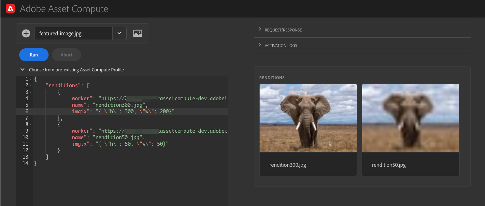

---
keywords:
  - Adobe I/O
  - Extensibility
  - API Documentation
  - Developer Tooling
contributors:
  - 'https://github.com/marcinczeczko'
title: 'Lesson 4: Test the worker'
---

# Lesson 4: Test the Worker

Run this command:

```
$> aio app run
```

After a few seconds it will open Asset Compute Devtool in your browser. Within that tool, you can test your worker without the AEM.



Since our worker requires `imgix` parameter (as seen at line 34 in the worker code), you need to provide it in the worker request object as shown on the screenshot. That parameter must be an escaped JSON. For instance, use this parameter to resize an image to 300x300px:

```json
"imgix": "{ \"h\": 300, \"w\": 300}"
```

Then run your worker and observe results on the right side of the Asset Compute Devtool.

To let AEM use our worker, deploy the app by running:

```
$> aio app deploy
```

The command, will return the URL of your worker, similar to the below. Write it down, so we can put it in the AEM configuration.

```
Your deployed actions:
  -> dx-asset-compute-worker-1/__secured_my-worker
  -> https://99999-myassetcompute-dev.adobeioruntime.net/api/v1/web/dx-asset-compute-worker-1/my-worker
Well done, your app is now online 🏄
```
