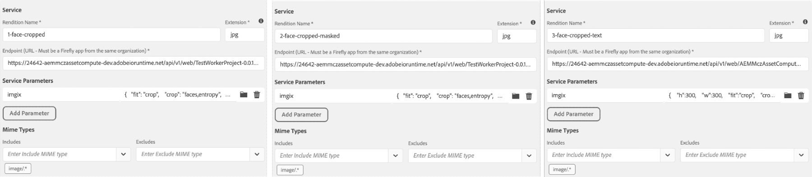
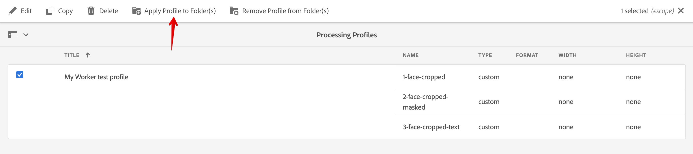
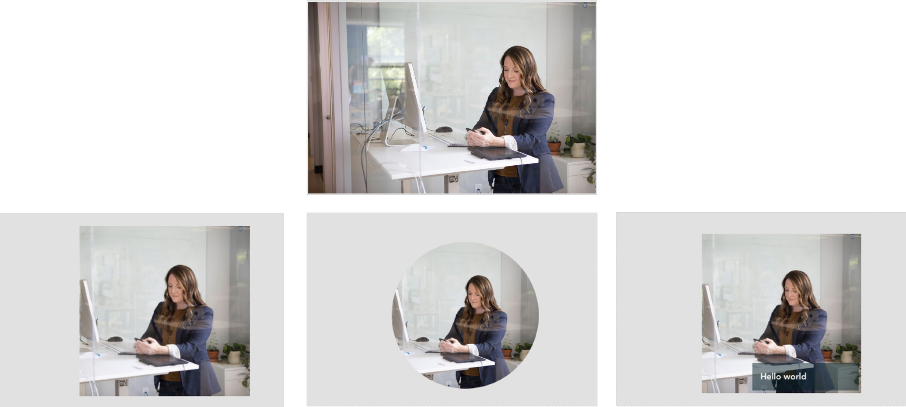

---
keywords:
  - Adobe I/O
  - Extensibility
  - API Documentation
  - Developer Tooling
contributors:
  - 'https://github.com/marcinczeczko'
title: 'Lesson 5: Setup AEM to use the worker'
---

# Lesson 5: Set Up AEM to Use the Worker

Go to your AEM Cloud instance and open Tools -> Assets -> Processing Profiles. Then create a new processing profile, for example `My Worker test profile`. On the Custom tab, configure your renditions to use your worker, as shown here:



These three renditions were created using imgix configuration parameters - we don't need to escape JSON, since it's used in AEM:

1. Crop an image to 300x300 px around faces if detected, or around busy sections of the image (entropy):
   
   ```json
   {
    "fit": "crop",
    "crop": "faces,entropy",
    "w": 300,
    "h": 300
   }
   ```

2. Apply an ellipse mask around the cropped area in the previous rendition.
   
   ```json
   {
    "fit": "crop",
    "crop": "faces,entropy",
    "w": 300,
    "h": 300,
    "fm": "png",
    "mask": "ellipse"
   }
   ```

3. Add a text watermark to the rendition in the previous image:
   
   ```json
   {
    "h": 300,
    "w": 300,
    "fit": "crop",
    "crop": "faces,entropy",
    "mark": "https://assets.imgix.net/~text?w=200&txt-color=fff&txt=Hello+world&txt-size=16&txt-lead=0&txt-pad=15&bg=80002228&txt-font=Avenir-Heavy"
   }
   ```

Finally, apply the profile to DAM folder:



Now you can upload images to the folder and observe results on the asset details page.

 

Photo by [LinkedIn Sales Navigator](https://unsplash.com/@linkedinsalesnavigator?utm_source=unsplash&amp;utm_medium=referral&amp;utm_content=creditCopyText) on [Unsplash](https://unsplash.com/s/photos/women-sitting?utm_source=unsplash&amp;utm_medium=referral&amp;utm_content=creditCopyText).
