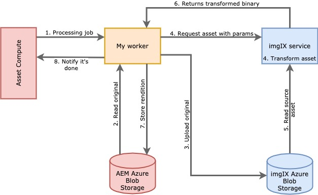

---
keywords:
  - Adobe I/O
  - Extensibility
  - API Documentation
  - Developer Tooling
contributors:
  - 'https://github.com/marcinczeczko'
title: Architecture of our worker
---

# Architecture of Our Worker

We're going to build a custom worker for Asset Compute service that will produce renditions using the [imgIX][**imgix**] service.

imgIX is an immensely powerful image processing service, composed of three layers:

- imgIX CDN to cache and deliver rendered images.
- imgIX rendering cluster to process the images.
- The source, where source images are hosted, and from which a the rendering cluster initially pulls them. In our case, it will be Azure blob storage.

The service architecture suggests that it's built primarily to provide a layer delivering transformed and optimized assets directly to a website via the dedicated domain. However, for the sake of this tutorial, we will use it differently - our worker will fetch the rendered images from imgIX and transfer them to AEM storage instead of serving them directly from the imgIX Content Delivery Network on the website.

A conceptual diagram of data flow for our solution looks like this:

- On each processing job, our worker first transfers the source image from AEM binaries cloud storage to the Azure blob storage that a source of assets for imgIX.
- The worker then generates a URL to imgIX. This URL holds the parameters specifying how to transform the image. These parameters come from the processing job, and are provided by the AEM user while configuring what renditions to generate.
- Finally, it downloads the asset from the generated URL and uploads it back to the AEM binaries cloud storage.

[imgix]: https://www.imgix.com/
