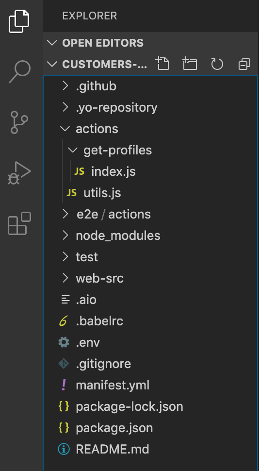
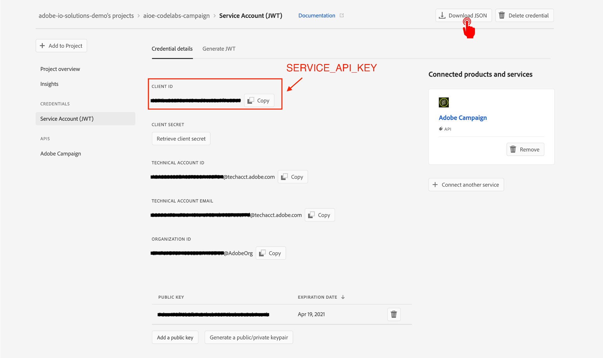
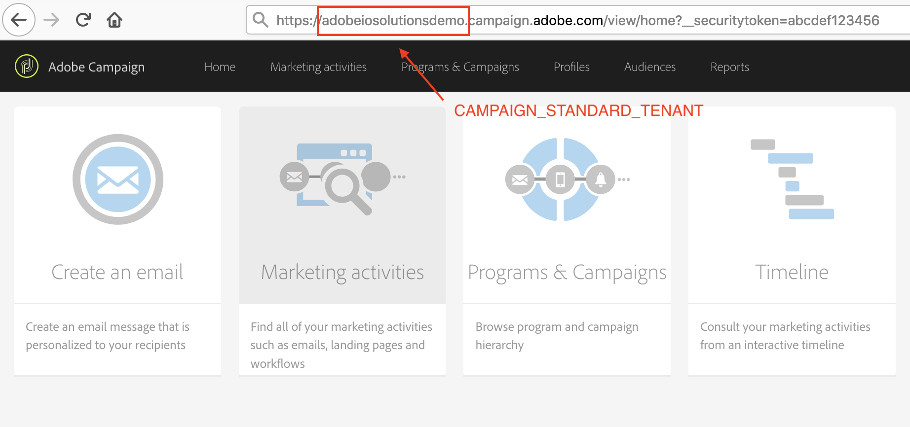
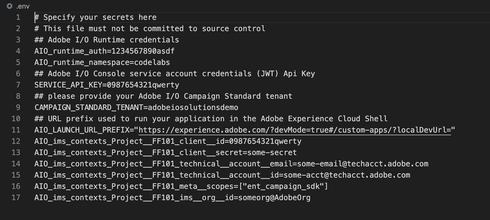

---
keywords:
  - Adobe I/O
  - Extensibility
  - API Documentation
  - Developer Tooling
contributors: 
  - https://github.com/duynguyen 
---

# Lesson 1: Create a New App Builder App from Campaign Standard Template

To initialize an App Builder app, let's use init command from the CLI.

```bash
aio app init customers-dashboard
```

You should be selecting the org, project and workspace for your app, and then presented with a few options what you want your app to include (serverless actions, web UI assets, CI/CD pipeline, events). In this lab, we keep all except events.

The next question asks you to select the sample actions to be created as part of the initial app. As customer profiles are pulled from Campaign Standard, we are going to select `Adobe Campaign Standard` for this question (by pressing `<Space>` to select / de-select, and `<Enter>` to confirm the choice).

Then you will be asked to specify the names of the sample action. Let's name it `get-profiles`.


What happens next, is that from the command line a NodeJS project is created including the Adobe I/O Runtime actions, configuration files, tests etc. You could explore your project in VS Code, either by opening VSCode -> Open... -> select app folder, or typing the following command.

```bash
code customers-dashboard
```



Upon app initialization, some of the mandatory environment variables are automatically defined in the `.env` file, namely `AIO_runtime_namespace`, `AIO_runtime_auth`, and `SERVICE_API_KEY`. If they are not set, you can download the Runtime credentials and obtain the API key from I/O Console.  



Finally, for Campaign Standard integration, you also need to set the required variable for `CAMPAIGN_STANDARD_TENANT`. It is usually the subdomain of your Campaign Standard instance. Otherwise, please consult with your Campaign TechOps team for the correct value.



All set environment variables should be then uncommented.




