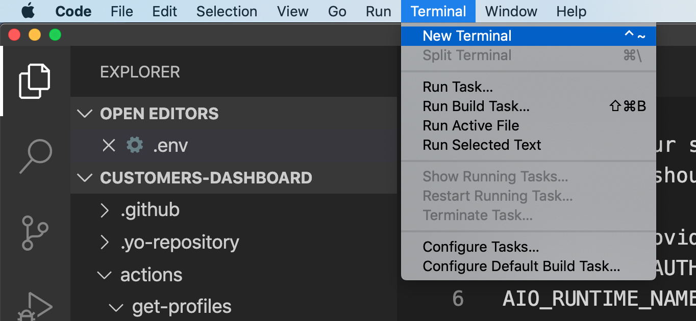
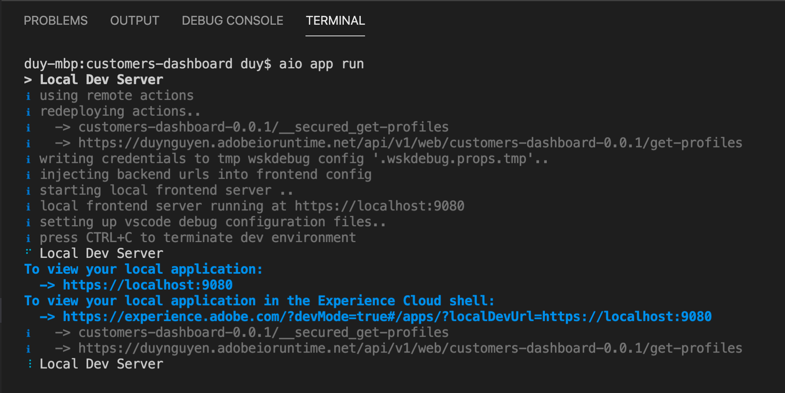
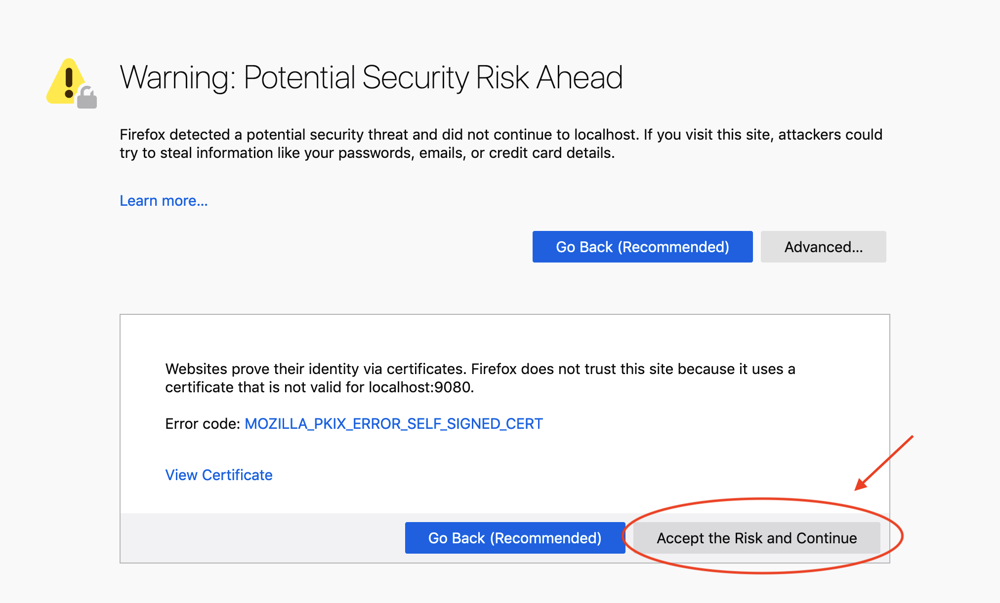
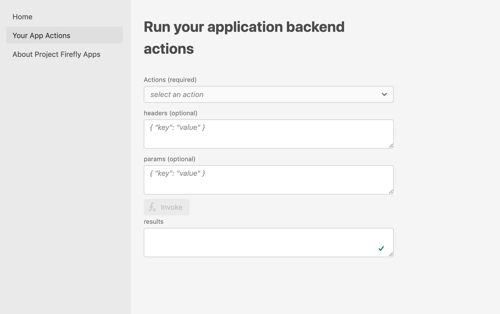
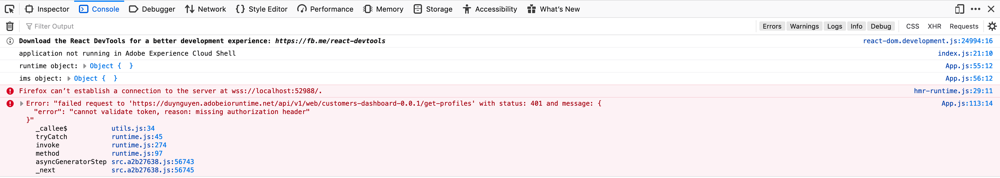
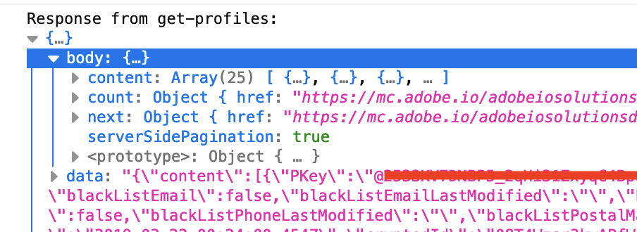

---
keywords:
  - Adobe I/O
  - Extensibility
  - API Documentation
  - Developer Tooling
contributors:
  - 'https://github.com/duynguyen'
title: 'Lesson 3: Run the App Builder App Locally'
---

# Lesson 3: Run the App Builder App Locally

First, open the terminal in VS Code:



Run the application by executing this using the AIO CLI:

```bash
aio app run
```

It will deploy the `get-profiles` action onto I/O Runtime, and spin up a local instance for the UI. When the app is up and running, it can be seen at https://localhost:9080



Please note that since you are visiting the localhost site using HTTPS, the browser may give you a warning for the lack of certificate. That's acceptable for this app, so you can accept and continue to the page.



You should be able to see the UI of the app. Navigating to `Your App Actions`, complete the form that allows you to try invoking the existing actions in the app:



Invoke the `get-profiles` action by selecting it from the dropdown list, and pressing the `Invoke` button. Since there is no user token embedded in the request header, you will see a `401 Unauthorized` error in the browser console:



You can see from the Terminal output that it is also possible to access the app from ExC Shell at https://experience.adobe.com/?devMode=true#/apps/?localDevUrl=https://localhost:9080. You may be asked to log in using your Adobe ID. 

When opened, you will see a UI like the one you accessed on localhost, except for the ExC Shell on top.


Here, your Adobe IMS user profile has been stored in the browser session, so you can make requests to the `get-profiles` action using your user token. Invoke the action again. 

This time, the action runs successfully and you can see the list of profiles in the browser console:



The app is now running locally and ready for development. If you explore why it works, please check out [App Builder App Security Overview](../../guides/app_builder_guides/security/index.md).
