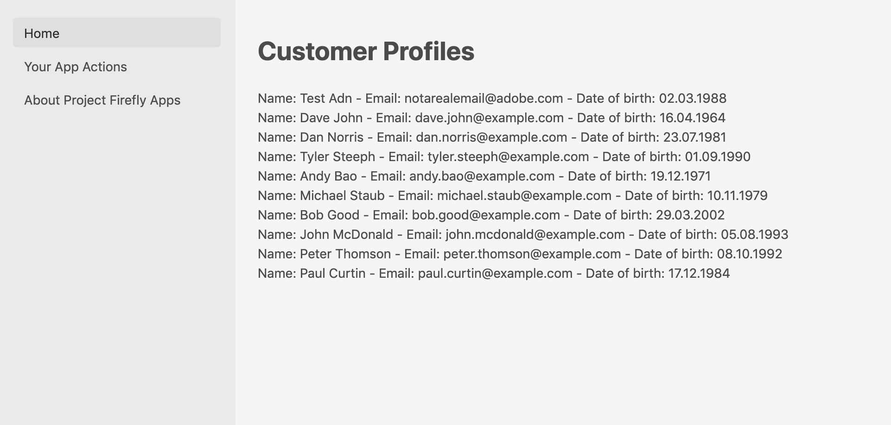

---
keywords:
  - Adobe I/O
  - Extensibility
  - API Documentation
  - Developer Tooling
contributors:
  - 'https://github.com/duynguyen'
title: 'Lesson 4: List All Customer Profiles on the UI'
---

# Lesson 4: List All Customer Profiles on the UI

The app UI is powered by [React Spectrum](https://react-spectrum.adobe.com/react-spectrum/index.html) by default. To learn more about React Spectrum, please consult the [React Spectrum Code Lab](../todo-app/index.md).  

In the [previous lesson](lesson3.md), customer profiles were loaded to the front end only when you click the "Invoke" button. Now we want the profiles loaded automatically on the Home page when the page is ready, with no human interaction. 

We will use the `componentWillMount` method to initiate loading profiles, and store the loaded data in `profiles` parameter of the component's state. We use `<Flex>` and `<Grid>` from React Spectrum to lay out spectrum components on the page. Each entry of the customer profiles returned by the `get-profiles` action is displayed with first name, last name, and email of the customer. You may also apply CSS styling in the `index.css` file to improve its appearance. 

Below is the complete code of `Home.js`:

```javascript
import React from 'react'
import PropTypes from 'prop-types'
import { Flex, Grid, ProgressCircle, Heading, Text, View } from '@adobe/react-spectrum'
import actions from '../config.json'
import actionWebInvoke from '../utils'

class Home extends React.Component {
  constructor (props) {
    super(props)

    this.state = {
      actionResponseError: null,
      actionInvokeInProgress: false,
      profiles: null
    }
  }

  async componentWillMount () {
    this.setState({ actionInvokeInProgress: true })

    const headers = {}
    const params = {}

    // set the authorization header and org from the ims props object
    if (this.props.ims.token && !headers.authorization) {
      headers.authorization = 'Bearer ' + this.props.ims.token
    }
    if (this.props.ims.org && !headers['x-gw-ims-org-id']) {
      headers['x-gw-ims-org-id'] = this.props.ims.org
    }
    try {
      const actionResponse = await actionWebInvoke(actions['get-profiles'], headers, params)
      this.setState({ profiles: actionResponse.body.content, actionResponseError: null, actionInvokeInProgress: false })
      console.log(`action response:`, actionResponse)
    } catch (e) {
      console.error(e)
      this.setState({ profiles: null, actionResponseError: e.message, actionInvokeInProgress: false })
    }
  }

  render () {
    const profiles = this.state.profiles
    console.log(`profiles object:`, profiles)
    return (
      <View>
        <Heading level={1}>Customer Profiles</Heading>
        <Flex UNSAFE_className='profiles'>
          <ProgressCircle
                UNSAFE_className='actions-invoke-progress'
                aria-label='loading'
                isIndeterminate
                isHidden={ !this.state.actionInvokeInProgress }/>
          { !!profiles &&
            <Grid>
              {profiles.map((profile, i) => {
                return <Flex UNSAFE_className='profile'>Name: { profile['firstName'] } { profile['lastName'] } - Email: { profile['email'] } - Date of birth: { profile['birthDate'] }</Flex>
              })}

            </Grid>
          }
          { !profiles &&
            <Text>No profiles!</Text>
          }
        </Flex>
      </View>
    )
  }
}

Home.propTypes = {
  ims: PropTypes.any
}

export default Home
```

> Note: For simplicity, we are displaying only the first page of the result. In a real environment with hundreds of profiles, results are returned in batches, so you will need to handle pagination of data accordingly.

The `Home` component above requires the `ims` object in its `propTypes` to get the IMS context for calling the back-end actions, including the access token and org ID. This object is passed from the `App` component, so it has to be updated accordingly in the `App.js` file.

```javascript
<Home ims={props.ims} />
```

Since your app is already running because you ran `aio app run` in the previous lesson, you can see the updated UI by refreshing the webpage at https://experience.adobe.com/?devMode=true#/apps/?localDevUrl=https://localhost:9080.


