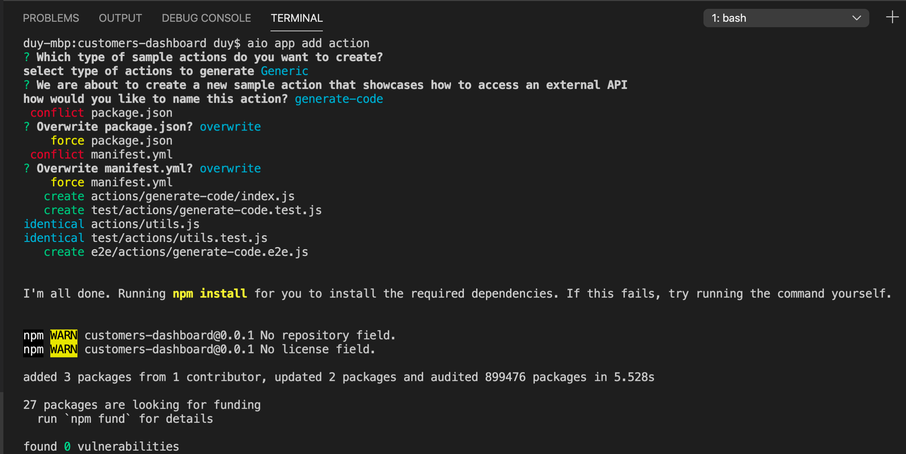
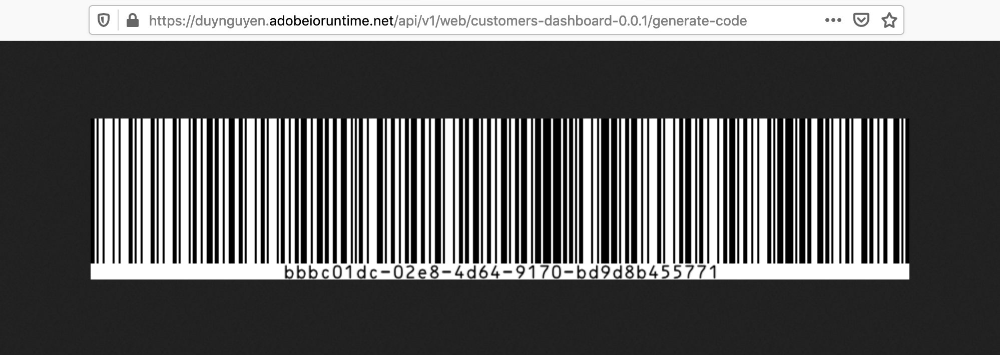
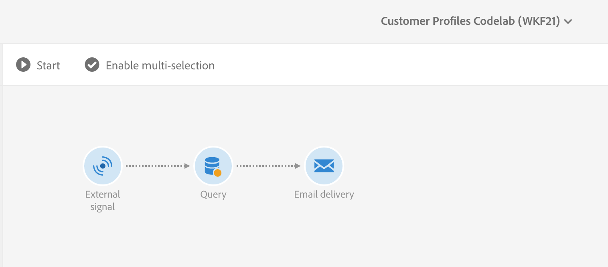
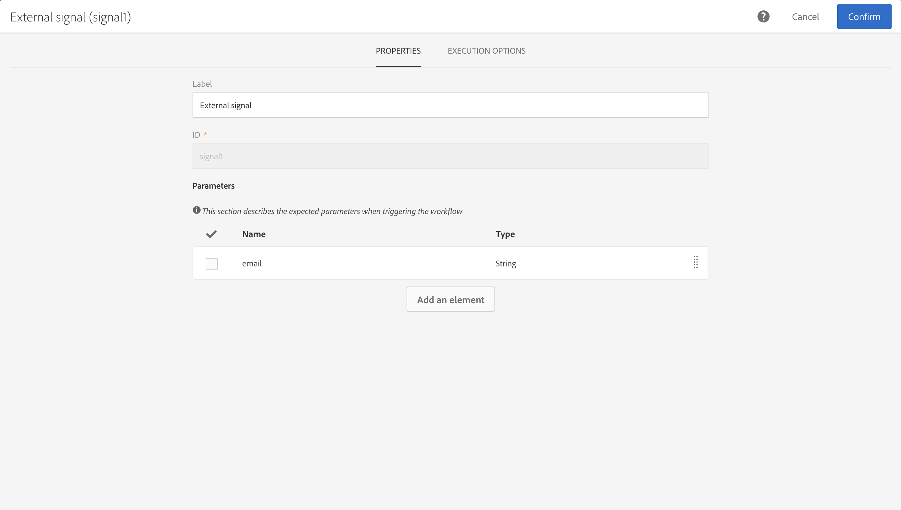
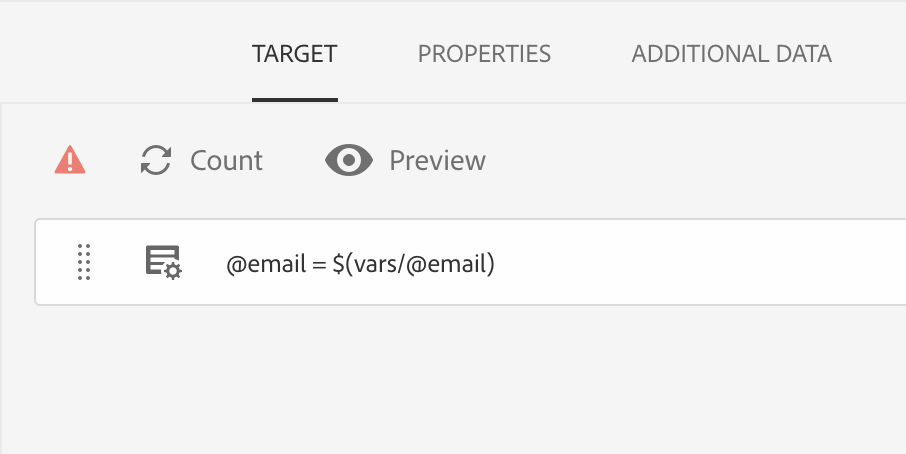
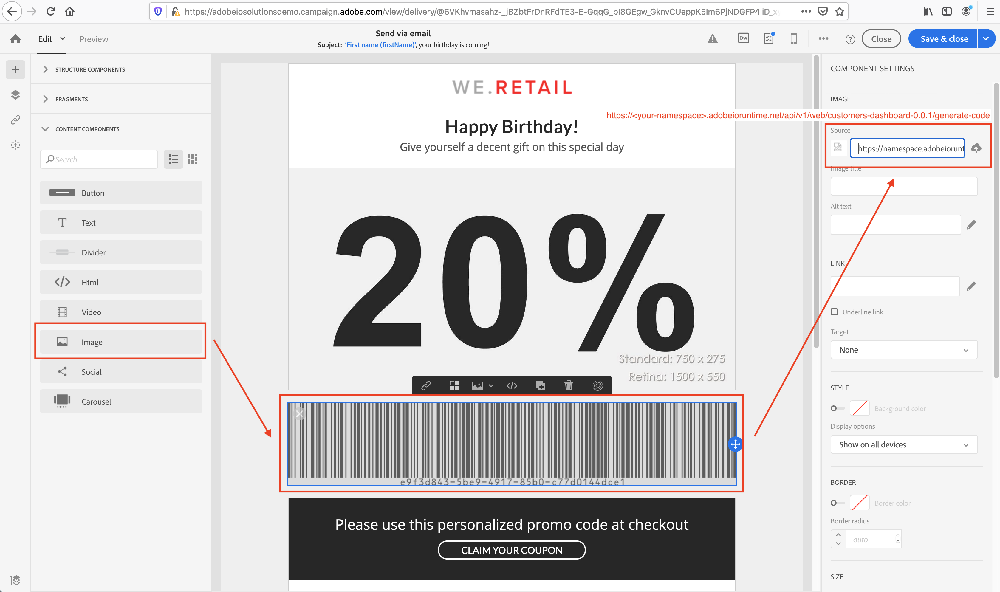
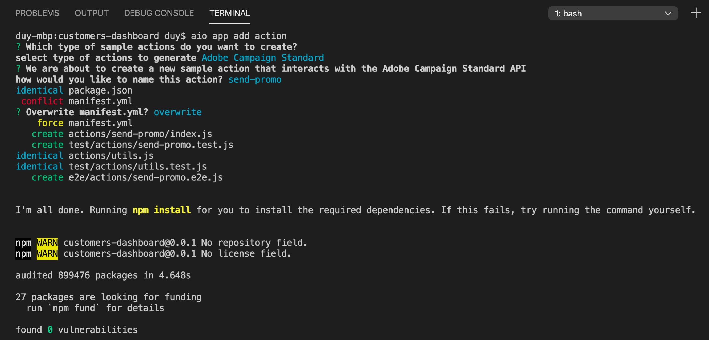
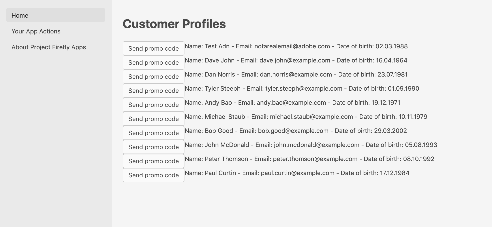
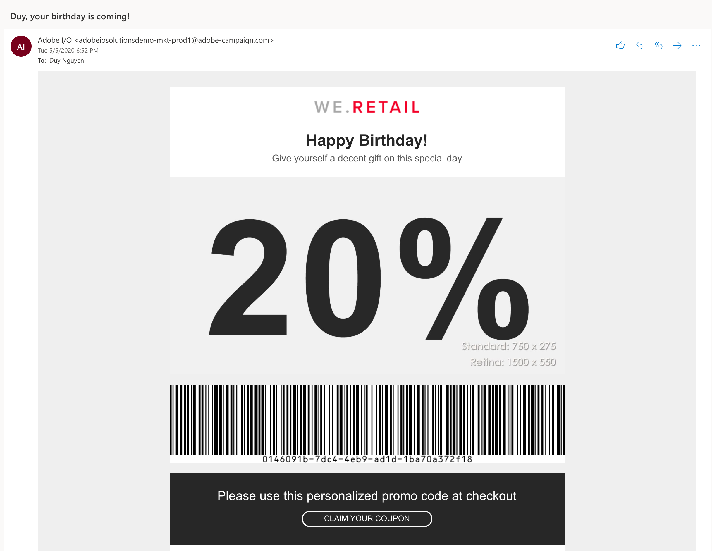

---
keywords:
  - Adobe I/O
  - Extensibility
  - API Documentation
  - Developer Tooling
contributors:
  - 'https://github.com/duynguyen'
title: 'Lesson 5: Add Personalized Promotion Emails Triggering'
---

# Lesson 5: Add Personalized Promotion Emails Triggering

> Note: This is an advanced part of the Code Lab. You can go through it, or skip it and jump to the [Recap](welldone.md).

Now that your app displays a list of customer profiles, you can add user interaction to it. Imagine a marketer looking at different customer profiles with more extensive data such as past orders, date of birth, gender), who wants to send promotional discount codes to specific customers. Therefore, we will add a "Send promo code" button.

First, we need a new action for generating the promo code. Here we use the [uuid](https://www.npmjs.com/package/uuid) npm package to generate it, and [bwip-js](https://www.npmjs.com/package/bwip-js) to render a visual barcode. Add them as a dependency in `package.json`, and run `npm install`. To add the new action, run this `aio` command, and specify the inputs according to the screenshot below:

```bash
aio app add action
```



Upon a successful execution, the `generate-code` action is added to the ext.config.yaml file, and its source code is at `src/dx-excshell-1/actions/generate-code/index.js`. Since we don't need authentication for this action, we will remove `require-adobe-auth: true` from its definition in manifest file, and remove the authorization checks in the code. We also add the code for generating UUID and return it in the response body:

```javascript
/**
 * This action generates a barcode of a random UUID as personalized promo code
 */

const { Core } = require('@adobe/aio-sdk')
const { v4: uuid4 } = require('uuid')
const bwipjs = require('bwip-js')
const { errorResponse } = require('../utils')

// main function that will be executed by Adobe I/O Runtime
async function main (params) {
  // create a Logger
  const logger = Core.Logger('main', { level: params.LOG_LEVEL || 'info' })

  try {
    // 'info' is the default level if not set
    logger.info('Calling the main action')

    // generate UUID code
    const promoCode = uuid4()
    const buffer = await bwipjs.toBuffer({
      bcid: 'code128',
      text: promoCode,
      scale: 2,
      includetext: true,
      backgroundcolor: 'ffffff'
    })
    const response = {
      headers: { 'Content-Type': 'image/png' },
      statusCode: 200,
      body: buffer.toString('base64')
    }

    // log the response status code
    logger.info(`${response.statusCode}: successful request`)
    return response
  } catch (error) {
    // log any server errors
    logger.error(error)
    // return with 500
    return errorResponse(500, 'server error', logger)
  }
}

exports.main = main
```

Verify that the new action is working by running the app locally with `aio app run`, and check the response of `https://<your-namespace>.adobeioruntime.net/api/v1/dx-excshell-1/generate-code` on the browser. You can find your own URL from the terminal output.



> Note: Visit the codelab [Headless Apps with App Builder](../barcode-reader/index.md) to learn more about building a headless app for barcode generation.

Now that you have it set up in App Builder app, the next step is to create a marketing workflow in Campaign Standard to receive external signals from the app and send promotion emails. To do that, go to *Marketing Activities > Create > Workflow*. Define the properties of your workflow, and finish the creation.  

Your new workflow should contain three components in this order:

1. External signal
2. Query user by email
3. Email delivery



In the "External signal" component, make sure it accepts `email` as an input parameter:



In the "Query" component, make sure that it uses the `email` param to query user:



In the "Email delivery" component, go to its editor to design the email. In this lab we will use the "Email Designer" mode, and the available "Astro - Coupon" template.  

Design the email as you like. A required component is an image that loads the barcode from the `generate-code` action:



Save your Campaign Standard Workflow and start it. It should be now ready to execute upon external signal triggering.  

The last step is to add an action to trigger the Campaign Standard workflow, and a "Send promo code" button on the app UI. We use `aio app add action` again to add the `send-promo` action:



To trigger the workflow, provide a workflow ID to the triggering API. You can find it on the Campaign Standard UI. In your `.env` file, add a new variable for it, for example `CAMPAIGN_STANDARD_WORKFLOW_ID=WKFXX`. This environment variable is then interpreted into a default parameter of the `send-promo` action in the `ext.config.yaml` file:

```yaml
send-promo:
  function: actions/send-promo/index.js
  web: 'yes'
  runtime: 'nodejs:14'
  inputs:
    LOG_LEVEL: debug
    tenant: $CAMPAIGN_STANDARD_TENANT
    apiKey: $SERVICE_API_KEY
    workflowId: $CAMPAIGN_STANDARD_WORKFLOW_ID
  annotations:
    require-adobe-auth: true
    final: true
```

Then update the source code at `actions/send-promo/index.js`:

```javascript
/**
 * This action triggers Campaign Standard workflow to send promotion email to a specific email address
 */

const { Core } = require('@adobe/aio-sdk')
const { CampaignStandard } = require('@adobe/aio-sdk')
const { errorResponse, getBearerToken, stringParameters, checkMissingRequestInputs } = require('../utils')

// main function that will be executed by Adobe I/O Runtime
async function main (params) {
  // create a Logger
  const logger = Core.Logger('main', { level: params.LOG_LEVEL || 'info' })

  try {
    // 'info' is the default level if not set
    logger.info('Calling the main action')

    // log parameters, only if params.LOG_LEVEL === 'debug'
    logger.debug(stringParameters(params))

    // check for missing request input parameters and headers
    const requiredParams = ['apiKey', 'tenant', 'workflowId', 'email']
    const errorMessage = checkMissingRequestInputs(params, requiredParams, ['Authorization'])
    if (errorMessage) {
      // return and log client errors
      return errorResponse(400, errorMessage, logger)
    }

    // extract the user Bearer token from the input request parameters
    const token = getBearerToken(params)

    // initialize the sdk
    const campaignClient = await CampaignStandard.init(params.tenant, params.apiKey, token)

    // get workflow from Campaign Standard
    const workflow = await campaignClient.getWorkflow(params.workflowId)
    const wkfHref = workflow.body.activities.activity.signal1.trigger.href

    // trigger the signal activity API
    const triggerResult = await campaignClient.triggerSignalActivity(wkfHref, { source: 'API', parameters: { email: params.email } })

    // log the trigger result
    logger.info(triggerResult)

    const response = {
      statusCode: 200,
      body: { success: 'ok' }
    }

    // log the response status code
    logger.info(`${response.statusCode}: successful request`)
    return response
  } catch (error) {
    // log any server errors
    logger.error(error)
    // return with 500
    return errorResponse(500, 'server error', logger)
  }
}

exports.main = main
```

To update the UI, open `Home.js` and add method `sendPromo()`:

```javascript
async sendPromo (email) {
  try {
    const headers = {}

    // set the authorization header and org from the ims props object
    if (this.props.ims.token && !headers.authorization) {
      headers.authorization = 'Bearer ' + this.props.ims.token
    }
    if (this.props.ims.org && !headers['x-gw-ims-org-id']) {
      headers['x-gw-ims-org-id'] = this.props.ims.org
    }
    const actionResponse = await actionWebInvoke(actions['send-promo'], headers, { email })
    console.log(`Response from send-promo:`, actionResponse)
  } catch (e) {
    // log and store any error message
    console.error(e)
  }
}
```

Finally, update the rendered profiles grid view to include the "Send Promo"" button. Since we're using new React Spectrum components for the confirm dialog, make sure they are imported properly in `Home.js`:

```javascript
// importing confirm dialog components, along with previously available components
import { ActionButton, AlertDialog, DialogTrigger, Flex, Grid, ProgressCircle, Heading, Text, View } from '@adobe/react-spectrum'
```

```javascript
// in render(), update the Grid component
render () {
  const profiles = this.state.profiles
  console.log(`profiles object:`, profiles)
  return (
    <View>
      <Heading level={1}>Customer Profiles</Heading>
      <Flex UNSAFE_className='profiles'>
          <ProgressCircle
            UNSAFE_className='actions-invoke-progress'
            aria-label='loading'
            isIndeterminate
            isHidden={ !this.state.actionInvokeInProgress }/>
          { !!profiles &&
            <Grid>
              {profiles.map((profile, i) => {
                return <Flex UNSAFE_className='profile' key={ profile['PKey'] }>
                  <DialogTrigger>
                    <ActionButton
                      UNSAFE_className='actions-invoke-button'>
                      Send promo code
                    </ActionButton>
                    <AlertDialog
                      variant='confirmation'
                      title='Send promo code'
                      primaryActionLabel='Confirm'
                      cancelLabel='Cancel'
                      onPrimaryAction={ () => this.sendPromo(profile['email']) }>
                      Do you want to send promo to { profile['email'] }?
                    </AlertDialog>
                  </DialogTrigger>
                  Name: { profile['firstName'] } { profile['lastName'] } - Email: { profile['email'] } - Date of birth: { profile['birthDate'] }
                </Flex>
              })}
            </Grid>
          }
          { !profiles &&
            <Text>No profiles!</Text>
          }
        </Flex>
    </View>
  )
}
```

Then execute `aio app run` again to confirm that your app is running locally:



Try clicking to send a promo to a profile with your own email address; a prompt will confirm your command. Check your email to confirm that you received it:


