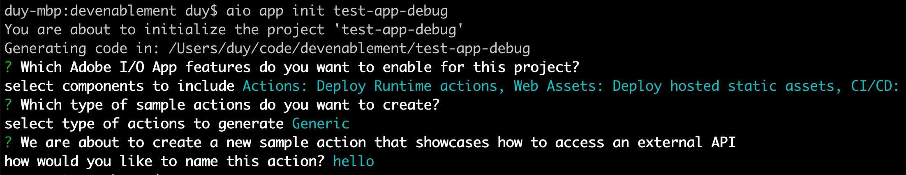
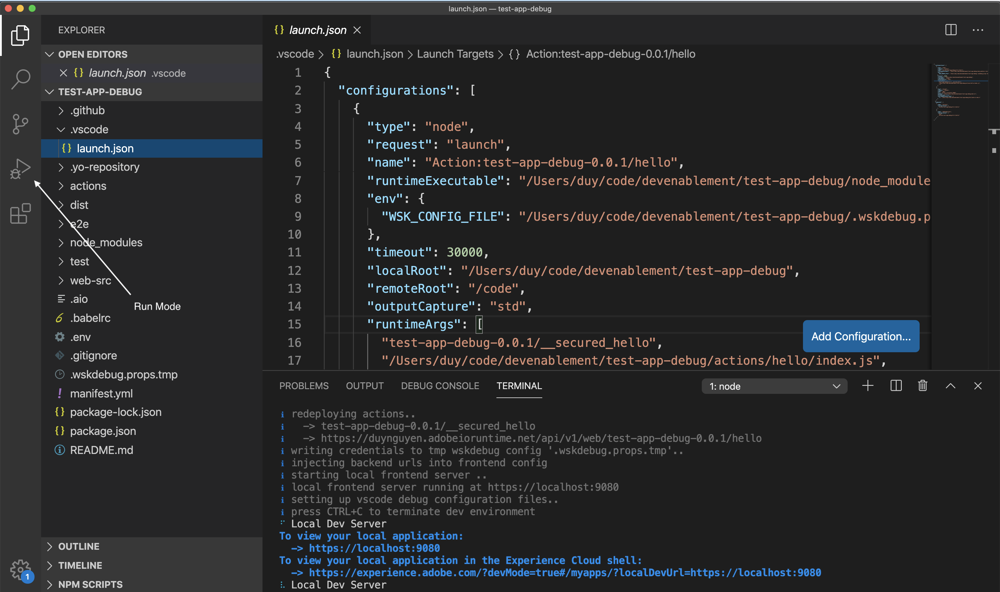
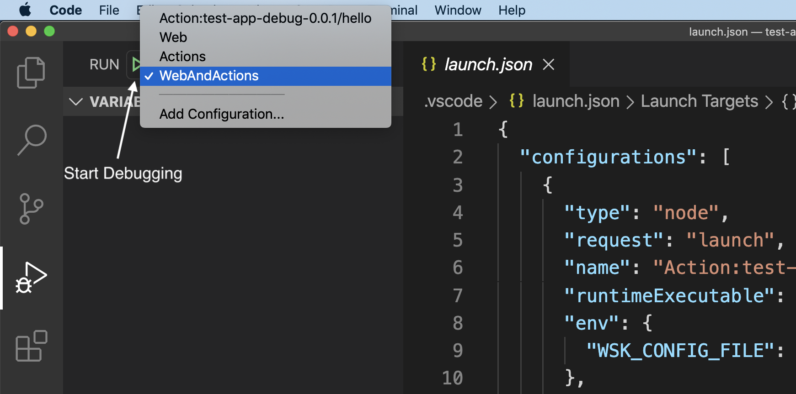
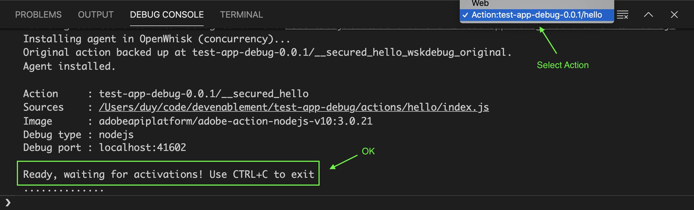
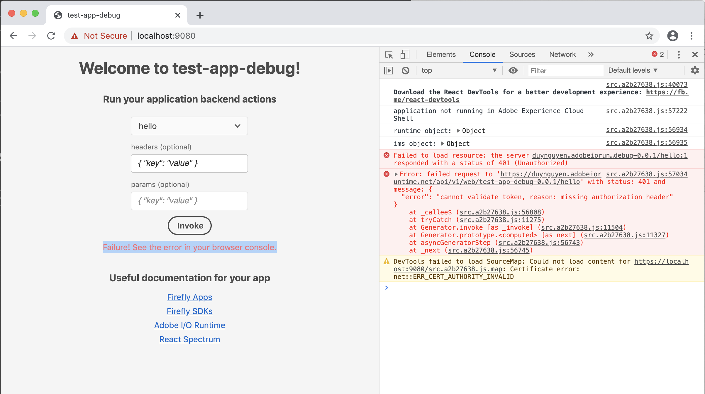

---
keywords:
  - Adobe I/O
  - Extensibility
  - API Documentation
  - Developer Tooling
contributors:
  - 'https://github.com/duynguyen'
title: 'Lesson 1: Getting familiar with Debugger'
---

# Lesson 1: Getting familiar with Debugger

First of all, you need a new app created with AIO CLI.

Then, open the app in VSCode, and execute `aio app run` in the terminal. Optionally, you can add `--local` flag to make your actions run in the local OpenWhisk environment, as well as `--verbose` flag to see more inspection details of your deployment.

You will see the VSCode launch profile automatically generated in `.vscode/launch.json`, with a few available configurations:
* `Action:test-app-debug-0.0.1/hello`: for debugging the `hello` action
* `Web`: for debugging the UI components
* `Actions` (compound): for debugging all actions
* `WebAndActions` (compound): for debugging all actions and UI components (end to end)

Let's navigate to the "Run" mode.

Select the `WebAndActions` profile, and click the Start Debugging button.

You will see the web UI appearing immediately after that. However, the action launch would take some time (usually up to 10 seconds). You could verify that the action is ready in the Action view of Debug Console.

Try invoking the `hello` action from the user form on UI, you will see an error `Failure! See the error in your browser console.`. That's all good for now.

