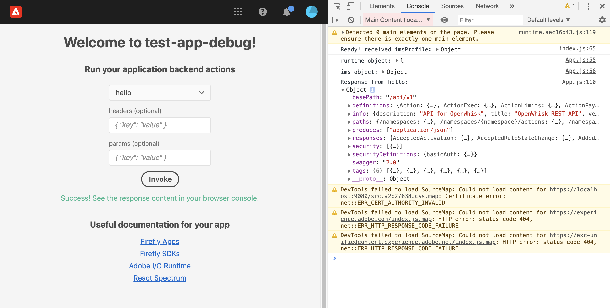
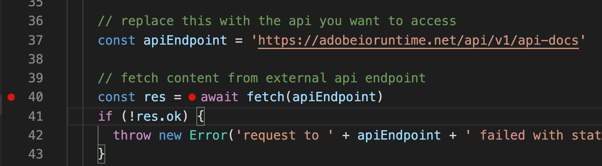
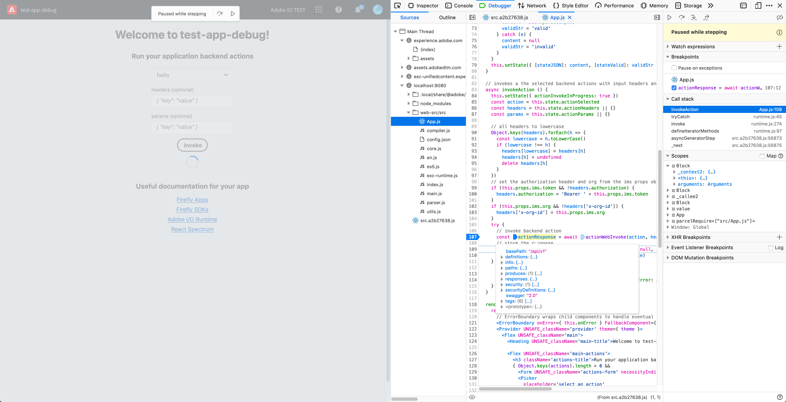

---
keywords:
  - Adobe I/O
  - Extensibility
  - API Documentation
  - Developer Tooling
contributors:
  - 'https://github.com/duynguyen'
title: 'Lesson 2: Debugging Application Code'
---

# Lesson 2: Debugging Application Code

To overcome the error that you got in the previous lesson, open your app inside the Adobe Experience Cloud (ExC) Shell on the same Chrome Debug window: https://experience.adobe.com/?devMode=true#/apps/?localDevUrl=https://localhost:9080. You may be asked to log in using your Adobe ID. When opened, the UI is similar to the one you accessed on localhost, except with the ExC Shell on top.

This time, the action runs successfully, and you can see the response body of `hello` action in the browser console:



To debug this action, go back to Explorer View in VSCode, open the file `actions/hello/index.js`. At line 40, it makes a request to the Adobe I/O Runtime API docs at https://adobeioruntime.net/api/v1/api-docs.

```javascript
const apiEndpoint = 'https://adobeioruntime.net/api/v1/api-docs'
const res = await fetch(apiEndpoint)
```

You may want to debug what was returned from this API call to decide what to do next. To debug, you need a breakpoint at line 40:



In the Chrome Debug window, access the at inside ExC Shell if you have not already done so: https://experience.adobe.com/?devMode=true#/apps/?localDevUrl=https://localhost:9080. Now select and invoke the `hello` action. Your debugger will stop at the breakpoint you set earlier so you can inspect the values of the variables in your code.

> Note: If your code uses App Builder [State](https://github.com/adobe/aio-lib-state) or [Files](https://github.com/adobe/aio-lib-files) SDKs, you cannot use this debugging method, as described [here](../../get_started/app_builder_get_started/troubleshoot.md#debugging-errors-with-state-and-files-sdk).


You can debug UI code in the `web-src` folder as outlined in [debugging action code](lesson2.md). But you may find the built-in debugging capabilities of most browsers a more productive approach.

Here is an example run on Firefox:


