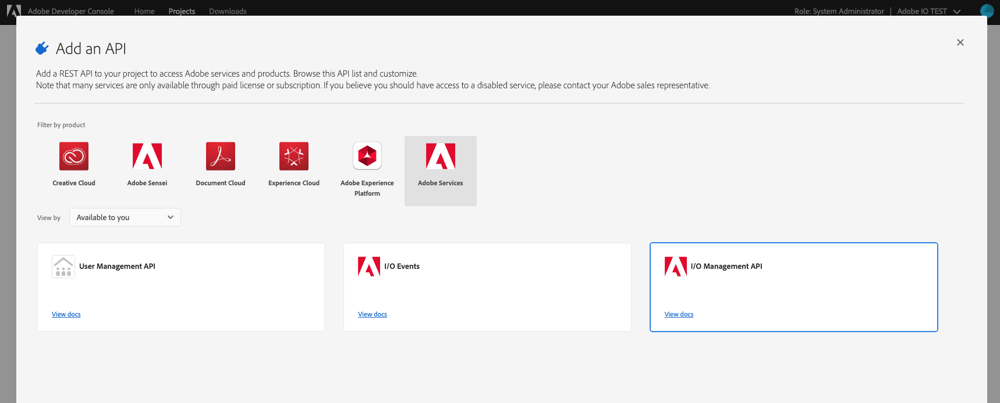
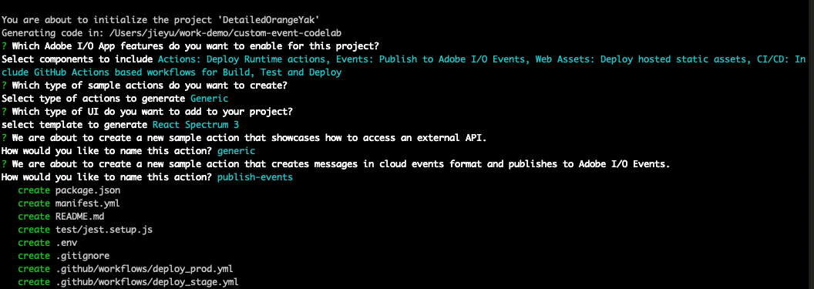

---
keywords:
  - Adobe I/O
  - Extensibility
  - API Documentation
  - Developer Tooling
contributors:
  - 'https://github.com/Yu1986'
title: 'Lesson 1: Create a New App Builder App from Template'
---

# Lesson 1: Create a New App Builder App from Template

## Create a Console integration and set up the project

To use the custom events CLI plugin, you need this information from the console integration:

- `IMS Org Id`: The organization ID in which the provider, event metadata, etc. are to be created

- `API key`: The API Key, or client ID, for the integration (project workspace)

- `JWT Token`: Note that the I/O Management Service needs to be enabled for the integration

- `Config.zip`: Configuration file downloaded from the console, including `private key` and `certificate_pub.crt`

- `project.json`: For instance, the `projectname-orgId-Production.json` file downloaded from the console 
1. Navigate to the Adobe I/O console at [https://console.adobe.io](https://console.adobe.io) in your browser and create a project using an App Builder template, or use your existing project .

2. Select `Add to Project` -> `Add an API` -> `Adobe Services` -> `I/O managemenet API`.



3. Follow the steps to configure the API and create a new service account (JWT) credential. Note that `config.zip` will be
   downloaded automatically, but you will need the private key to generate JWT token.

4. Go to `project overview` tab, download project metadata from `Download` button and get the needed info from this `.json`file, or you can also get these info from `.aio` file in the project folder.

## Initialize an App Builder app using a CLI template

To initialize an App Builder app, let's use the `init` command from the CLI. For more information, please refer to [Creating your First App Builder App](../../get_started/app_builder_get_started/first-app.md).

```bash
aio app init <Your-project-name> --no-extensions
```

You will be presented with several options:

* First, "Which Adobe I/O App features do you want to enable for this project?" For this lab, we will keep all of them. 

* Second, "Which type of sample actions do you want to create?" For this lab, we will select `Generic`; please remember to keep the `publish-event` template.



Once you have named your action, you have created your App Builder template and can use it to start your app.

For this lab, you will use this generic template to create a web page. If this is your first time using App Builder, please follow the instructions at [Creating your First App Builder App](../../get_started/app_builder_get_started/first-app.md).

In the next lesson, we will show how to use the custom events plugin to register this app as event provider and click the `invoke` button to fire an event. The event will be consumed by Journaling API, webhook URL, and runtime action.
