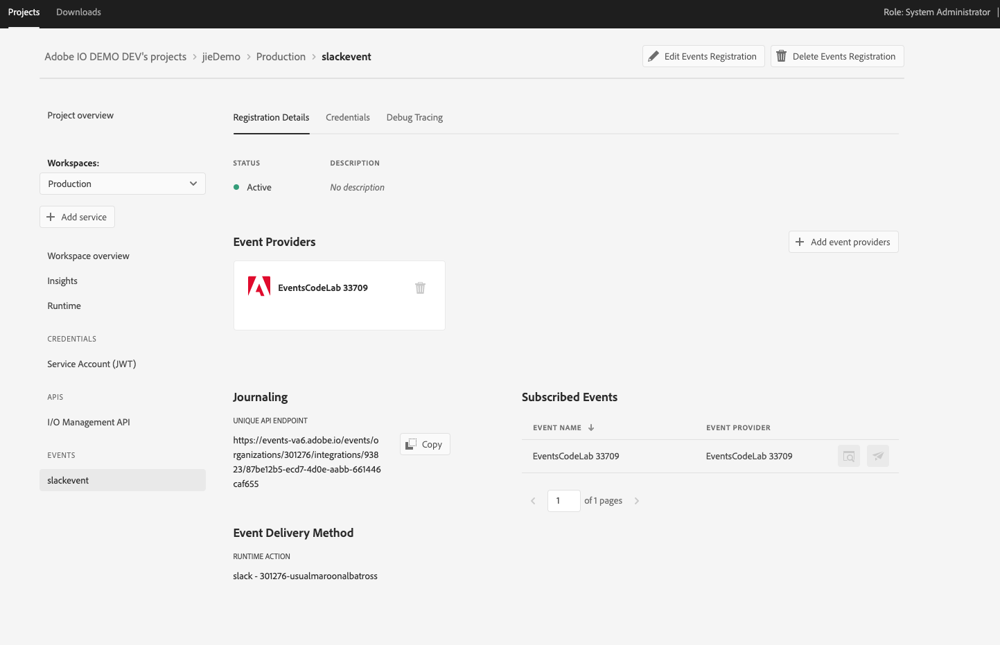

---
keywords:
  - Adobe I/O
  - Extensibility
  - API Documentation
  - Developer Tooling
contributors:
  - 'https://github.com/Yu1986'
title: 'Lesson 2: Register the App as Event Provider'
---

# Lesson 2: Register the App as Event Provider 

## Set up project and use CLI to register the app as event provider
After set up your integration and collect the informations, you can start set up your event provider

### Use CLI to create provider, eventmetadata and webhook registration

Now we can start using CLI to create provider, eventmetadata and webhook registration.
Make sure you install the Adobe I/O Events CLI Plugin, then run the below commands:

```bash
aio console org list
aio console org select <orgId>
aio console project list
aio console project select <projectid>
aio console workspace list
aio console workspace select <wkspId>
aio app use
aio event => this will list all the commands for events.
```

## Register the Event Provider
After select the org, project and workspace, now we start to create registration 
```bash
aio event provider create
```
Fill in the information, and in the terminal you will see the provider id after successfully create provider,copy the `provider id` for next steps, now we can create eventmetadata:
```bash
aio event eventmetadata create <provider id>
```
CLI will promote you to the questions asking you to input the `label` and `event code`for the eventmetadata.
Now you can create registration by:
```bash
aio event registration create 
```
It will show you a sample of JSON format with the information to create a new event registration
which you can copy, create your `.json` file and fill in details and use it. 

Now with all that we have finished registering the event provider.

Note: another option to register an event provider is to run javascript code
For your convenience,the source code is available [here](https://github.com/AdobeDocs/adobeio-samples-custom-events-registration)
simply fill in the `.env` and run `npm start` 

## Check your result on Console
After using event CLI plugin to create an event provider, you will see event provider registrated in console 
as well as your jouranling end point

 

Note: You will need your `event provider id` and `event code` from this lesson to fire event in next steps:

