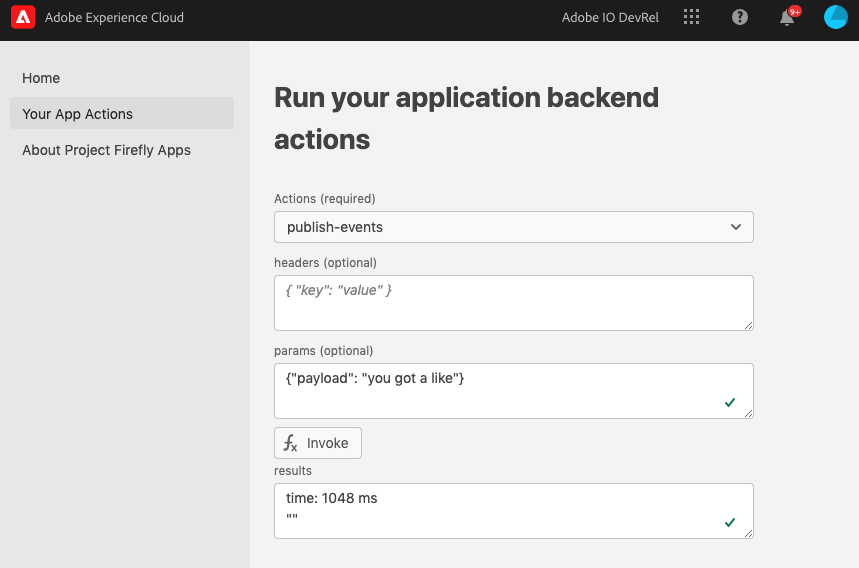
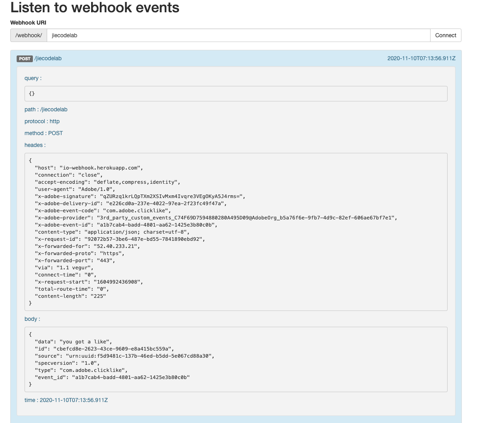

---
keywords:
  - Adobe I/O
  - Extensibility
  - API Documentation
  - Developer Tooling
contributors:
  - 'https://github.com/Yu1986'
title: 'Lesson 3: Fire an Event'
---

# Lesson 3: Fire an Event

Once the app is set up and the event provider registered, we can make a user click of the `invoke` button a fire event This lesson will walk through the code in `publish-event` template, test it on the UI using the "invoke" button, and see the success response, in this lession using webhook.

You may use the template code at `/actions/publish-events/index.js`, or create your own.

Within the newly created app, first set up `package.json` with the lists of dependencies, version, etc. 

Then `manifest.yml` lists the declaration of serverless actions including names, source files, runtime kind, default params, annotations, and so on. For this lesson, we will use this template and modify the code as needed.

Put the `providerId`,`apiKey` and `eventCode` saved from Lesson 2 in the `manifest.yml`; `orgId` and `accessToken`can be passed through `headers`.

Here is a sample `app.config.yaml`: 

```javascript
application:
  actions: actions
  web: web-src
  runtimeManifest:
    packages:
      my-app:
        license: Apache-2.0
        actions:
          generic:
            function: actions/generic/index.js
            web: 'yes'
            runtime: 'nodejs:18'
            inputs:
              LOG_LEVEL: debug
            annotations:
              require-adobe-auth: true
              final: true
      publish-events:
        function: actions/publish-events/index.js
        web: 'yes'
        runtime: 'nodejs:18'
        inputs:
          LOG_LEVEL: debug
          apiKey: <Your-SERVICE_API_KEY>
          providerId: <YOUR-PROVIDER_ID>
          eventCode: <YOUR-EVENT_CODE>
        annotations:
          final: true
```

In the template code: 

* Source code is at `actions/publish-events/index.js`
* It is a [web action](../../guides/runtime_guides/creating-actions.md#invoking-web-actions)
* The action will be run in the `nodejs:18` [runtime container on I/O Runtime](../../guides/runtime_guides/reference_docs/runtimes.md#nodejs-v18142)
* It has some [default parameters](../../guides/runtime_guides/creating-actions.md#working-with-parameters) such as `LOG_LEVEL`, and those you can pass in your `params` like `apiKey`, `provideId` and `eventCode`from `manifest.yml`

```javascript
const { Core, Events } = require('@adobe/aio-sdk')
const uuid = require('uuid')
const { CloudEvent } = require('cloudevents')
const { errorResponse, getBearerToken, stringParameters, checkMissingRequestInputs } = require('../utils')

// main function that will be executed by Adobe I/O Runtime
async function main (params) {
  // create a Logger
  const logger = Core.Logger('main', { level: params.LOG_LEVEL || 'info' })

  try {
    // 'info' is the default level if not set
    logger.info('Calling the main action')

    // log parameters, only if params.LOG_LEVEL === 'debug'
    logger.debug(stringParameters(params))

    // check for missing request input parameters and headers
    const requiredParams = ['apiKey', 'providerId', 'eventCode', 'payload']
    const requiredHeaders = ['Authorization', 'x-gw-ims-org-id']
    const errorMessage = checkMissingRequestInputs(params, requiredParams, requiredHeaders)
    if (errorMessage) {
      // return and log client errors
      return errorResponse(400, errorMessage, logger)
    }

    // extract the user Bearer token from the Authorization header
    const token = getBearerToken(params)


    // initialize the client
    const orgId = params.__ow_headers['x-gw-ims-org-id']
    const eventsClient = await Events.init(orgId, params.apiKey, token)

    // Create cloud event for the given payload
    const cloudEvent = createCloudEvent(params.providerId, params.eventCode, params.payload)

    // Publish to I/O Events
    const published = await eventsClient.publishEvent(cloudEvent)
    let statusCode = 200
    if (published === 'OK') {
      logger.info('Published successfully to I/O Events')
    } else if (published === undefined) {
      logger.info('Published to I/O Events but there were not interested registrations')
      statusCode = 204
    }
    const response = {
      statusCode: statusCode,
    }

    // log the response status code
    logger.info(`${response.statusCode}: successful request`)
    return response
  } catch (error) {
    // log any server errors
    logger.error(error)
    // return with 500
    return errorResponse(500, 'server error', logger)
  }
}

function createCloudEvent(providerId, eventCode, payload) {
  let cloudevent = new CloudEvent({
    specversion: "1.0",
    source: 'urn:uuid:' + providerId,
    type: eventCode,
    id: uuid.v4(),
    data: payload,
  })

  return cloudevent;
}
exports.main = main
```

The action here exposes a `main` function, which accepts a list of parameters from the client. It checks the required parameters for using the `cloudevents-sdk`. 

You can run the App Builder app locally by executing this command with AIO CLI:

```bash
aio app run
```

This command will deploy the `publish-event` action into I/O Runtime and spin up a local instance for the UI. When the app is up and running, it can be seen at `https://localhost:9080`. You should be able to see the UI of the app and also access it from ExC Shell: `https://experience.adobe.com/?devMode=true#/apps/?localDevUrl=https://localhost:9080`. You may be asked to log in using your Adobe ID.  When the website is opened, the UI is similar to what you see when deployed on localhost, except for the ExC Shell on top of the UI.

Once you are satisfied with your app, you can deploy it with this command:

```bash
aio app deploy
```

This command will deploy the app to your namespace, and you will get a URL like this one:
`https://<Runtime-namespace>.adobeio-static.net/<project-name>-0.0.1/index.html`
You will see your deployed link in the terminal.

Next, let's see how the web UI communicates with the back end. In `web-src/src/components` we already provided a template of the UI.
After you select the actions to `publish-events`, clicking the `invoke` button will invoke the action. The action will send out the event. When you invoke, you could also add actual parameters. In this example we added `{"payload": "you got a like"}` In the webhook result, you will see the payload: `{"data": "you got a like"}`.

> Note: This example uses [this webhook tool](https://io-webhook.herokuapp.com/) to generate a webhook link and put the webhook to the console integration. You can use other tools, as discussed in the next lesson. 




