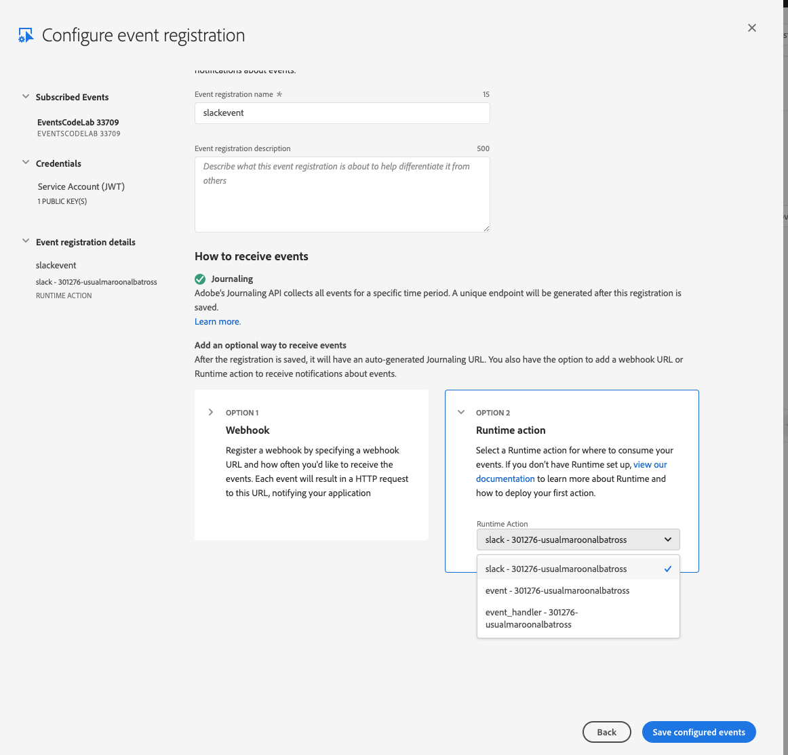
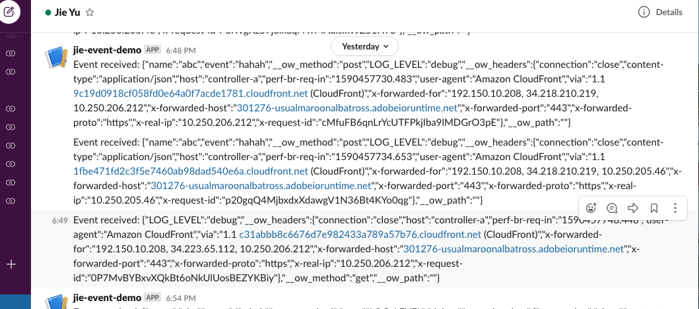
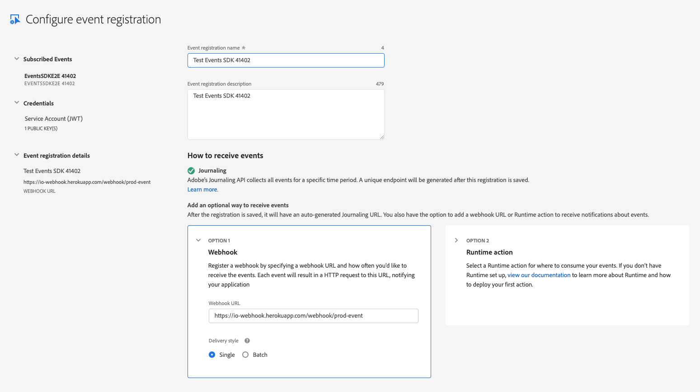

---
keywords:
  - Adobe I/O
  - Extensibility
  - API Documentation
  - Developer Tooling
contributors:
  - 'https://github.com/Yu1986'
title: 'Lesson 4: Consume Events'
---

# Lesson 4: Consume Events

There are three ways one can consume event:

* Using Journaling API 
* Using runtime action 
* Using webhook URL

## Option 1: Using Journaling API to consume events

Adobe offers journaling to consume events. The Adobe I/O Events Journaling API lets enterprise integrations consume events at their own cadence and process them in bulk. Unlike webhooks, no additional registration or other configuration is required. Every enterprise integration that is registered for events is automatically enabled for journaling. Journaling data is retained for 7 days. 

After you fire an event, you should be able to verify it by journaling the `UNIQUE API ENDPOINT` you get from the console by following the instructions in the Adobe I/O Events documentation: [Journaling API](https://developer.adobe.com/events/docs/guides/api/journaling_api/).

You could also use the `Curl` command or `POSTMAN` to call the journaling `UNIQUE API ENDPOINT` to see your fired event. Or you could use [Custom event SDK](https://github.com/adobe/aio-lib-events/) to call the Journaling API and retrieve your event.

## Option 2: Using runtime action

If you have access to Adobe I/O Runtime (included with App Builder) and have defined a [Slack webhook url](https://api.slack.com/incoming-webhooks), you can edit the `app.config.yaml` to add an action called slack:

* ```javascript
  slack:
        function: actions/slack/index.js
        web: 'yes'
        runtime: 'nodejs:14'
        inputs:
          LOG_LEVEL: debug
        annotations:
          final: true
  ```
  
  Add an actions folder `actions/slack/index.js` with this sample code:

```javascript
 var request = require('request');

/* default slackwebhook and channel add yours here and replace the TODO below */
/* this is a sample action for how to receive event and sent a message to slack */
var request = require('request');

/* default slackwebhook and channel add yours here and replace the TODO below */
var slackWebhook = "<your-webhook>";
var slackChannel = "<your-slack>";

async function main (params) {

  /* print event detail */
  console.log('in main + event detail: ', params.event);

  var returnObject = {
    statusCode: 200,
    headers: {
      'Content-Type': 'application/json'
    },
    body: ""
  };

  /* handle the challenge */
  if (params.challenge) {

    console.log('Returning challenge: ' + params.challenge);

    returnObject.body = new Buffer(JSON.stringify({
      "challenge": params.challenge
    })).toString('base64');

    return returnObject;

  } else {

    /* we need it to run asynchronously, so we are returning a Promise */
    return new Promise(function (resolve, reject) {

      var slackMessage = " Event received: " + JSON.stringify(params);

      var payload = {
        "channel": slackChannel,
        "username": "incoming-webhook",
        "text": slackMessage,
        "mrkdwn": true,
      };

      var options = {
        method: 'POST',
        url: slackWebhook,
        headers:
            { 'Content-type': 'application/json' },
        body: JSON.stringify(payload)
      };

      request(options, function (error, response, body) {
        if (error) {

          console.log("ERROR: fail to post " + response);

          reject(error);

        } else {

          console.log ("SUCCESS: posted to slack " + slackMessage);

          returnObject.body = new Buffer(JSON.stringify({
            "slackMessage": slackMessage
          })).toString('base64');

          resolve(returnObject);
        }

      });

    });

  }
}

exports.main = main
```

Once you have deployed your runtime action, verfiy that the webhook is working by: 

```bash
curl -X POST -H 'Content-type: application/json' --data '{"text":"Hello, World!"}' https://<your-namespace>.adobeio-static.net/api/v1/web/event-demo-0.0.1/slack
```

On Developer console, you will see: 
Select the Slack option and save it. Now when you fire an event, you should receive a Slack message whenever a person clicks the "Like" button:


## Option 3: Using webhook to consume events

You could configure another event delivery method through the console using `Edit Events Registration` and add a webhook: 



Before you can register a webhook, the webhook needs to be online and operational. If it is not, the registration will fail. So set that up first. Your webhook must be hosted on a server. For development, you may use localhost along with a tool like [Ngrok](https://ngrok.com/).

Your webhook needs to:

- Be accessible from the internet (localhost won't work)
- Be reachable over HTTPS
- Correctly respond to a "challenge" request. For more details, consult [Introduction to Adobe I/O Events Webhooks](https://developer.adobe.com/events/docs/guides/).

## Test it and fire events

Now when you fire an event (or in our Code Lab case, click the invoke button) you should see it appearing in three ways:

- Through Adobe I/O Journaling API 
- Receiving a Slack message through the slack runtime action webhook
- Through a webhook URL
