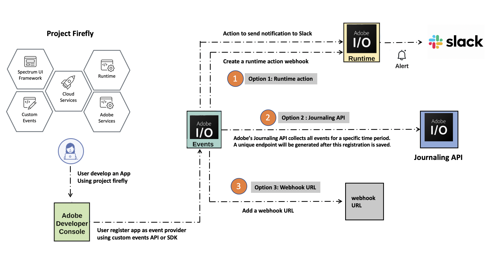

---
keywords:
  - Adobe I/O
  - Extensibility
  - API Documentation
  - Developer Tooling
contributors:
  - 'https://github.com/Yu1986'
title: Codelab Environment Requirements
---

import Requirements from '../transclusions/requirements.md'

<Requirements/>

## Code Lab Environment

In addition to the prerequisites listed above, please install the [Adobe I/O Events CLI Plugin](https://github.com/adobe/aio-cli-plugin-events):

```bash
npm install -g @adobe/aio-cli-plugin-events
```

We assume that you have access and authorization to create integrations on [Adobe I/O Console](https://console.adobe.io/).  `I/O Management Service` needs to be enabled for the integration. This will help create the JWT token with adobeio_api scope that is required for all the API calls.


