---
keywords:
  - Adobe I/O
  - Extensibility
  - API Documentation
  - Developer Tooling
contributors:
  - 'https://github.com/Yu1986'
title: 'Lesson 1: Step by Step Guide'
---

# Lesson 1: Initialize an App Builder App Using a Template

If you don't have an App Builder app, please follow [Create a New App Builder App from Template](../event-driven/lesson1.md) to create one. Make sure you have `publish-event`in the template, and add `I/O management API`in the console. Then run `aio app deploy`, and you should see this: 
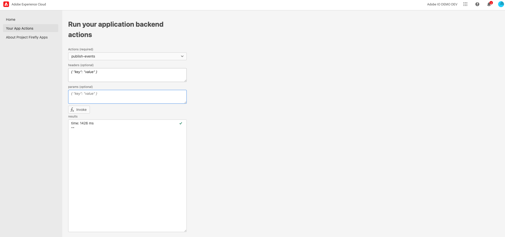

Here is the project set up at the Adobe Developer console:
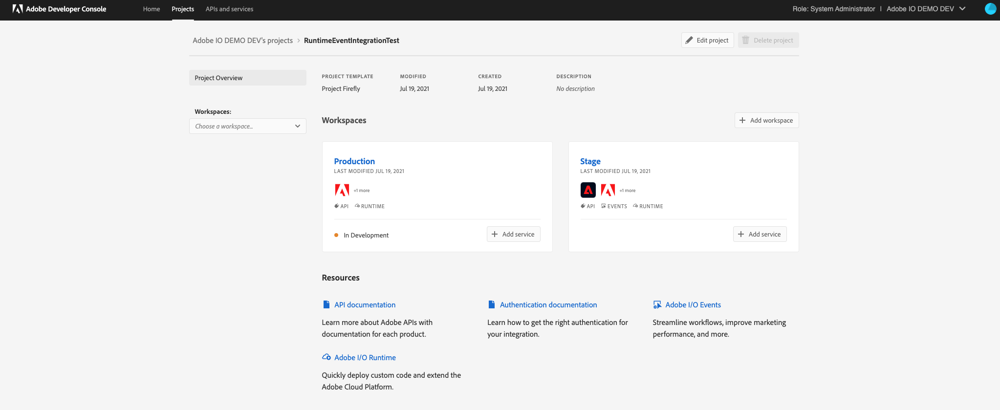

## Event registration

- Follow [Register the App as Event Provider](../event-driven/lesson2.md) to register the event provider:
  
  ```
  aio event registration create 
  ```
  
  This will return a sample in JSON format. Make sure you select `webhook`. Here is an example of a .json file:
  
  ```
  {
    "name": "event-runtime-integration",
    "description": "test event runtime",
    "delivery_type": "WEBHOOK",
    "webhook_url": "https://io-webhook.herokuapp.com/webhook/testjie",
    "events_of_interest": [
        {
        "provider_id": "ccefc74d-9696-4b99-a799-f2d34a4189cd",
        "event_code": "eventrt"
        }
    ]
  }
  ```

- After finishing the steps above, your terminal should show that you successfully created and registered the event. On Adobe Developer console, you will see your registration provider `eventrt` under the left bottom corner `event`: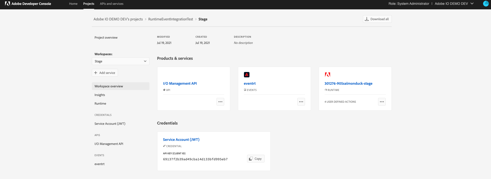

## Create event consumer

We will use the `generic` App Builder template to modify the code that creates an event consumer, naming the action `consume-event`.  After deploying the event, you will be able to set up the event registration runtime actions you deployed.

Here is some sample code that shows how to test the webhook feature: 

```
function main(params) {
  console.log('user action is processing event ' + params.event);
  var event = params.event;
  var id = event.id;
  var event_processed = "Event Received And Processed :: " + JSON.stringify(params.event)
    return {
        body: event_processed,
        statusCode: 200,
        headers: {
          'Content-Type': 'application/json'
        }
    };
  }
```

Alternatively, you could use this one to create a webhook to send to Slack:

```
/* this is a sample action sent a message to slack */
var request = require('request');

/* default slackwebhook and channel add yours here and replace the TODO below */
var slackWebhook = "Your webhook";
var slackChannel = "your channel";

async function main (params) {

  /* print event detail */
  console.log('in main + event detail: ', params.event);

  var returnObject = {
    statusCode: 200,
    headers: {
      'Content-Type': 'application/json'
    },
    body: ""
  };

  /* handle the challenge */
  if (params.challenge) {

    console.log('Returning challenge: ' + params.challenge);

    returnObject.body = new Buffer(JSON.stringify({
      "challenge": params.challenge
    })).toString('base64');

    return returnObject;

  } else {

    /* we need it to run asynchronously, so we are returning a Promise */
    return new Promise(function (resolve, reject) {

      var slackMessage = " Event received: " + JSON.stringify(params);

      var payload = {
        "channel": slackChannel,
        "username": "incoming-webhook",
        "text": slackMessage,
        "mrkdwn": true,
      };

      var options = {
        method: 'POST',
        url: slackWebhook,
        headers:
            { 'Content-type': 'application/json' },
        body: JSON.stringify(payload)
      };

      request(options, function (error, response, body) {
        if (error) {

          console.log("ERROR: fail to post " + response);

          reject(error);

        } else {

          console.log ("SUCCESS: posted to slack " + slackMessage);

          returnObject.body = new Buffer(JSON.stringify({
            "slackMessage": slackMessage
          })).toString('base64');

          resolve(returnObject);
        }

      });

    });

  }
}

exports.main = main
```

> Note: An action used as event consumer does not need to be `web: yes`, and doesn't need `require-adobe-auth: true` in the manifest.yml file. Please make the necessary modifications to ensure your app's security. 

## Event runtime integration

- With all the above set up, get your `providerId` and `eventCode` and return to your App Builder App to invoke a custom event like this: 
  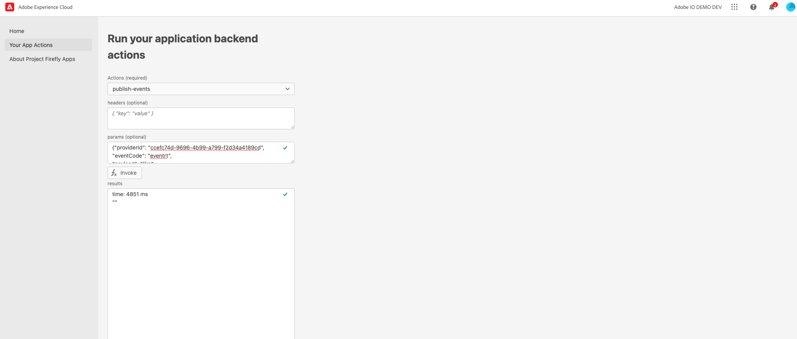

- You should see this runtime action created in the `user defined actions`:
  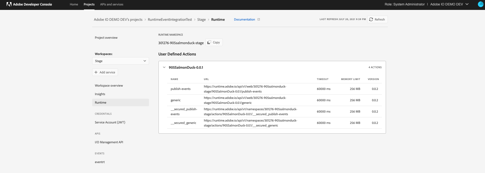

- Now add the event API to the project to set up the event registration:
  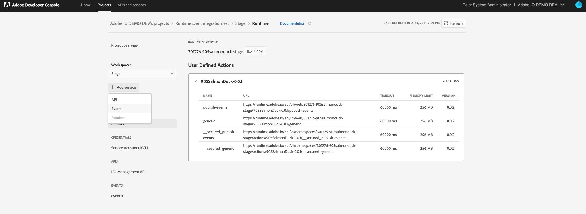

- We registered `eventruntime` as our custom event provider, and you should see your registered event in this list:
  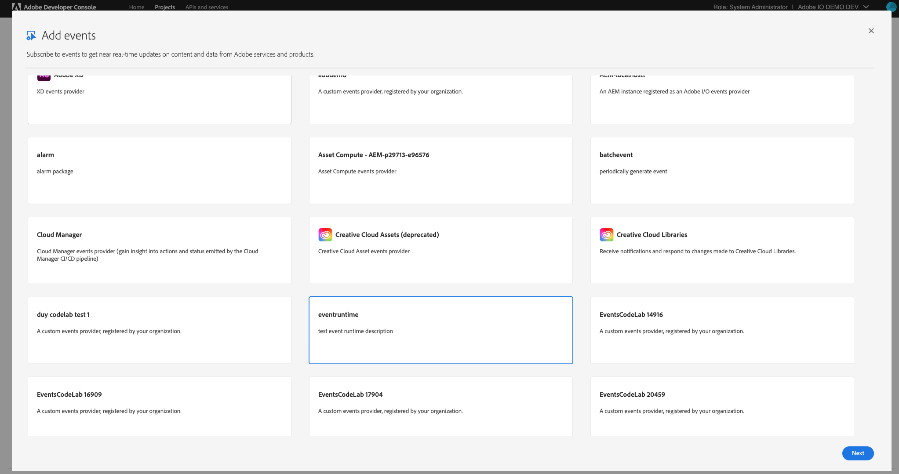

- Subscribe to the "eventrt" event type:
  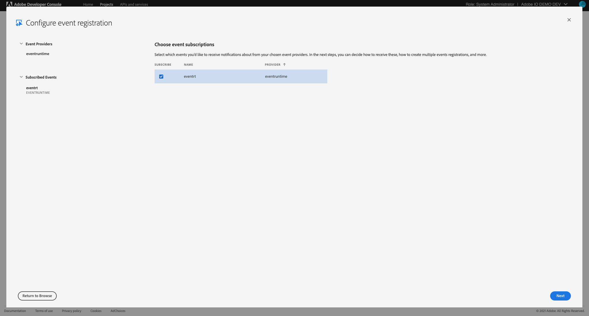

- Generate the JWT service account credentials key pair:
  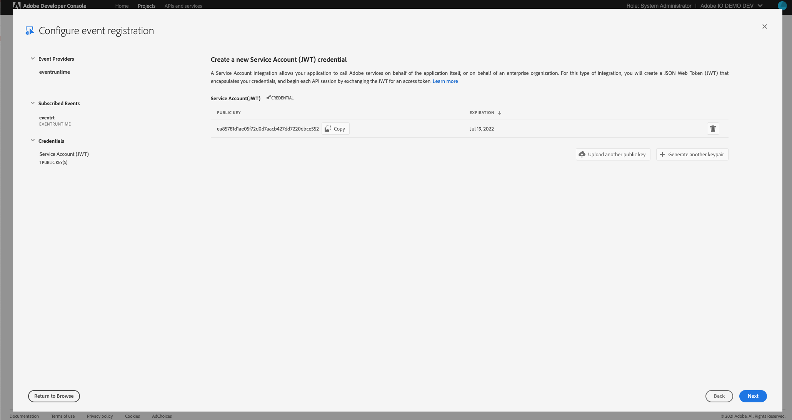

- On the registration details page, provide the name and select the runtime user action created to set up event registration. Then select the user action from the dropdown of Runtime Actions. Since we previously created and deployed the `consume-event`, so choose it and click `Save configured events`. This creates an event registration with an event handler webhook pointing to your runtime action.
  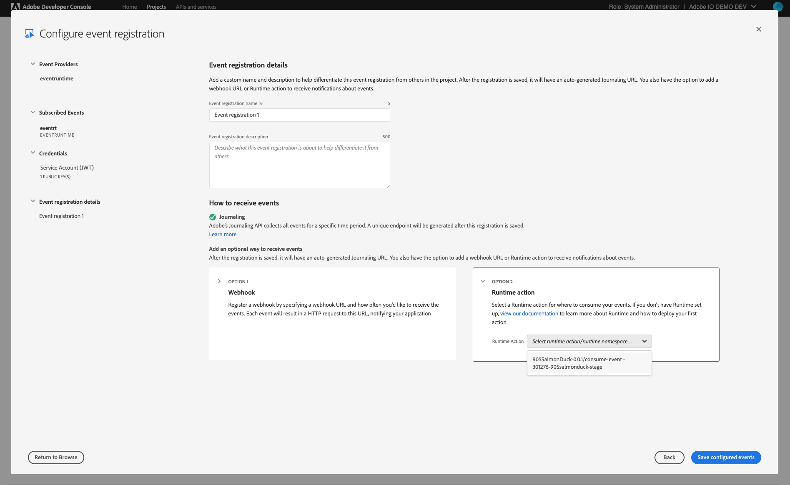

- If user enters `aio runtime list` to his aio cli it will show these entities created as part of the new flow of event registration:
  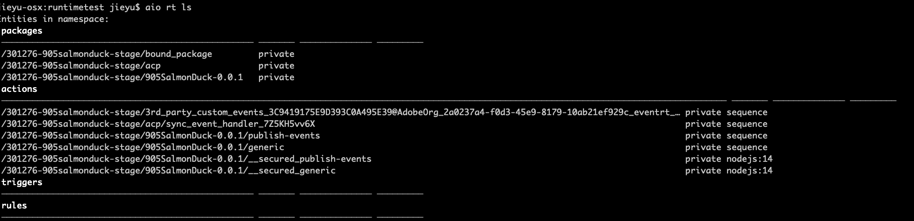
