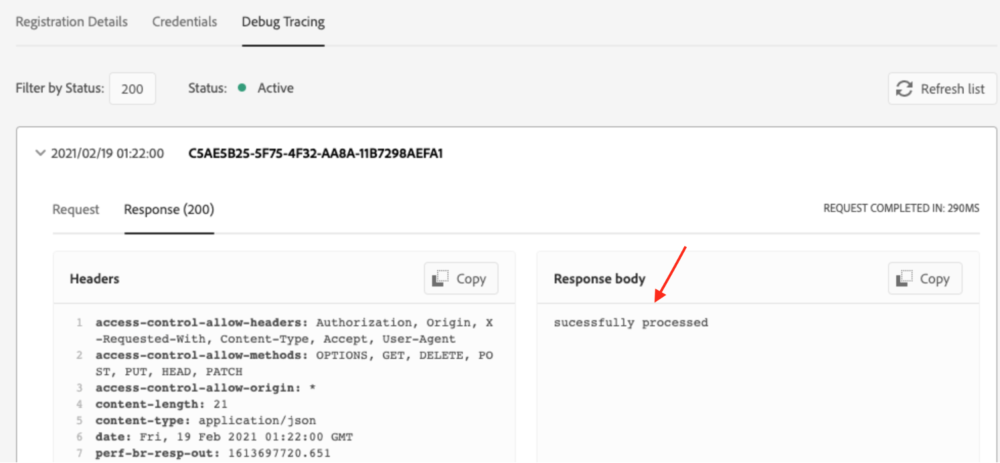
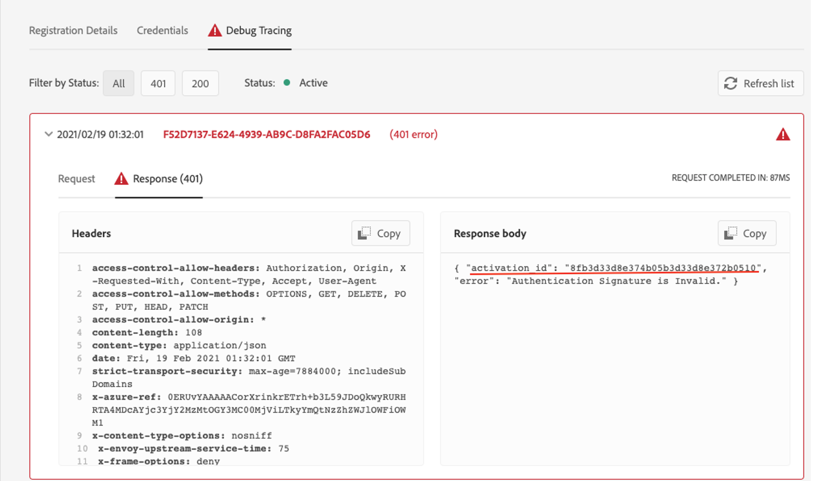
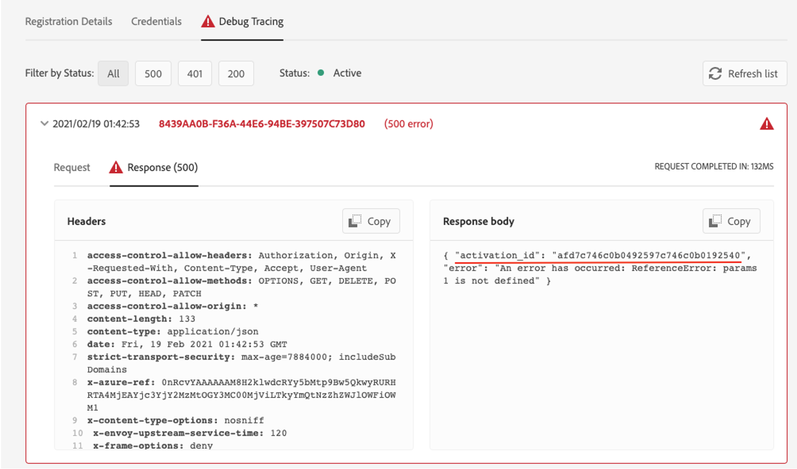

---
keywords:
  - Adobe I/O
  - Extensibility
  - API Documentation
  - Developer Tooling
contributors:
  - 'https://github.com/Yu1986'
title: 'Lesson 2: Verify the result'
---

# Lesson 2: Verify the Result

Let's take a closer look at these actions:

- `bound_package`: default parameter package created as a binding of the shared package deployed in Adobe namespace and containing the validate action. 
- `acp`: package created that will keep the new sync_event_handler sequence.
- `sync_Event_handler_7Z5KH5vv6X`: the new event handler unique to this registration with a webhook URL.
- `3rd_party_custom_events_3C9419175E9D393C0A495E39@AdobeOrg_2a0237a4-f0d3-45e9-8179-10ab21ef929c_eventrt_7Z5KH5vv6X`: the user sequence created taking the validate action as first action and user runtime action as second action, created with the same unique identifier suffixed to its name, to bind this user sequence 1:1 with the event registration.

## Tracing actions with Activation IDs

Debug Tracing is an important Developer Console tool to keep users informed of whether their runtime action invocation was successful, and what it responds.
Upon successful invocation of a runtime action as webhook, you will see a custom response returned in the Debug Tracing webhook response section like this:

A failed invocation will return an error response body with an Activation ID for the same. This helps users to debug their actions as described below.

You can use this Activation ID in the aio cli to trace the error that occurred in your invocation by retrieving the logs:

`aio rt activation logs`

[failed_activation_id]

You may now get activation IDs for two types of failed activations:

- Signature validator action
- Your runtime action

In case of failure in the signature verification step, this is how to get the error response and the failed activation ID:

For failed invocation of your runtime action, you will get an error response with the failed activation ID like this:

