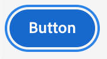
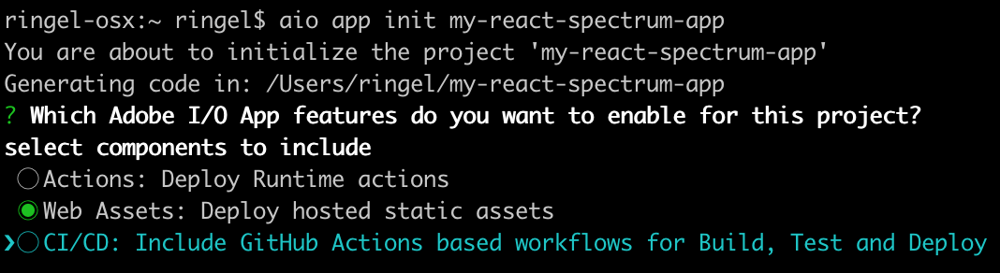

---
keywords:
  - Adobe I/O
  - Extensibility
  - API Documentation
  - Developer Tooling
title: 'Lesson 2: Spectrum CSS'
---

# Lesson 2: Spectrum CSS

Spectrum CSS is the CSS-only implementation of Spectrum.

> Note: Even this simple example involves quite a bit of work. We recommend the use of Spectrum CSS only by implementations of Spectrum, or in very simple applications that need only things like typography, textfields etc.
> 
> Adobe maintains separate JavaScript libraries written with React, Angular, and web components that use Spectrum CSS to create fully interactive Spectrum components. 
> These libraries support font loading and SVG icons, and offer built-in accessibility and internationalization. For complex work, we recommend using them instead of Spectrum CSS.

## Using Spectrum CSS

The preferred method of using Spectrum CSS uses custom properties to swap out variables for different themes and colorstops. This results in the lowest bundle size and is easiest to use, but is incompatible with Internet Explorer 11 and earlier versions.

Each component is released on npm as a separate, individually versioned package inside the [@spectrum-css org](https://www.npmjs.com/org/spectrum-css).

## Building a simple form using Spectrum CSS

This example will show how to build a simple form using Spectrum CSS. 

To get started, install the following components:

`npm install @spectrum-css/vars @spectrum-css/typography @spectrum-css/page @spectrum-css/icon @spectrum-css/button @spectrum-css/textfield @spectrum-css/checkbox @spectrum-css/fieldlabel`

Then include the stylesheets:

```html
<!-- Include global variables first -->
<link rel="stylesheet" href="node_modules/@spectrum-css/vars/dist/spectrum-global.css">

<!-- Include only the scales your application needs -->
<link rel="stylesheet" href="node_modules/@spectrum-css/vars/dist/spectrum-medium.css">
<link rel="stylesheet" href="node_modules/@spectrum-css/vars/dist/spectrum-large.css">

<!-- Include only the colorstops your application needs -->
<link rel="stylesheet" href="node_modules/@spectrum-css/vars/dist/spectrum-light.css">

<!-- Include index-vars.css for all components you need -->
<link rel="stylesheet" href="node_modules/@spectrum-css/page/dist/index-vars.css">
<link rel="stylesheet" href="node_modules/@spectrum-css/typography/dist/index-vars.css">
<link rel="stylesheet" href="node_modules/@spectrum-css/button/dist/index-vars.css">
<link rel="stylesheet" href="node_modules/@spectrum-css/textfield/dist/index-vars.css">
<link rel="stylesheet" href="node_modules/@spectrum-css/fieldlabel/dist/index-vars.css">  
```

Then, make sure you've included the relevant classes so you can choose which scale and colorstop you want:

```html
<html lang="en" dir="ltr" class="spectrum spectrum--medium spectrum--light"> 
```

Then include the Adobe Fonts, for example using your Typekit ID. To create one, visit [Adobe Fonts](https://fonts.adobe.com/?ref=tk.com).

```html
<!-- mge7bvf is the Typekit id. Please don't reuse, it's not meant for production. -->
<script src="https://use.typekit.net/mge7bvf.js"></script>
<script>window.Typekit.load()</script>
```

Now you can start using components by copy/pasting their code from the [documentation](http://opensource.adobe.com/spectrum-css/).
In this example, we'll use these components: 

* [Heading](https://opensource.adobe.com/spectrum-css/components/typography-heading/)
* [Form](https://opensource.adobe.com/spectrum-css/components/form/)
* [CTA Button](https://opensource.adobe.com/spectrum-css/components/button-cta/)
* [Textfield](https://opensource.adobe.com/spectrum-css/components/textfield/)
* [Checkbox](https://opensource.adobe.com/spectrum-css/components/checkbox/)

This results in the following code: 

```html
<!-- .spectrum-Typography will apply margins to all typography components like headings. -->
<main class="spectrum-Typography">
  <h3 class="spectrum-Heading spectrum-Heading--M" id="login-label">Login</h3>
  <form class="spectrum-Form spectrum-Form--labelsAbove" aria-labelledby="login-label" id="login">
    <div class="spectrum-Form-item">
      <label for="email" class="spectrum-Form-itemLabel spectrum-FieldLabel--left">Email</label>
      <div class="spectrum-Form-itemField">
        <input class="spectrum-Textfield" id="email" placeholder="Enter your email" name="email"/>
      </div>
    </div>
    <div class="spectrum-Form-item">
      <label class="spectrum-Form-itemLabel spectrum-FieldLabel--left" for="password">Password</label>
      <div class="spectrum-Form-itemField">
        <input class="spectrum-Textfield" type="password" placeholder="Enter your password" id="password">
      </div>
    </div>
    <div class="spectrum-Form-item">
      <div class="spectrum-Form-itemField">
        <div class="spectrum-FieldGroup">
          <label class="spectrum-Checkbox">
            <input type="checkbox" class="spectrum-Checkbox-input">
            <span class="spectrum-Checkbox-box">
              <svg class="spectrum-Icon spectrum-UIIcon-CheckmarkSmall spectrum-Checkbox-checkmark" focusable="false" aria-hidden="true">
                <use xlink:href="#spectrum-css-icon-CheckmarkSmall"></use>
              </svg>
            </span>
            <span class="spectrum-Checkbox-label">Remember me</span>
          </label>
        </div>
      </div>
    </div>
    <button form="login" type="submit" class="spectrum-Button spectrum-Button--cta">
        <span class="spectrum-Button-label">Login</span>
    </button>
  </form>
</main>
```

The checkbox component requires the `spectrum-css-icon-CheckmarkSmall` SVG icon. We recommend using [loadicons](https://www.npmjs.com/package/loadicons) to load the `spectrum-css-icons.svg` collection that includes it:

```html
<script src="node_modules/loadicons/index.js"></script>
<script>
  loadIcons('node_modules/@spectrum-css/icon/dist/spectrum-css-icons.svg');
</script> 
```

Spectrum supports the `:focus-visible` property, but requires a script to make it work across all browsers:

```bash
npm i @adobe/focus-ring-polyfill 
```

Include the script:

```
<script src="node_modules/@adobe/focus-ring-polyfill/index.js"></script>
```

Now when you tab into a button, for example, you should see a focus-ring appearing around the button: 

  

### Results

Combining all the pieces, you should see: 

  
