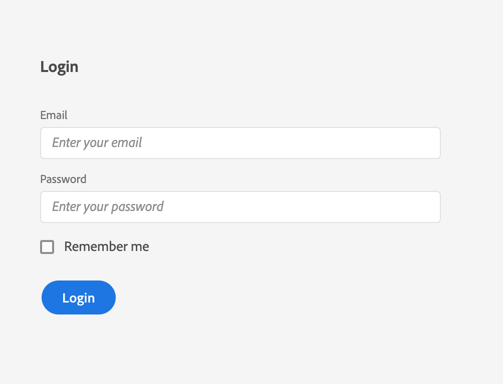

---
keywords:
  - Adobe I/O
  - Extensibility
  - API Documentation
  - Developer Tooling
title: 'Lesson 3: React Spectrum'
---

# Lesson 3: React Spectrum

The React Spectrum project implements the Spectrum design language into React UI components.

React Spectrum is composed of three parts:

* react-spectrum, a component library implementing the Adobe Spectrum design system
* react-aria, a library of React hooks implementing the patterns defined in the ARIA practices specification, including mouse, touch, and keyboard behavior, accessibility, and internationalization support
* react-stately, a library of React hooks that implement cross- platform (for example web/native) state management for components that need it

React Spectrum enables accessibility and common behavior to be handled out of the box. Using it saves front-end development time, so you can focus on styling and other design-specific features that can be built on top of the library.

If you're not familiar with React, please read the [React getting started guide](https://reactjs.org/docs/getting-started.html). 

> Note: these documents, and this tutorial, refer to the legacy version of React. The sample project should work as indicated.

## Using React Spectrum

React Spectrum is usable with a module bundler like [Parcel](https://parceljs.org/). 
Components are then usable as in the following example. The styles for each component you import will be bundled alongside the JavaScript. Each component should be imported independently so that only the components you use will be included in the output JavaScript and CSS files.

## Building a simple form using React Spectrum

This example will show you how to build a simple form using React Spectrum components.

To get started, install the following components:

`yarn add @react-spectrum/provider @react-spectrum/theme-default @react-spectrum/button @react-spectrum/textfield @react-spectrum/form @react-spectrum/checkbox`

> *Note*: if you don't have yarn installed, run `npm i -g yarn` first.

Then start importing the components to build the form: 

```javascript
import ReactDOM from 'react-dom';
// Import root provider and theme
import {Provider} from '@react-spectrum/provider';
import {theme} from '@react-spectrum/theme-default';

// Import the needed components
import {Button} from '@react-spectrum/button';
import {Form} from '@react-spectrum/form';
import {Checkbox} from '@react-spectrum/checkbox';
import {TextField} from '@react-spectrum/textfield';
```

Render them using, for example, [ReactDOM](https://fr.reactjs.org/docs/react-dom.html): 

```html
ReactDOM.render(
  <Provider theme={theme} typekitId="mge7bvf">
    <h3 id="login-label">Login</h3>
    <Form width={192} aria-labelledby="login-label">
      <TextField label="Email" placeholder="Enter your email" />
      <TextField label="Password" placeholder="Enter your password" type="password" />
      <Checkbox>Remember me</Checkbox>
    </Form>
    <Button variant="cta">Login</Button>
  </Provider>
, document.getElementById('root'));
```

Provider is the containing component that all other React Spectrum components are the children of. The Provider's theme is the CSS variable set for colorScheme and scale values.

Consult the [React documentation](https://react-spectrum.adobe.com/docs/react-spectrum/Provider.html) for more details.

> **Note**: A Typekit ID is required to use the suggested Adobe fonts. Visit [Adobe Fonts](https://fonts.adobe.com/?ref=tk.com) to create one. The default font is intended only for prototyping work.

You should then see the same result as in the previous lesson on [Spectrum CSS](lesson2.md). If you have dark mode enabled in your OS, you will see the Spectrum dark theme instead.

 
