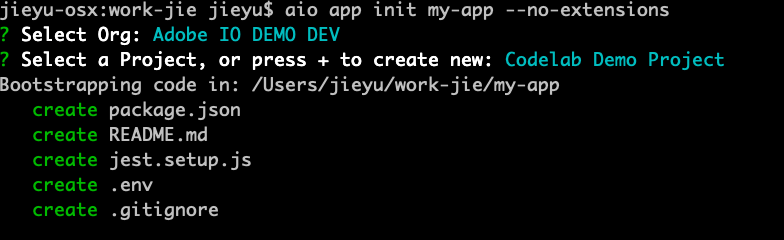
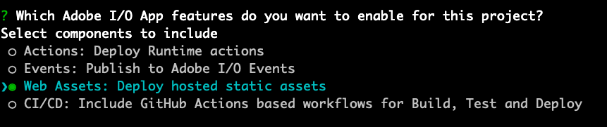

---
keywords:
  - Adobe I/O
  - Extensibility
  - API Documentation
  - Developer Tooling
title: 'Lesson 4: React Spectrum in App Builder'
---

# Lesson 4: React Spectrum in App Builder

To initialize an App Builder app, let’s use the `init` command from the [CLI](https://github.com/adobe/aio-cli).

```bash
aio app init my-app --standalone-app
```

You'll see several options for your app to include, such as serverless actions, web UI assets, and CI/CD pipeline. In this lab, we're interested only in `Web Assets: Deploy hosted static assets`:




## Single-Page application

This will generate a single-page application project using [React](https://reactjs.org/) and [Experience Cloud Shell](../../guides/app_builder_guides/exc_app/aec-integration.md) utilities to integrate the SPA within the Adobe Experience Cloud.
The best ways to use Experience Shell (for example, routing) will be covered in another Code Lab.

App Builder SPAs follow [JAMstack principles](https://jamstack.org/): "Fast and secure apps delivered by pre-rendering files and serving them directly from a Content Delivery Network." 

> Note: This SPA uses client-side rendering. Server-side rendering or isomorphic rendering to build views on the server at runtime is not supported.

## Project structure

The `web-src` folder holds the source files of the React App, including:

* The Adobe Experience Cloud Shell runtime object containing Identity Management System information, for example to retrieve the user token
* A pre-defined 404 error handling page
* A sample React App using React Spectrum components

In `package.json`, define your app name, version and all dependencies that will be bundled when deploying the SPA.
The React Spectrum components used in the sample React App are listed as dependencies, for example `@react-spectrum/button` or `@react-spectrum/layout`.

The `test` folder includes a simple test file using the JavaScript Testing Framework [Jest](https://jestjs.io/).

To deploy the SPA into Adobe's Content Delivery Network (CDN),  specify your namespace and credentials in the `env` file, namely `AIO_RUNTIME_NAMESPACE` and `AIO_RUNTIME_AUTH`.

## Running and deployment

You can run the App Builder SPA locally using the CLI command:

```bash
aio app run
```

This will:

- Bundle all static files (HTML, CSS, JS, assets etc.) using the built-in web application bundler [Parcel](https://parceljs.org/).  
- Start a local development server on http://localhost:9080/. 

Thanks to the Experience Shell integration, you also preview the SPA directly on the Adobe Experience Cloud at: https://experience.adobe.com/?devMode=true#/apps/?localDevUrl=https://localhost:9080

To deploy the web assets to the CDN, use: 

```bash
aio app deploy
```

The CDN is provisioned on `adobeio-static.net` and the deployed App Builder SPA will be available at `https://<namespace>.adobeio-static.net/<appname>-<appversion>/index.html`.

## Caching

Content caching is defined via the HTTP header [Cache-Control](https://developer.mozilla.org/en-US/docs/Web/HTTP/Headers/Cache-Control) and is measured in seconds.

| Resource type | max-age |
| ------------- | ------- |
| HTML          | 60      |
| CSS           | 604800  |
| JS            | 604800  |
| Assets        | 604800  |

That is, HTML content is cached for one minute; the rest is cached for one week.
