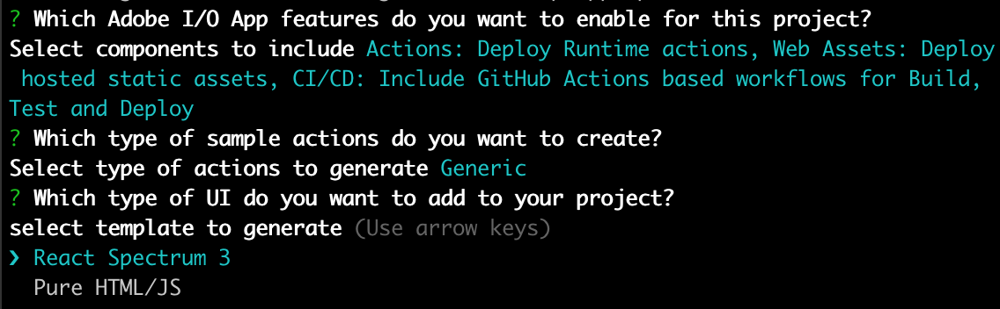

---
keywords:
  - Adobe I/O
  - Extensibility
  - API Documentation
  - Developer Tooling
title: 'Lesson 1: Create a New App Builder App with the React Spectrum template'
---

# Lesson 1: Create a New App Builder App using the React Spectrum template

In this lesson, we'll start bootstrapping the app with Runtime actions and the React Spectrum starter template.

## Initialization

To initialize an App Builder app, let's use `init` command from the CLI.

```bash
aio app init todo-app --no-extensions
```

You should select the org, project and workspace for your app, and then see a few options what to include in your app: serverless actions, web UI assets, CI/CD pipeline, and events. For this lab, select all except events.

The next question asks for the sample actions to be created as part of the initial app. Since we'll only rely on the [aio-lib-state](https://github.com/adobe/aio-lib-state) service, we can select the default option, `Generic`. 

Next, select the UI template, `React Spectrum 3`.



Finally, name your generic action `todolist`. 

Next, a NodeJS project is created from the command line. including the Adobe I/O Runtime actions, configuration files, tests etc. You could explore your project in VS Code either by opening VSCode -> Open... -> select app folder, or by typing:

```bash
code todo-app
```

The mandatory environment variables should be automatically defined in the `.env` file: `AIO_runtime_namespace`, `AIO_runtime_auth`, and `SERVICE_API_KEY`.  
