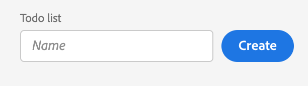

---
keywords:
  - Adobe I/O
  - Extensibility
  - API Documentation
  - Developer Tooling
title: 'Lesson 3: Setup the CreateTodoList component'
---

# Lesson 3: Setup the CreateTodoList component

In this lesson, we'll create a first React component that will be used to perform a create operation to generate a to-do list. The only value that will be passed to create a to-do list is its name.

First, we'll create the React component file under `web-src/src/components/` and name it `CreateTodoList.js`. 
If you're not familiar with React components and props, please first read the React documentation on [JSX](https://reactjs.org/docs/introducing-jsx.html) and [Components and props](https://reactjs.org/docs/components-and-props.html).

> Note: these documents, and this tutorial, refer to the legacy version of React. The sample project should work as indicated.

## Import React Spectrum components

If you choose the React Spectrum template, the App Builder app will have `@adobe/react-spectrum` dependencies installed by default.

This component will make use of several React Spectrum components: 

* [Flex](https://react-spectrum.adobe.com/react-spectrum/Flex.html) for the layout.
* [Form](https://react-spectrum.adobe.com/react-spectrum/Form.html) to submit the todo list.
* [TextField](https://react-spectrum.adobe.com/react-spectrum/TextField.html) as the main input field.
* [Button](https://react-spectrum.adobe.com/react-spectrum/Button.html) to trigger form submission.

We can import them all with a single statement:

```jsx
import { Flex, Form, TextField, Button } from '@adobe/react-spectrum';
```

## Component property

The component will accept a single property, a callback function `onCreate` invoked when a todo list is created:

```javascript
function CreateTodoList({ onCreate }) {
  // ...
}
```

## Creating a to-do list

We'll declare a state variable and bind it to the Textfield in order to retrieve the input value. If you're not familiar with React hooks, please read the [hooks introduction](https://reactjs.org/docs/hooks-intro.html).

First, we have to import the [State Hook](https://reactjs.org/docs/hooks-state.html) `useState` from `react` before being able to define a state variable:

```javascript
import { useState } from 'react';
```

Calling `useState` will return an `array` with two values: the state value and a function to set the state value:

```javascript
const [todoListName, setTodoListName] = useState('');
```

We're using a [destructuring assignment](https://developer.mozilla.org/en-US/docs/Web/JavaScript/Reference/Operators/Destructuring_assignment) to retrieve and declare both values. On initialization, the value of `todoListName` is set to empty string `''` by default.

Next we'll bind the `todoListName` state to the TextField value and update it with `setTodoListName()` on every input change. 
Learn more about React event handling [here](https://reactjs.org/docs/handling-events.html).

```jsx
<TextField
    value={todoListName}
    onChange={(value) => {
      setTodoListName(value);
    }}
    label="Todo list"
    placeholder="Name"
/>
<Button type="submit" variant="cta">
  Create
</Button>
```

We'll wrap the `TextField` and submit `Button` with a `Form` component so that we can invoke the callback function on form submission. We'll prevent the default form submission behavior with `event.preventDefault()` and pass the to-do list name as parameter to the callback function:  

```jsx
<Form
  onSubmit={async (event) => {
    event.preventDefault();

    onCreate && (await onCreate(todoListName));
}}>
```

## The full component

Finally, we'll add the Flex layout to align the TextField with the Button to obtain a fully functional React component.
Read more about React rendering [here](https://reactjs.org/docs/rendering-elements.html).

See the full component code [here](https://github.com/AdobeDocs/adobeio-samples-todoapp/blob/master/web-src/src/components/CreateTodoList.js).


