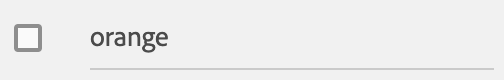

---
keywords:
  - Adobe I/O
  - Extensibility
  - API Documentation
  - Developer Tooling
title: 'Lesson 4: Setup the Todo component'
---

# Lesson 4: Setup the Todo component

In this lesson, we'll create a Todo React component composed of only two React Spectrum components: [Checkbox](https://react-spectrum.adobe.com/react-spectrum/Checkbox.html) and [TextField](https://react-spectrum.adobe.com/react-spectrum/TextField.html).

In a way similar to [lesson 3](lesson3.md), we'll create the React component file under `web-src/src/components/` and name it `Todo.js`.

## Import React Spectrum components

This component will make use of several React Spectrum components: 

* [Flex](https://react-spectrum.adobe.com/react-spectrum/Flex.html) for the layout.
* [TextField](https://react-spectrum.adobe.com/react-spectrum/TextField.html) the input field for the todo value.
* [Checkbox](https://react-spectrum.adobe.com/react-spectrum/Checkbox.html) to check a todo which is done.

```javascript
import { Flex, Checkbox, TextField } from '@adobe/react-spectrum';
```

## Component properties

The component will accept three properties:

* `name` to identify the to-do list name 
* `todo` which holds the to-do ID, text value and checked status.
* `onUpdate` which is the callback function invoked whenever the todo item is updated.

```javascript
function Todo({ name, todo, onUpdate }) {
  // ...
}
```

## Updating a to-do item

Again, we're going to use the [State hook](https://reactjs.org/docs/hooks-state.html) `useState` to declare two state variables, bind one to the Checkbox and the other to the Textfield:

```javascript
const [value, setValue] = useState(todo.value);
const [isDone, setIsDone] = useState(todo.done);
```

Here we use the `todo` properties `value` and `done` to define the default state values.

Next we'll bind the `value` state to the TextField, update the `value` state with `setValue()`, and invoke the callback function `onUpdate` on every input change. `onUpdate` takes 2 parameters: the to-do list name and the todo object.

```jsx
<TextField
    isDisabled={isDone}
    aria-label="Todo"
    width="100%"
    value={value}
    onChange={async (value) => {
      todo.value = value;
      setValue(value);

      onUpdate && (await onUpdate(name, todo));
    }}
    isQuiet
/>
```

We'll do the same for `Checkbox`:

```jsx
<Checkbox
    aria-label="done"
    isSelected={isDone}
    onChange={async (value) => {
      todo.done = value;
      setIsDone(value);

      onUpdate && (await onUpdate(name, todo));
    }}
    isEmphasized
    value={value}
/>
```

## Full component

Finally, we use the Flex layout to align the Checkbox with the TextField and finish our To-do component.

See the full component code [here](https://github.com/AdobeDocs/adobeio-samples-todoapp/blob/master/web-src/src/components/Todo.js).


