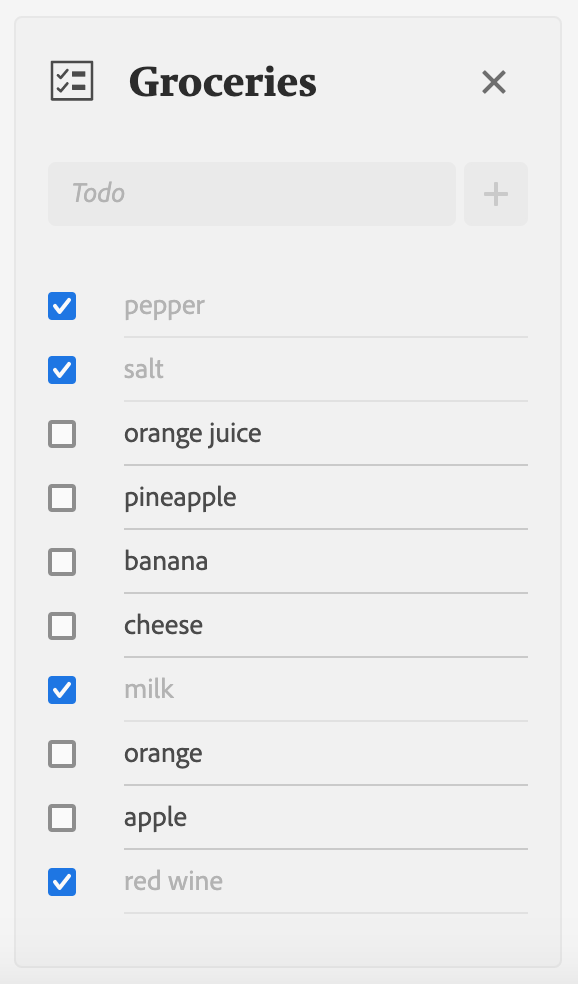

---
keywords:
  - Adobe I/O
  - Extensibility
  - API Documentation
  - Developer Tooling
title: 'Lesson 5: Setup the TodoList component'
---

# Lesson 5: Set up the TodoList component

In this lesson, we'll create a TodoList React component that will be able to: 

* Create a new to-do item.
* Delete the whole to-do list. 
* Display to-do items we have built in the previous lesson.  

We'll create the React component file under `web-src/src/components/` and name it `TodoList.js`.

## Import React Spectrum components

This component will make use of several React Spectrum components: 

* [View](https://react-spectrum.adobe.com/react-spectrum/View.html) a generic container.
* [Well](https://react-spectrum.adobe.com/react-spectrum/Well.html) a generic pre-styled container which will contain the todo list.
* [Flex](https://react-spectrum.adobe.com/react-spectrum/Flex.html) for the layout.
* [Form](https://react-spectrum.adobe.com/react-spectrum/Form.html) to submit the todo.
* [TextField](https://react-spectrum.adobe.com/react-spectrum/TextField.html) the input field for the todo value.
* [ActionButton](https://react-spectrum.adobe.com/react-spectrum/ActionButton.html) to trigger form submission.
* [AlertDialog](https://react-spectrum.adobe.com/react-spectrum/AlertDialog.html) to warn the user before deleting a todo list.
* [DialogTrigger](https://react-spectrum.adobe.com/react-spectrum/DialogTrigger.html) to open the AlertDialog.

```javascript
import { View, Flex, Form, TextField, ActionButton, AlertDialog, DialogTrigger, Well } from '@adobe/react-spectrum';
```

## Component properties

The component will accept three properties:

* `todoList` which corresponds to the to-do list object which holds the todo list name and to-do items.  
* `onDelete` the callback function to delete a to-do list.
* `onUpdate` the callback function to update a to-do list.

```javascript
function TodoList({ todoList, onDelete, onUpdate }) {
  const { name, todos } = todoList;
  // ...
}
```

## Spectrum Icons

We'll add [React Spectrum Workflow Icons](https://react-spectrum.adobe.com/react-spectrum/workflow-icons.html) to the `TodoList` component. The icons are simply SVGs packed as React components.  

To import icons, you need the `@spectrum-icons/workflow` dependency. It's pre-installed if you initialize the App Builder app with the React Spectrum template.

Each icon must be imported individually with a single statement:

```javascript
import TaskList from '@spectrum-icons/workflow/TaskList';
import Close from '@spectrum-icons/workflow/Close';
import Add from '@spectrum-icons/workflow/Add';
```

A [searchable list of workflow icons](https://spectrum.adobe.com/page/icons/) is available on the Spectrum website. The name of the icon without any whitespace matches the import in React Spectrum.  

## Displaying the to-do list name

React Spectrum has made available a set of components . Unfortunately, some components are not available in React Spectrum but available in [Spectrum CSS](https://opensource.adobe.com/spectrum-css/) which is the CSS framework used by React Spectrum to style components. 
Fortunately, we can use React Spectrum together with Spectrum CSS to fill in missing components.

In this case, we're going to install the [Spectrum CSS Typography](https://opensource.adobe.com/spectrum-css/?path=/docs/components-typography--docs) dependency to render Spectrum headings. Since React Spectrum already defines the Spectrum CSS variables, you'll need to install only the Spectrum CSS Typography package:

```bash
npm i --save @spectrum-css/typography
```

Then you can import the CSS:

```javascript
import '@spectrum-css/typography';
```

Now you can use Spectrum CSS Heading classes to render the to-do list name.

```jsx
<h2 className="spectrum-Heading spectrum-Heading--sizeM spectrum-Heading--serif">{name}</h2>
```

## Rendering to-do items

Once again, we're going to use the [State hook](https://reactjs.org/docs/hooks-state.html) `useState` to declare a state variable which will hold a list of to-do items. This list will be updated whenever a new to-do item is created. By default, it's initialized with the `todos` from the `todoList` prop: 

```javascript
const [todoItems, setTodoItems] = useState(todos);
```

Next we'll iterate over the `todoItems` array using the [map()](https://developer.mozilla.org/en-US/docs/Web/JavaScript/Reference/Global_Objects/Array/map) function to render each item as `Todo` component.

```jsx
<View marginTop="size-100">
  {todoItems.map((todo) => (
    <Todo key={todo.id} name={name} todo={todo} onUpdate={onUpdate} />
  ))}
</View>
```

The `key` property is necessary in React to uniquely identify the to-do item. In this case, we use the todo id. You can read more about React lists and keys [here](https://reactjs.org/docs/lists-and-keys.html).

We're also passing the `name`, `todo` and `onUpdate` props down to the `Todo` component.      

## Creating a to-do item

In [lesson 2](lesson2.md), we defined a `MAX_TODO_ITEMS` value within a global configuration file `defaults.json` at the root of the App Builder App. Now we'll use it to block the user from creating too many to-do items inside a to-do list. We can import the value in a way similar to what we did in the Runtime action:

```javascript
import { MAX_TODO_ITEMS } from '../../defaults.json';
```

Now we'll use the [React hook](https://reactjs.org/docs/hooks-intro.html) `useState` again to bind it to the TextField to create a new to-do item the way we did in the previous lesson: 

```javascript
const [newTodo, setNewTodo] = useState('');
```

But this time we will disable the input once we reach the count of `MAX_TODO_ITEMS` by setting the `isDisabled` prop:

```jsx
<TextField
  autoComplete="off"
  isDisabled={todoItems.length >= MAX_TODO_ITEMS}
  aria-label="New todo"
  width="100%"
  value={newTodo}
  onChange={(value) => {
    setNewTodo(value);
  }}
  placeholder="Todo"
  minLength={1}
  maxLength={140}
/>
<ActionButton type="submit" isDisabled={todoItems.length >= MAX_TODO_ITEMS}>
  <Add />
</ActionButton>
```

Finally, we'll wrap the `TextField` and the submit `ActionButton` with a `Form` component so we can invoke the `onUpdate` callback function on form submission. We'll prevent default form submission behavior with `event.preventDefault()` and create a new to-do item object that we pass to the callback function.
Additionally, we're clearing the value of `TextField`: 

```jsx
<Form
  onSubmit={async (event) => {
    event.preventDefault();

    const index = todoItems.length;
    const newTodoItem = { name, id: index, value: newTodo, done: false };
    setTodoItems([newTodoItem, ...todoItems]);
    setNewTodo('');

    onUpdate && (await onUpdate(name, newTodoItem));
  }}>
```

### Deleting a to-do list

Next to the to-do list name, we'll add a trigger to delete the list. The trigger will open an `AlertDialog` to warn the user about the action.
Confirming the operation calls the `onDelete` callback function passing it the `name` of the to-do list. The dialog will close itself automatically.  

```jsx
<DialogTrigger>
    <ActionButton isQuiet>
      <Close />
    </ActionButton>
    <AlertDialog
      title="Clear todo list"
      variant="destructive"
      primaryActionLabel="Delete"
      secondaryActionLabel="Cancel"
      onPrimaryAction={async () => {
        onDelete && (await onDelete(name));
      }}>
      This action will clear the todo list <strong>{name}</strong>. Are you sure you want to continue ?
    </AlertDialog>
</DialogTrigger>
```

## Full component

Finally, we'll wrap the whole component inside a `Well` and use the Flex layout to align the `Todo` items vertically.

See the full component code [here](https://github.com/AdobeDocs/adobeio-samples-todoapp/blob/master/web-src/src/components/TodoList.js).


