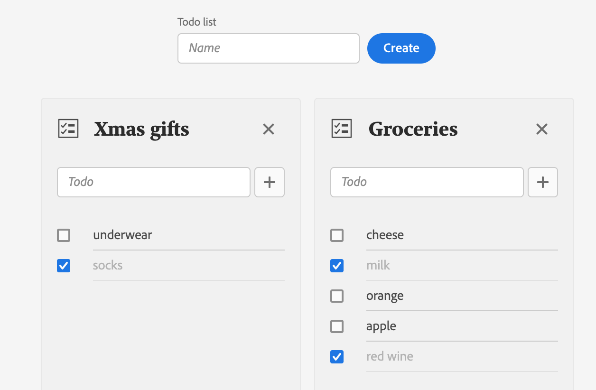

---
keywords:
  - Adobe I/O
  - Extensibility
  - API Documentation
  - Developer Tooling
title: 'Lesson 5: Bringing the pieces together to build the App'
---

# Lesson 5: Assembling the Pieces to Build the App

In the previous lessons, we have set up:

* A Runtime action to perform CRUD operations for to-do items
* `CreateTodoList` React component to create a to-do list 
* `Todo` React component to display and update a to-do item      
* `TodoList` React component to display to-do items      

In this lesson, we'll build the actual App to manage to-do lists. We'll create the React component file under `web-src/src/components/` and name it `App.js`.

We'll start by importing our components: 

```javascript
import { CreateTodoList } from './CreateTodoList';
import { TodoList } from './TodoList';
```

## Import React Spectrum components

This component will make use of several React Spectrum components:

* [Provider](https://react-spectrum.adobe.com/react-spectrum/Provider.html), the container of the React Spectrum application.
* [defaultTheme](https://react-spectrum.adobe.com/react-spectrum/theming.html), the default React Spectrum theme.
* [ProgressCircle](https://react-spectrum.adobe.com/react-spectrum/ProgressCircle.html), the loading indicator.
* [View](https://react-spectrum.adobe.com/react-spectrum/View.html), a generic container.
* [Flex](https://react-spectrum.adobe.com/react-spectrum/Flex.html), for the layout of the loading indicator.
* [Grid](https://react-spectrum.adobe.com/react-spectrum/Grid.html), for the layout of the todo lists.
* [Repeat](https://react-spectrum.adobe.com/react-spectrum/Grid.html#repeat), a helper function for Grid.

```javascript
import { Provider, defaultTheme, View, Flex, Grid, repeat, ProgressCircle } from '@adobe/react-spectrum';
```

## Component property

The component will accept a single property, the `ims` information that we'll pass to the Runtime action for authentication: 

```javascript
function App({ ims }) {
  // ...
}
```

## Component state values

On initialization, the App will display a loading indicator while fetching the todo lists. For the loading indicator and the to-do lists, we'll use the [State hook](https://reactjs.org/docs/hooks-state.html) `useState` again.   

```javascript
const [isLoading, setIsLoading] = useState(true);
const [todoList, setTodoList] = useState([]);
```

## Action function callbacks

To communicate with the Runtime action, we'll create a simple utility function with two parameters:

* The expected CRUD operation.
* The sent data, that is, the to-do list name or todo object. 

First, besure to import the `config.json` which contains the URL to your Runtime action.

```javascript
import actions from '../config.json';
```

Then, inside the `App`, we'll define the utility function with the `ims` information:

```javascript
const action = async (operation, body = {}) => {
  const res = await fetch(actions['todolist'], {
    method: 'POST',
    headers: {
      'Content-Type': 'application/json',
      'x-gw-ims-org-id': ims.org,
      authorization: `Bearer ${ims.token}`
    },
    body: JSON.stringify({
      operation,
      ...body
    })
  });

  return await res.json();
};
```

Finally, we'll use the utility function inside callback functions that we're going to pass as prop to the components we have built in the previous lessons:

```javascript
const onCreateTodoList = async (name) => {
  if (!todoList.find(({ name: todoListName }) => name === todoListName)) {
    setTodoList([{ name, todos: [] }, ...todoList]);

    console.log(await action('create', { name }));
  }
};

const onDeleteTodoList = async (name) => {
  setTodoList(todoList.filter(({ name: toDeleteName }) => name !== toDeleteName));

  console.log(await action('delete', { name }));
};

const onUpdateTodoList = async (name, todo) => {
  console.log(await action('update', { name, todo }));
};
```

## Loading indicator

By default, we'll be showing a `ProgressCircle` to indicate that the App is loading.  Meanwhile, the to-do lists will be fetched using an [Effect Hook](https://reactjs.org/docs/hooks-effect.html) which will run only once when the App is mounted.    

Once we've retrieved the to-do lists, well update the to-do list state and set the loading state to `false`:

```javascript
useEffect(() => {
  (async () => {
    const { todoList } = await action('read');
    if (todoList) {
      setTodoList(todoList);
      setIsLoading(false);
    }
  })();
}, []);
```

With React [Conditional Rendering](https://reactjs.org/docs/conditional-rendering.html), we can easily define what will be rendered based on the `isLoading` state. Once the state value is set to `false`, we'll display the `CreateTodoList` from [lesson 3](lesson3.md) and pass the `onCreateTodoList` callback function as prop:   

```jsx
<View elementType="main" minHeight="100vh">
  {isLoading ? (
    <Flex alignItems="center" justifyContent="center" height="100vh">
      <ProgressCircle size="L" aria-label="Loading…" isIndeterminate />
    </Flex>
  ) : (
    <View height="size-800" marginY="size-400">
      <CreateTodoList onCreate={onCreateTodoList} />
      ...
    </View>
  )}
</View>
```

## Rendering to-do lists

Next to `CreateTodoList`, we'll also render the to-do lists. For that, we're going to use the React Spectrum `Grid` component.
As in the previous lesson, we'll iterate over the `todoList` array using the [map()](https://developer.mozilla.org/en-US/docs/Web/JavaScript/Reference/Global_Objects/Array/map) function to render each item as `TodoList` component:

```jsx
<Grid
  columns={repeat('auto-fit', 'size-3400')}
  autoRows="size-6000"
  justifyContent="center"
  gap="size-200">
  {todoList.map((list) => (
    <TodoList key={list.name} todoList={list} onDelete={onDeleteTodoList} onUpdate={onUpdateTodoList} />
  ))}
</Grid>
```

Since to-do list names are unique, we're using the `name` as `key` prop.  We're also passing the `todoList` object and the `onDelete`, `onUpdate` function callbacks as props to the `TodoList` component.

## Full component

Finally, we'll wrap the App inside the React Spectrum Provider with the default theme set to `light`, which corresponds to the [Experience Cloud Shell](https://experience.adobe.com/) main content theme.

```jsx
<Provider theme={defaultTheme} colorScheme={`light`}>
...
</Provider>
```

See the full component code [here](https://github.com/AdobeDocs/adobeio-samples-todoapp/blob/master/web-src/src/components/App.js).


